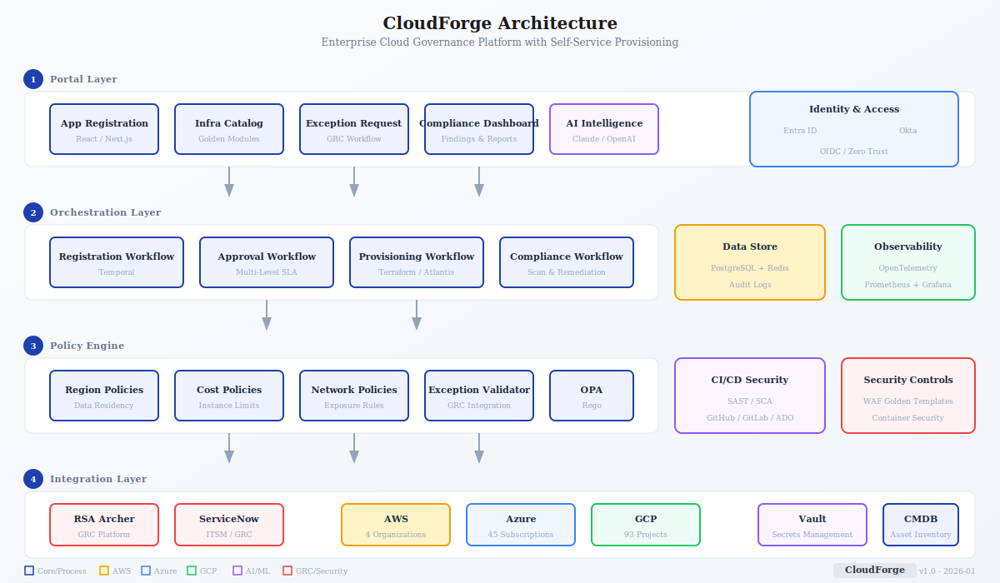

# CloudForge

**Enterprise Cloud Governance Platform with Self-Service Provisioning**

CloudForge is a reference architecture and implementation for an Internal Developer Platform (IDP) that enables self-service cloud resource provisioning with built-in governance, compliance guardrails, and exception management workflows.

---

## [*] What This Solves

Enterprise cloud environments face a constant tension:
- **Developers** want fast, self-service access to infrastructure
- **Security** needs guardrails, approvals, and audit trails
- **Finance** requires cost controls, tagging, and chargeback
- **Compliance** demands policy enforcement and exception documentation

CloudForge bridges these needs with a unified platform that provides:
- Self-service portal for requesting cloud resources
- Policy-as-code guardrails (OPA/Rego)
- Golden path Terraform modules (pre-approved, versioned)
- Exception workflow integration with enterprise GRC tools
- Multi-cloud support (AWS, Azure, GCP)

---

## [/] Architecture



<details>
<summary><strong>ASCII Diagram (Fallback)</strong></summary>

```
+-----------------------------------------------------------------------------+
|                              PORTAL LAYER                                    |
|         (Self-Service UI - React / Next.js)                                 |
|  +-------------+  +-------------+  +-------------+  +-------------+         |
|  |    App      |  |   Infra     |  |  Exception  |  |  Dashboard  |         |
|  | Registration|  |  Catalog    |  |   Request   |  |  & Reports  |         |
|  +------+------+  +------+------+  +------+------+  +-------------+         |
+---------|--------------|--------------|---------------------------------+
          |              |              |
+---------v--------------v--------------v---------------------------------+
|                         ORCHESTRATION LAYER                              |
|                    (Temporal Workflows)                                  |
|  +--------------------------------------------------------------------+  |
|  |  Registration    |  Approval     |  Provisioning  |  Compliance    |  |
|  |  Workflow        |  Workflow     |  Workflow      |  Scan Workflow |  |
|  +--------------------------------------------------------------------+  |
+-------------------------------------------------------------------------+
          |              |              |
+---------v--------------v--------------v---------------------------------+
|                          POLICY ENGINE                                   |
|                         (OPA / Rego)                                     |
|  +-------------+  +-------------+  +-------------+  +-------------+      |
|  |   Region    |  |    Cost     |  |  Network    |  |  Exception  |      |
|  |  Policies   |  |  Policies   |  |  Policies   |  |  Validator  |      |
|  +-------------+  +-------------+  +-------------+  +-------------+      |
+-------------------------------------------------------------------------+
          |              |              |
+---------v--------------v--------------v---------------------------------+
|                        INTEGRATION LAYER                                 |
|  +-------------+  +-------------+  +-------------+  +-------------+      |
|  |    CMDB     |  |     GRC     |  |  Terraform  |  |   Cloud     |      |
|  | (ServiceNow)|  |  (Archer)   |  |  (Atlantis) |  |   APIs      |      |
|  +-------------+  +-------------+  +-------------+  +-------------+      |
+-------------------------------------------------------------------------+
```

</details>

---

## [/] Repository Structure

```
cloudforge/
├── cmd/
│   └── server/             # API server entrypoint
├── internal/
│   ├── ai/                 # AI provider integration (Claude, OpenAI)
│   ├── api/                # API handlers and rate limiting
│   ├── cicd/               # CI/CD security scanning
│   │   ├── sast/           # SAST integrations (SonarQube, Checkov, Veracode)
│   │   └── vcs/            # VCS integrations (GitHub, GitLab, Azure DevOps)
│   ├── compliance/         # Compliance frameworks and deduplication
│   ├── container/          # Container security module
│   ├── grc/                # GRC provider abstraction (Archer, ServiceNow)
│   ├── identity/           # Identity providers (Entra ID, Okta) + Zero Trust
│   ├── observability/      # Logging, metrics, tracing, health checks
│   ├── policy/             # OPA integration
│   ├── waf/                # WAF golden templates and compliance scanner
│   └── workflow/           # Temporal workflow definitions
├── migrations/             # Database migrations
├── policies/               # OPA/Rego policies
├── configs/                # Configuration templates
├── docs/
│   ├── architecture/       # HLD, DDD, data models
│   ├── diagrams/           # Architecture diagrams (SVG)
│   ├── adr/                # Architecture Decision Records
│   └── runbooks/           # Operational procedures
└── Makefile                # Build targets
```

---

## [+] Key Features

### Self-Service Portal
- Application registration with metadata capture
- Infrastructure request catalog (golden modules)
- Exception request workflow
- Compliance dashboards

### Policy-as-Code
- Region restrictions (data residency)
- Instance size limits (cost control)
- Network exposure rules (security)
- Tagging requirements (governance)
- Exception validation (GRC integration)

### GRC Integration
Pluggable providers for enterprise GRC platforms:
- **RSA Archer** - Full exception workflow integration
- **ServiceNow GRC** - Native ServiceNow integration
- **PostgreSQL** - Lightweight option for smaller orgs
- **In-Memory** - For demos and testing

### AI Intelligence
- Contextual risk scoring with business context
- Finding explanation generation
- Remediation runbook generation
- Request triage and routing

### Multi-Cloud Support
- AWS (4 Organizations, 270+ accounts)
- Azure (45 Subscriptions)
- GCP (93 Projects)
- Extensible provider pattern

---

## [>] Tech Stack

| Component | Technology | Purpose |
|-----------|------------|---------|
| API Server | [Go 1.24](https://go.dev/) | Core platform API |
| Portal | React / Next.js | Self-service UI (planned) |
| Workflows | [Temporal](https://temporal.io/) | Orchestration, approvals |
| Policies | [OPA / Rego](https://www.openpolicyagent.org/) | Guardrails, validation |
| IaC | [Terraform](https://www.terraform.io/) | Resource provisioning |
| Database | [PostgreSQL 16](https://www.postgresql.org/) | State, audit logs |
| Cache | [Redis](https://redis.io/) | Session, caching |
| AI | [Anthropic Claude](https://www.anthropic.com/) | Intelligence services |
| Identity | OIDC (Okta/Entra ID) | Authentication |
| Observability | [OpenTelemetry](https://opentelemetry.io/) | Tracing, metrics |

---

## [>] Quick Start

### Prerequisites
- Go 1.21+
- Docker & Docker Compose
- Terraform 1.5+
- OPA CLI

### Local Development

```bash
# Clone repository
git clone https://github.com/lvonguyen/cloudforge.git
cd cloudforge

# Start dependencies (Postgres, OPA, Temporal)
docker-compose up -d

# Run migrations
make migrate

# Start API server
make run

# Run tests
make test
```

### Configuration

```yaml
# configs/config.yaml
server:
  port: 8080

database:
  host: localhost
  port: 5432
  name: cloudforge

grc:
  provider: memory  # memory | postgres | archer | servicenow

policy:
  opa_url: http://localhost:8181

workflow:
  temporal_host: localhost:7233
```

---

## [/] Documentation

| Document | Description |
|----------|-------------|
| [High-Level Design](docs/architecture/HLD.md) | System architecture overview |
| [Detailed Design](docs/architecture/DDD.md) | ADRs, API specs, data models |
| [DR/BC Plan](docs/DR-BC.md) | Disaster recovery procedures |
| [Component Rationale](docs/architecture/component-rationale.md) | Build vs buy decisions |

### Architecture Decision Records

| ADR | Decision |
|-----|----------|
| [ADR-001](docs/adr/ADR-001-programming-language.md) | Programming Language (Go) |
| [ADR-002](docs/adr/ADR-002-database-selection.md) | Database Selection (PostgreSQL) |
| [ADR-003](docs/adr/ADR-003-caching-strategy.md) | Caching Strategy (Redis) |
| [ADR-004](docs/adr/ADR-004-ai-provider-selection.md) | AI Provider (Anthropic Claude) |
| [ADR-005](docs/adr/ADR-005-rate-limiting.md) | Rate Limiting Strategy |
| [ADR-006](docs/adr/ADR-006-authentication.md) | Authentication (OIDC) |

### Runbooks

| Runbook | Purpose |
|---------|---------|
| [01-deployment](docs/runbooks/01-deployment.md) | Deployment procedures |
| [02-incident-response](docs/runbooks/02-incident-response.md) | Incident handling |
| [04-performance](docs/runbooks/04-performance-troubleshooting.md) | Performance issues |

---

## [!] Security

- All API endpoints require authentication (OIDC via Entra ID/Okta)
- Service-to-service communication uses mTLS
- Secrets managed via HashiCorp Vault
- Audit logging for all provisioning actions
- RBAC with Zero Trust policy enforcement
- API rate limiting and throttling
- Container security scanning
- CI/CD pipeline security (SAST/DAST integration)

---

## [+] Observability

| Capability | Implementation |
|------------|----------------|
| Logging | Structured JSON logging with zap |
| Metrics | Prometheus metrics at `/metrics` |
| Tracing | OpenTelemetry distributed tracing |
| Health | Kubernetes probes at `/health`, `/ready`, `/live` |
| Dashboards | Grafana dashboards included |

---

## [+] Compliance Frameworks

Built-in support for 20+ frameworks:

| Category | Frameworks |
|----------|------------|
| **General** | CIS, NIST CSF, ISO 27001, PCI-DSS |
| **Cloud** | AWS Security Best Practice, GCP CIS, Azure MCSB |
| **Healthcare** | HIPAA, HITRUST |
| **Finance** | SOX, GLBA, FFIEC |
| **Government** | FedRAMP, CMMC, NIST 800-53/800-171 |
| **AI** | NIST AI RMF, ISO 42001 |
| **Automotive** | ISO 21434, UN ECE R155, TISAX |

---

## [/] Roadmap

- [x] Core API and GRC abstraction layer
- [x] OPA policy engine integration
- [x] AI-powered risk analysis
- [x] Multi-cloud provider support
- [x] Compliance framework engine
- [ ] Self-service portal UI
- [ ] Terraform golden module catalog
- [ ] Cost estimation integration
- [ ] Compliance reporting dashboard

---

## [*] License

MIT License - See [LICENSE](LICENSE)

---

## [+] Contributing

Contributions welcome! Please read [CONTRIBUTING.md](CONTRIBUTING.md) first.

---

**Note:** This is a reference architecture and portfolio project demonstrating enterprise cloud governance patterns. Production deployments require additional hardening, testing, and customization for your organization's specific requirements.
