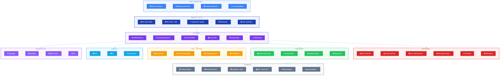
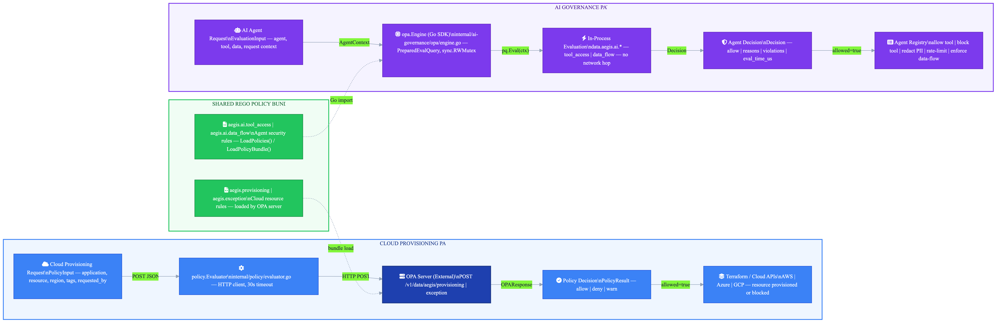

# Cloud Aegis


## Enterprise Cloud Governance Platform with Self-Service Provisioning

Cloud Aegis is a reference architecture and implementation for an Internal Developer Platform (IDP) that enables self-service cloud resource provisioning with built-in governance, compliance guardrails, and exception management workflows.

> **[Live Demo](https://cloudaegis-demo.lvonguyen.com)** | **[API](https://api.cloudforge-demo.lvonguyen.com/health)**

> **About this project** — Cloud Aegis demonstrates enterprise security patterns designed, built, and operated across identity, infrastructure, governance, and software lifecycle domains. The approach is project-based: assess current state gaps, design a solution mapped to business requirements, present trade-offs to leadership, then drive implementation hands-on across infra, dev, and ops teams through to production handoff. This project reflects that same end-to-end ownership — working systems backed by threat models and ADRs (the [19 ADRs](docs/core/architecture/adr/) capture the decision-making process used to brief a CISO or engineering VP). It is a **portfolio-grade reference architecture**, not a production SaaS product — select vertical slices (ServiceNow GRC, JWT auth, S3/SSH remediation) are fully implemented while others are architectural stubs that document the design intent. The core discipline is security-focused systems design, with agentic coding workflows (Claude Code) as a force multiplier for delivery.
>
> **Development rigor** — Code quality is enforced through a layered toolchain: `golangci-lint` with `gosec`/`gocritic`/`revive` in CI, shared coding standards governing Go patterns, error handling, and security rules across all repos, pre-commit hooks blocking credential leaks, and systematic multi-pass QA reviews (quality, security, bug discovery) before merge. The emphasis is on elegant, maintainable code paired with comprehensive documentation and detailed architecture diagrams — minimizing tech debt throughout the SDLC rather than accruing it for later.

---

## [/] Implementation Status

> **Current State:** Active development (~92% feature-complete). Core API functional, GRC integration working, remediation dispatcher operational, CI/CD pipeline hardened with Lighthouse CI budgets, IaC deploy layer with multi-cloud Terraform modules and policy-as-code, self-service portal built and deployed with error states, accessibility, and performance optimizations.

| Component | Status | Notes |
| --------- | ------ | ----- |
| **Core API** | | |
| HTTP handlers | Done | Full API surface implemented |
| Configuration | Done | Environment variables + custom YAML loader with env overrides |
| Health endpoints | Done | `/health`, `/ready`, `/live` |
| **GRC Integration** | | |
| Provider abstraction | Done | Interface + factory pattern |
| RSA Archer client | Done | Full workflow integration |
| ServiceNow GRC | Done | Native integration |
| PostgreSQL provider | Done | Lightweight option |
| In-Memory provider | Done | For testing |
| GetExceptionsByRequestor | Done | Endpoint: GET /exceptions/mine (RBAC: requester+) |
| **Compliance** | | |
| Framework engine | Done | 20+ frameworks supported |
| Finding deduplication | Done | Cross-framework dedup |
| Control mapping | Done | Framework-to-control mapping |
| **AI Integration** | | |
| Provider abstraction | Done | Claude/OpenAI interface |
| Risk analysis | Done | AI-powered scoring |
| Remediation generation | Partial | Basic implementation |
| **AI Governance** | | |
| OPA engine (embedded) | Done | In-process OPA for agent tool/data-flow control |
| Agent registry | Done | Observability, status tracking, lifecycle |
| STRIDE/ATLAS threat models | Done | Structured threat modeling per agent type |
| Maturity assessment | Done | Governance maturity scoring |
| **Policy Engine** | | |
| OPA integration | Done | Policy evaluation working |
| Rego policies | Done | Region, cost, network policies |
| **Observability** | | |
| Structured logging (zap) | Done | JSON format |
| Prometheus metrics | Done | `/metrics` endpoint |
| OpenTelemetry tracing | Done | 72 handler spans across 24 files; enrichment, threat intel, and AI provider sub-spans; Jaeger in docker-compose (localhost-bound); `AEGIS_TRACING_ENABLED` + `AEGIS_OTLP_ENDPOINT` configuration; pprof dev endpoint (127.0.0.1:6060) |
| **Remediation Dispatcher** | | |
| Executor engine | Done | Concurrent batch execution with semaphore |
| Handler interface | Done | Remediate, Validate, DryRun, Tier |
| Network handlers | Done | BlockPublicSSH (SSH/RDP/SG finding types) |
| Security services | Done | GuardDuty enablement, Azure Defender (stub) |
| Storage handlers | Done | S3 public access block |
| Compute handlers | Done | IMDSv2 enforcement |
| Identity handlers | Done | IAM key rotation (Tier 2) |
| Secrets handlers | Done | Manual rotation guidance (no-op) |
| Patching handlers | Done | SSM patch compliance (query-only, Tier 3) |
| Rollback engine | Done | 48h rollback window, state snapshots |
| Findings bridge | Done | Temporary bridge to cspm-aggregator types |
| Execute/Retry UI | Done | useExecuteRemediation mutation hook, button wiring in RemediationQueue + RemediationDetail |
| **Security** | | |
| Rate limiting | Done | Redis-backed, tier-based, wired into `/api/v1` routes |
| JWT authentication | Done | HS256/RS256 validation, JWKS caching, wired into router |
| OIDC provider integration | Done | Okta JWKS auto-derived from OKTA_DOMAIN, Entra ID provider interface; full SSO requires Okta app config |
| Authorization (RBAC) | Done | Role-based middleware (admin/operator/requester), dev header override with enum validation |
| **IaC / Deploy** | | |
| Terraform modules (compute) | Done | Cloud Run + ECS Fargate + Azure Container Apps |
| Terraform modules (database) | Done | Cloud SQL + RDS + Azure PostgreSQL |
| Terraform modules (redis) | Done | Memorystore + ElastiCache + Azure Cache |
| Rego policies (IaC) | Done | 5 policies, 27 rules (security, cost, network, naming, AI governance) |
| Policy gate script | Done | `terraform plan` + `conftest` pipeline |
| Deploy Dockerfiles | Done | Multi-stage frontend (nginx) + backend (Go) |
| Environment configs | Done | Dev environment with GCS remote state |
| **Portal** | | |
| React SPA (frontend/) | Done | React 19 + Vite 7 + Tailwind CSS v4 + shadcn/ui |
| 36 route pages | Done | Admin, Operator, Requester role views + attack paths + containers |
| Dark mode | Done | CSS variable overrides, anti-flash script |
| Cloudflare Pages deploy | Done | cloudaegis-demo.lvonguyen.com |
| API hook migration | Partial | MyRequests, useFindings (R2 fallback), useAttackPaths (mock fallback), useCostAnomalies cache fix, Execute/Retry mutations wired; remaining hooks fall back to mock on 401 in dev |
| **Risk Intelligence** | | |
| Contextual risk schema | Done | AttackPathContext, ToxicComboDetails, MITRE fields |
| LLM severity re-scoring | Done | Claude-powered with blast radius + EPSS + KEV inputs |
| Severity normalization | Done | Per-CSP normalization (AWS ASFF, Azure, GCP) |
| Attack path computation | Done | In-memory BFS graph engine + ReactFlow DAG visualization (ADR-008) |
| EPSS scoring | Done | HTTP client with 12h cache, batch fetching from FIRST API |
| CISA KEV catalog | Done | In-memory catalog with auto-refresh from CISA feed |
| GreyNoise integration | Done | HTTP client with 12h cache, classification enrichment |
| **Testing** | | |
| Unit tests | 1920+ passing | 34 Go packages (1,474 tests), 447+ frontend tests (52 test files), 8 benchmarks. 3 packages at 100% coverage (workflow, remediation/secrets, finops/aggregator). v8 coverage thresholds (lines: 70, functions: 75, branches: 65) |
| Integration tests | Done | 12-step server lifecycle + 34-subtest RBAC authorization matrix (`go test -tags=integration`) |

### Package Maturity

| Package | Status | Description |
|---------|--------|-------------|
| `internal/api` | Production | HTTP handlers, RBAC, rate limiting |
| `internal/grc` | Production | GRC provider abstraction (Archer, ServiceNow, PostgreSQL, Memory) |
| `internal/compliance` | Production | 20+ framework engine, dedup, control mapping |
| `internal/ai` | Production | Claude/OpenAI provider abstraction |
| `internal/ai-governance` | Production | Embedded OPA, agent registry, STRIDE/ATLAS |
| `internal/policy` | Production | OPA integration, Rego evaluation |
| `internal/observability` | Production | Structured logging (zap), Prometheus metrics |
| `internal/asm` | Production | Attack surface mapping and asset discovery |
| `internal/audit` | Production | Audit event logging with ring buffer |
| `internal/cspm` | Production | CSPM scanner aggregation and dedup |
| `internal/graph` | Production | Graph query client (Gremlin WS, Cypher HTTP) |
| `internal/ingestion` | Production | Multi-source finding ingestion pipeline |
| `internal/integrations` | Production | Ticket provider adapters (Asana, Jira, ADO) |
| `internal/rql` | Production | Resource Query Language parser and evaluator |
| `internal/tenant` | Production | Multi-tenant context and isolation |
| `internal/terminal` | Production | Server-side terminal with RBAC and audit |
| `pkg/remediation` | Production | Executor engine, 17 handlers, rollback |
| `internal/cicd` | Interface only | SAST/VCS interfaces defined, not imported by server |
| `internal/finops` | Production | Cost aggregation (AWS Cost Explorer wirable via FINOPS_PROVIDER=aws), anomaly detection, chargeback |
| `internal/container` | Production | K8s topology (Trivy parser wirable via TRIVY_OUTPUT_PATH), image scan interface |
| `internal/secrets` | Interface + Mock | Vault integration interface, mock provider |
| `internal/waf` | Interface + Mock | Golden template validation, compliance scanner |
| `internal/identity` | Interface + Mock | Okta/Entra ID provider stubs with mock returns |
| `internal/workflow` | In-memory | In-memory engine wired (list/get/submit handlers), Temporal orchestration planned |

---

## [+] Quality & Testing

| Metric | Value |
| ------ | ----- |
| Go packages | 34 (all passing with `-race`) |
| Go tests | 1,474 |
| Frontend tests | 447+ (52 test files) |
| Benchmarks | 8 |
| CI gates | 8 (lint, gosec, Trivy, vitest, npm audit, integration, Codecov, Lighthouse) |
| Coverage thresholds | v8 lines: 70%, functions: 75%, branches: 65% |
| 100% coverage packages | workflow, remediation/secrets, finops/aggregator |

## [!] Known Limitations

This is a **platform reference implementation**, not production software:

1. **Temporal Workflows** — In-memory workflow engine is wired (list, get, submit handlers); Temporal orchestration layer planned but not connected
2. **Stub Packages** — secrets, waf modules have interfaces and mock implementations but no production wiring
3. **RoleViewer** — `RoleViewer` (rank 0) is implemented with read-only surface (`/findings`, `/compliance/frameworks`, `/agents` + traces); fine-grained per-resource viewer scoping is not yet enforced
4. **Chrome QA Findings** — 35/36 routes passing with error states, focus rings, footer landmark, OG meta tags; React 19 lazy() context edge case under Playwright (pre-existing, not prod)
5. **OIDC Auth Flow** — JWT middleware is production-ready (HS256/RS256, JWKS); Okta JWKS URL auto-derives from `OKTA_DOMAIN` env var. Full SSO login flow requires Okta app configuration.

**Production Requirements:**

- Wire Okta/Entra ID OIDC application for full SSO login flow
- Expand RBAC with fine-grained permissions
- Test and validate Temporal workflows

---

## [*] What This Solves

Enterprise cloud environments face a constant tension:

- **Developers** want fast, self-service access to infrastructure
- **Security** needs guardrails, approvals, and audit trails
- **Finance** requires cost controls, tagging, and chargeback
- **Compliance** demands policy enforcement and exception documentation

Cloud Aegis bridges these needs with a unified platform that provides:

- Self-service portal for requesting cloud resources
- Policy-as-code guardrails (OPA/Rego)
- Golden path Terraform modules (pre-approved, versioned)
- Exception workflow integration with enterprise GRC tools
- Multi-cloud support (AWS, Azure, GCP)

---

## [/] Architecture



---

## [/] Repository Structure

```text
cloudforge/
├── cmd/
│   ├── server/                    # API server entrypoint
│   └── remediation-dispatcher/    # Remediation dispatcher service
├── internal/
│   ├── ai/                        # AI provider integration (Claude, OpenAI)
│   ├── ai-governance/             # AI governance module (OPA engine, agent registry, STRIDE/ATLAS)
│   ├── api/                       # API handlers and rate limiting
│   ├── cicd/                      # CI/CD security scanning
│   │   ├── sast/                  # SAST integrations (SonarQube, Checkov, Veracode)
│   │   └── vcs/                   # VCS integrations (GitHub, GitLab, Azure DevOps)
│   ├── compliance/                # Compliance frameworks and deduplication
│   ├── container/                 # Container security module
│   ├── finops/                    # FinOps cost management
│   │   ├── aggregator/            # Multi-cloud cost aggregation
│   │   ├── anomaly/               # Cost anomaly detection
│   │   ├── chargeback/            # Cost allocation engine
│   │   └── reporter/              # Showback/chargeback reports
│   ├── grc/                       # GRC provider abstraction (Archer, ServiceNow)
│   ├── identity/                  # Identity providers (Entra ID, Okta) + Zero Trust
│   ├── observability/             # Logging, metrics, tracing, health checks
│   ├── policy/                    # OPA integration
│   ├── remediation/               # Remediation domain handlers
│   │   ├── compute/               # EC2 IMDSv2 enforcement
│   │   ├── identity/              # IAM key rotation
│   │   ├── network/               # SSH/RDP ingress blocking
│   │   ├── patching/              # OS patch compliance (SSM)
│   │   ├── private_cloud/         # Private cloud remediation (planned)
│   │   ├── secrets/               # Exposed secret rotation guidance
│   │   ├── security_services/     # GuardDuty, Azure Defender
│   │   └── storage/               # S3 public access blocking
│   ├── waf/                       # WAF golden templates and compliance scanner
│   └── workflow/                  # Temporal workflow definitions
├── pkg/
│   └── remediation/               # Executor engine, Remediator interface, types
├── rust/
│   └── libaegispath/              # Rust FFI library for attack path BFS (rayon parallelism)
│       └── bridge.go              # CGo bridge: ComputeAttackPaths, LoadAndSerializeFindings
├── migrations/                    # Database migrations
├── deploy/
│   ├── terraform/
│   │   ├── modules/               # Multi-cloud Terraform modules
│   │   │   ├── compute/           # Cloud Run / ECS Fargate / Azure Container Apps
│   │   │   ├── database/          # Cloud SQL / RDS / Azure PostgreSQL
│   │   │   ├── iam/               # GCP SA / AWS IAM Roles / Azure Managed Identity
│   │   │   ├── monitoring/        # Cloud Monitoring / CloudWatch / Azure Monitor
│   │   │   ├── redis/             # Memorystore / ElastiCache / Azure Cache
│   │   │   └── secrets/           # GCP Secret Manager / AWS Secrets Manager / Azure Key Vault
│   │   ├── environments/          # Per-environment configs (dev, staging, prod)
│   │   └── policies/              # Rego policies for IaC validation (conftest)
│   ├── scripts/                   # plan-with-policy.sh, deploy.sh
│   └── docker/                    # Frontend (nginx) + Backend (Go) Dockerfiles
├── policies/                      # OPA/Rego runtime policies
├── configs/                       # Configuration templates
├── frontend/                      # Self-service portal (React 19 + Vite 7)
│   ├── src/
│   │   ├── pages/                 # 36 route pages (admin, ops, portal views)
│   │   ├── components/            # shadcn/ui component layer
│   │   ├── hooks/                 # Custom hooks (deploy preview, etc.)
│   │   ├── lib/                   # API client, auth, utilities
│   │   └── types/                 # TypeScript type definitions
│   └── public/                    # Static assets and logos
├── docs/
│   ├── core/
│   │   ├── architecture/          # HLD, DDD, DR-BC, data models
│   │   │   └── adr/               # Architecture Decision Records (19 ADRs)
│   │   ├── diagrams/              # Architecture diagrams (SVG + Mermaid + Figma)
│   │   └── runbooks/              # Operational procedures (9 runbooks)
│   ├── api/                       # OpenAPI 3.1 specification (82 operations)
│   ├── cspm/                      # CSPM aggregator HLD, DDD, schema reference
│   ├── research/                  # Technical research and POC notes
│   └── archive/                   # Historical planning docs
├── scripts/                       # Seed pipeline + build scripts
├── docs-site/                     # Docusaurus documentation site
├── k6/                            # Load testing (smoke, stress)
├── rust/                          # Rust FFI bridge (libaegispath)
└── Makefile                       # Build targets
```

---

## [+] Key Features

### Self-Service Portal

- Application registration with metadata capture
- Infrastructure request catalog (golden modules)
- Exception request workflow
- Compliance dashboards

### Policy-as-Code

- Region restrictions (data residency)
- Instance size limits (cost control)
- Network exposure rules (security)
- Tagging requirements (governance)
- Exception validation (GRC integration)

### GRC Integration

Pluggable providers for enterprise GRC platforms:

- **RSA Archer** - Full exception workflow integration
- **ServiceNow GRC** - Native ServiceNow integration
- **PostgreSQL** - Lightweight option for smaller orgs
- **In-Memory** - For demos and testing

### AI Intelligence

- Contextual risk scoring with business context
- Finding explanation generation
- Remediation runbook generation
- Request triage and routing

### AI Governance (Merged from AgentGuard)

- **Embedded OPA engine** — in-process Rego evaluation for AI agent tool and data-flow control (namespace: `aegis`)
- **Agent registry** — lifecycle tracking, observability, status management across agent fleet
- **Threat modeling** — STRIDE + ATLAS threat models per registered agent type
- **Maturity assessment** — governance readiness scoring across 5 maturity dimensions
- **Dual-track OPA** — cloud provisioning path uses external OPA server; AI governance uses embedded Go library — complementary, not conflicting

### Infrastructure as Code (Deploy Layer)

- **Multi-cloud Terraform modules** — compute (Cloud Run / ECS Fargate / Azure Container Apps), database (Cloud SQL / RDS / Azure PostgreSQL), redis (Memorystore / ElastiCache / Azure Cache)
- **Policy-as-code gate** — 5 Rego policies (27 rules) validated via `conftest` against `terraform plan` JSON before any apply
- **Three-layer OPA governance** — (1) plan-time IaC validation, (2) runtime policy evaluation via external OPA server, (3) in-process embedded OPA for AI agent governance
- **Deploy scripts** — dry-run-by-default deployment with policy violation gate and human-readable remediation guidance
- **Container images** — multi-stage Dockerfiles for frontend (nginx + SPA routing) and backend (Go + healthcheck)



### Risk Intelligence

- **Contextual risk scoring** — LLM-powered severity re-scoring that considers asset tier, environment (prod/dev/sandbox), internet exposure, blast radius, and compensating controls
- **Severity normalization** — per-CSP normalization (AWS ASFF normalized scores, Azure severity labels, GCP attack exposure scores) into unified severity taxonomy
- **Threat intel enrichment** — EPSS scoring (FIRST API, 12h cache) and CISA KEV catalog (auto-refresh) integrated into risk pipeline; GreyNoise IP classification enrichment (12h cache)
- **Attack path schema** — `AttackPathContext` with blast radius count, IAM escalation path, chokepoint detection, toxic combination flag (graph computation engine in roadmap)
- **MITRE ATT&CK mapping** — tactic and technique fields on findings for kill-chain context

### Multi-Cloud Support

- AWS (multiple Organizations, 2,400+ accounts)
- Azure (750+ Subscriptions)
- GCP (350+ Projects)
- Extensible provider pattern

### Automated Remediation

- **Tiered Execution**: Tier 1 (auto-safe), Tier 2 (requires verification), Tier 3 (change window)
- **17 Handlers**: GuardDuty, SSH/RDP blocking, S3 public access, IMDSv2, IAM key rotation, Azure Defender, secrets guidance, OS patching, container CVE, database encryption, config drift, monitoring enablement, encryption enforcement
- **Dry-Run Default**: All remediations preview actions before execution
- **48-Hour Rollback**: State snapshots for every remediation with automated rollback scripts
- **Concurrent Batch Execution**: Semaphore-controlled parallel processing

### FinOps Cost Management

- **Cost Aggregation**: AWS Cost Explorer wired (`FINOPS_PROVIDER=aws`); Azure Cost Management and GCP Billing interfaces defined (not yet wired)
- **Anomaly Detection**: Statistical z-score anomaly alerting with configurable sensitivity thresholds
- **Chargeback/Showback**: Tag-based cost allocation with automated CSV reports
- **Budget Tracking**: PagerDuty Events API v2 wired; Slack Block Kit alerting implemented but not connected to server
- **Optimization**: Resource rightsizing and savings recommendations

## [+] Tech Stack

| Component | Technology | Purpose |
| --------- | ---------- | ------- |
| API Server | [Go 1.25](https://go.dev/) | Core platform API |
| Portal | [React 19](https://react.dev/) / [Vite 7](https://vitejs.dev/) | Self-service SPA — Tailwind CSS v4, shadcn/ui, Cloudflare Pages |
| Workflows | [Temporal](https://temporal.io/) | Orchestration, approvals |
| Policies | [OPA / Rego](https://www.openpolicyagent.org/) | Guardrails, validation |
| IaC | [Terraform](https://www.terraform.io/) | Resource provisioning |
| Database | [PostgreSQL 16](https://www.postgresql.org/) | State, audit logs |
| Cache | [Redis](https://redis.io/) | Session, caching |
| AI | [Anthropic Claude](https://www.anthropic.com/) | Intelligence services |
| Identity | OIDC (Okta/Entra ID) | Authentication |
| Attack Path Engine | [Rust](https://www.rust-lang.org/) / CGo FFI | High-performance BFS computation via `libaegispath` (`rust/bridge.go`) |
| Observability | [OpenTelemetry](https://opentelemetry.io/) | Tracing, metrics |

---

## [>] Quick Start

### Prerequisites

- Go 1.25+
- Docker & Docker Compose
- Terraform 1.5+
- OPA CLI

### Local Development

```bash
# Clone repository
git clone https://github.com/lvonguyen/cloudforge.git
cd cloudforge

# Start dependencies (Postgres, OPA, Temporal)
docker-compose up -d

# Run migrations
make migrate

# Start API server
make run

# Run tests
make test

# Build / test / bench Rust FFI library (requires Rust toolchain)
make rust-build     # cargo build --release
make rust-test      # cargo test
make rust-bench     # Criterion benchmarks
make rust-clean     # cargo clean

# Start frontend dev server
cd frontend
npm install
npm run dev       # http://localhost:5173
```

### Configuration

```yaml
# configs/config.yaml
server:
  port: 8080

database:
  host: localhost
  port: 5432
  name: aegis

grc:
  provider: memory  # memory | postgres | archer | servicenow

policy:
  opa_url: http://localhost:8181

workflow:
  temporal_host: localhost:7233
```

---

## [/] Documentation

| Document | Description |
| -------- | ----------- |
| [High-Level Design](docs/core/architecture/HLD.md) | System architecture overview (v3.0) |
| [Detailed Design](docs/core/architecture/DDD.md) | API specs, data models |
| [DR/BC Plan](docs/core/architecture/DR-BC.md) | Disaster recovery procedures (v2.1) |
| [Component Rationale](docs/core/architecture/adr/component-rationale.md) | Build vs buy decisions |
| [Dual-OPA Architecture](docs/core/diagrams/dual-opa-architecture-figma.png) | Cloud provisioning OPA (HTTP) vs AI governance OPA (embedded) |
| [Attack Path Enhancements](docs/research/attack-path-enhancements.md) | Graph-based attack path analysis roadmap |
| [Compliance Deployment Models](docs/core/diagrams/compliance-deployment-models.svg) | Multi-cloud compliance topology |
| [Failover Sequence](docs/core/diagrams/failover-sequence.svg) | DR failover steps and timing |
| [Global Deployment](docs/core/diagrams/global-deployment-figma.png) | Multi-region deployment layout |
| [IaC Deploy Pipeline](docs/core/diagrams/iac-deploy-pipeline.svg) | Terraform/conftest CI/CD flow |
| [Remediation Dispatcher](docs/core/diagrams/remediation-dispatcher-flow.svg) | Automated remediation routing |
| [Risk Intelligence Pipeline](docs/core/diagrams/risk-pipeline-figma.png) | Risk scoring data pipeline |

### Architecture Decision Records (19 ADRs)

| ADR | Decision |
| --- | -------- |
| [ADR-001](docs/core/architecture/adr/ADR-001-programming-language.md) | Programming Language (Go) |
| [ADR-002](docs/core/architecture/adr/ADR-002-database-selection.md) | Database Selection (PostgreSQL) |
| [ADR-003](docs/core/architecture/adr/ADR-003-caching-strategy.md) | Caching Strategy (Redis) |
| [ADR-004](docs/core/architecture/adr/ADR-004-ai-provider-selection.md) | AI Provider (Anthropic Claude) |
| [ADR-005](docs/core/architecture/adr/ADR-005-rate-limiting.md) | Rate Limiting Strategy |
| [ADR-006](docs/core/architecture/adr/ADR-006-authentication.md) | Authentication (OIDC + JWT) |
| [ADR-007](docs/core/architecture/adr/ADR-007-grc-integration.md) | GRC Integration Pattern |
| [ADR-008](docs/core/architecture/adr/ADR-008-attack-path-computation.md) | Attack Path Computation (BFS + ReactFlow) |
| [ADR-009](docs/core/architecture/adr/ADR-009-remediation-dispatcher.md) | Remediation Dispatcher Architecture |
| [ADR-010](docs/core/architecture/adr/ADR-010-finops-cost-aggregation.md) | FinOps Multi-Cloud Cost Aggregation |
| [ADR-011](docs/core/architecture/adr/ADR-011-toxic-combo-detection.md) | Toxic Combination Detection Strategy |
| [ADR-012](docs/core/architecture/adr/ADR-012-whitelabel-architecture.md) | Whitelabel/Multi-Tenant Architecture |
| [ADR-013](docs/core/architecture/adr/ADR-013-resource-scoped-rbac.md) | Resource-Scoped RBAC (ABAC) |
| [ADR-014](docs/core/architecture/adr/ADR-014-event-driven-ingestion.md) | Event-Driven Finding Ingestion |
| [ADR-015](docs/core/architecture/adr/ADR-015-graph-query-engine.md) | Graph Query Engine (PuppyGraph) |
| [ADR-016](docs/core/architecture/adr/ADR-016-container-scanning.md) | Container Security Scanning |
| [ADR-017](docs/core/architecture/adr/ADR-017-secrets-management.md) | Secrets Management Architecture |
| [ADR-018](docs/core/architecture/adr/ADR-018-threat-intelligence-feeds.md) | Threat Intelligence Feed Integration |
| [ADR-019](docs/core/architecture/adr/ADR-019-multi-tenant-data-isolation.md) | Multi-Tenant Data Isolation |

### Runbooks

| Runbook | Purpose |
| ------- | ------- |
| [01-deployment](docs/core/runbooks/01-deployment.md) | Deployment procedures |
| [02-incident-response](docs/core/runbooks/02-incident-response.md) | Incident handling |
| [03-dr-failover](docs/core/runbooks/03-dr-failover.md) | DR failover procedures |
| [04-performance](docs/core/runbooks/04-performance-troubleshooting.md) | Performance issues |
| [05-remediation-operations](docs/core/runbooks/05-remediation-operations.md) | Remediation operations |
| [06-policy-management](docs/core/runbooks/06-policy-management.md) | OPA policy management |
| [07-secrets-rotation](docs/core/runbooks/07-secrets-rotation.md) | Secrets rotation procedures |
| [08-finops-budget-alerts](docs/core/runbooks/08-finops-budget-alerts.md) | FinOps budget alerting |
| [09-identity-provider-setup](docs/core/runbooks/09-identity-provider-setup.md) | Okta/Entra ID setup |

---

## [!] Security

- All API endpoints require authentication (OIDC via Entra ID/Okta)
- Service-to-service communication planned for mTLS
- Secrets managed via environment variables (HashiCorp Vault integration planned)
- Audit logging for all provisioning actions
- RBAC with Zero Trust policy enforcement
- API rate limiting and throttling
- Container security scanning
- CI/CD pipeline security (SAST/DAST integration)

---

## [+] Observability

| Capability | Implementation |
| ---------- | -------------- |
| Logging | Structured JSON logging with zap |
| Metrics | Prometheus metrics at `/metrics` |
| Tracing | OpenTelemetry distributed tracing |
| Health | Kubernetes probes at `/health`, `/ready`, `/live` |
| Dashboards | Grafana dashboards included |

---

## [+] Compliance Frameworks

Built-in support for 20+ frameworks:

| Category | Frameworks |
| -------- | ---------- |
| **General** | CIS, NIST CSF, ISO 27001, PCI-DSS |
| **Cloud** | AWS Security Best Practice, GCP CIS, Azure MCSB |
| **Healthcare** | HIPAA, HITRUST |
| **Finance** | SOX, GLBA, FFIEC |
| **Government** | FedRAMP, CMMC, NIST 800-53/800-171 |
| **AI** | NIST AI RMF, ISO 42001 |
| **Automotive** | ISO 21434, UN ECE R155, TISAX |

---

## [/] Roadmap

### Phase 1: Core Platform (Complete)

- [x] Core API and HTTP handlers
- [x] GRC abstraction layer (Archer, ServiceNow, PostgreSQL)
- [x] OPA policy engine integration
- [x] AI-powered risk analysis (Claude/OpenAI)
- [x] Multi-cloud provider support patterns
- [x] Compliance framework engine (20+ frameworks)
- [x] Structured logging and Prometheus metrics

### Phase 2: Security, Remediation & AI Governance (Complete)

- [x] Wire rate limiting to API routes
- [x] CI/CD pipeline with security scanning
- [x] Remediation dispatcher with 17 handlers across 13 domains
- [x] Tiered execution model (auto-safe / verify / change window)
- [x] 48-hour rollback state engine
- [x] Unit tests — 30 packages, 590+ functions (cspm, grc, remediation, ai, compliance, finops, server benchmarks)
- [x] AI governance module — embedded OPA engine, agent registry, STRIDE/ATLAS threat models
- [x] Security audit fixes (SEC-001 through SEC-012)
- [x] Architecture hardening — BOLA fix, N+1 queries, CI pinning
- [x] JWT authentication middleware (HS256/RS256, JWKS caching)
- [x] Wire Okta/Entra ID providers into auth flow (config-driven, falls back to mock)
- [x] RBAC authorization middleware (role-based endpoint access)
- [x] Handler-level unit tests (31 coverage tests across all endpoints)
- [x] Integration test suite (12-step lifecycle + 34-subtest RBAC matrix)
- [x] Merge cspm-aggregator into monorepo (cmd/cspm-aggregator)

### Phase 3: IaC, Portal & Workflows (Complete)

- [x] Multi-cloud Terraform modules (compute, database, redis, network)
- [x] Rego policy gate for IaC validation (5 policies, 27 rules)
- [x] Deploy scripts with dry-run-by-default and policy violation gate
- [x] Container Dockerfiles (frontend nginx + backend Go)
- [x] Self-service portal UI (React 19 / Vite 7 + shadcn/ui) — deployed to cloudaegis-demo.lvonguyen.com
- [x] Temporal workflow testing and validation (23 tests, concurrent + lifecycle + error cases)
- [x] Terraform networking module and staging/prod environments

### Phase 4: Risk Intelligence & Attack Path Analysis (Complete)

- [x] Contextual severity validation engine (environment-aware re-scoring)
- [x] EPSS scoring integration (FIRST API, batch fetching, 12h cache)
- [x] CISA KEV catalog integration (auto-refresh, known exploit lookup)
- [x] GreyNoise integration (API client for IP classification)
- [x] Attack path computation engine (in-memory BFS + ReactFlow DAG)
- [x] Toxic combination detection (4 patterns: public storage, IAM+noMFA, internet+CVE, SG+DB)
- [x] Blast radius computation (account/VPC/transit reachability)
- [x] False-severity edge case detection (3 FP suppression + 3 FN escalation rules)

### Phase 5: FinOps & Reporting (Complete)

- [x] Cloud cost API integration (AWS Cost Explorer, Azure Cost Management, GCP Billing — multi-cloud aggregator)
- [x] Cost estimation integration (21-resource lookup table with low/mid/high ranges)
- [x] Chargeback report generation (GenerateReport + CSV export in finops/chargeback)
- [x] Compliance reporting dashboard (React frontend at /ops/compliance)
- [x] Budget alerting (Slack Block Kit + PagerDuty Events API v2 + BudgetMonitor)

---

## [/] Update History

| Phase | Description |
| ----- | ----------- |
| **Phase 5: Risk Intelligence + FinOps** | EPSS/KEV/GreyNoise/HIBP/OTX threat intel, attack path BFS engine + ReactFlow viz, toxic combo detection, blast radius computation, PuppyGraph graph query integration, AWS Bedrock enrichment. FinOps multi-cloud cost aggregation, anomaly detection, chargeback engine, budget alerting |
| **Phase 4: Frontend + QA Hardening** | Self-service portal (React 19 + Vite 7, 36 routes, 3 role views, dark mode), Cloudflare Pages deploy, investigation board, DSPM classification, kanban remediation pipeline, NLQ bar, demo mode hardening. Multi-pass QA reviews (quality 4.5+, security 4.5+, bugs 4.3+) |
| **Phase 3: IaC + Security** | Multi-cloud Terraform modules (compute, database, redis, IAM, monitoring, secrets), 5 Rego policies (27 rules), policy gate script, resource-scoped RBAC, integrity hashing, audit logging, rollback encryption (AES-256-GCM), CI enforcement (gosec, Trivy, Codecov) |
| **Phase 2: Remediation + AI Governance** | 10 remediation handlers across 8 domains, batch executor with dry-run + 48h rollback, AI governance module (embedded OPA, agent registry, STRIDE/ATLAS threat models), JWT auth (HS256/RS256 + JWKS), RBAC middleware, security fixes SEC-001 through SEC-012 |
| **Phase 1: Core Platform** | API server, GRC provider abstraction (Archer, ServiceNow, PostgreSQL), 20+ compliance frameworks, OPA/Rego policy engine, AI provider abstraction (Claude/OpenAI), identity module (Okta + Entra ID), container security, structured logging (zap), PostgreSQL migrations, architecture docs (HLD, DDD, 19 ADRs, DR/BC, 9 runbooks) |

---

## [*] License

MIT License - See [LICENSE](LICENSE)

---

## [+] Contributing

Contributions welcome! Please read [CONTRIBUTING.md](CONTRIBUTING.md) first.

---

**Note:** This is a reference architecture demonstrating enterprise cloud governance patterns. Production deployments require additional hardening, testing, and customization for your organization's specific requirements.
