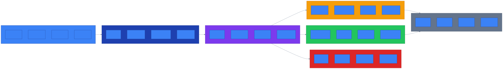
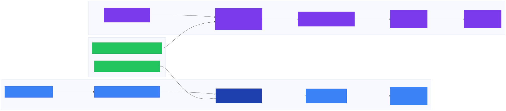

# CloudForge


## Enterprise Cloud Governance Platform with Self-Service Provisioning

CloudForge is a reference architecture and implementation for an Internal Developer Platform (IDP) that enables self-service cloud resource provisioning with built-in governance, compliance guardrails, and exception management workflows.

---

## [/] Implementation Status

> **Current State:** Active development (~96% complete). Core API functional, GRC integration working, remediation dispatcher operational, CI/CD pipeline hardened, IaC deploy layer with multi-cloud Terraform modules and policy-as-code, self-service portal built and deployed.

| Component | Status | Notes |
| --------- | ------ | ----- |
| **Core API** | | |
| HTTP handlers | Done | Full API surface implemented |
| Configuration | Done | Environment variables + custom YAML loader with env overrides |
| Health endpoints | Done | `/health`, `/ready`, `/live` |
| **GRC Integration** | | |
| Provider abstraction | Done | Interface + factory pattern |
| RSA Archer client | Done | Full workflow integration |
| ServiceNow GRC | Done | Native integration |
| PostgreSQL provider | Done | Lightweight option |
| In-Memory provider | Done | For testing |
| **Compliance** | | |
| Framework engine | Done | 20+ frameworks supported |
| Finding deduplication | Done | Cross-framework dedup |
| Control mapping | Done | Framework-to-control mapping |
| **AI Integration** | | |
| Provider abstraction | Done | Claude/OpenAI interface |
| Risk analysis | Done | AI-powered scoring |
| Remediation generation | Partial | Basic implementation |
| **AI Governance** | | |
| OPA engine (embedded) | Done | In-process OPA for agent tool/data-flow control |
| Agent registry | Done | Observability, status tracking, lifecycle |
| STRIDE/ATLAS threat models | Done | Structured threat modeling per agent type |
| Maturity assessment | Done | Governance maturity scoring |
| **Policy Engine** | | |
| OPA integration | Done | Policy evaluation working |
| Rego policies | Done | Region, cost, network policies |
| **Observability** | | |
| Structured logging (zap) | Done | JSON format |
| Prometheus metrics | Done | `/metrics` endpoint |
| OpenTelemetry tracing | Partial | Basic spans only |
| **Remediation Dispatcher** | | |
| Executor engine | Done | Concurrent batch execution with semaphore |
| Handler interface | Done | Remediate, Validate, DryRun, Tier |
| Network handlers | Done | BlockPublicSSH (SSH/RDP/SG finding types) |
| Security services | Done | GuardDuty enablement, Azure Defender (stub) |
| Storage handlers | Done | S3 public access block |
| Compute handlers | Done | IMDSv2 enforcement |
| Identity handlers | Done | IAM key rotation (Tier 2) |
| Secrets handlers | Done | Manual rotation guidance (no-op) |
| Patching handlers | Done | SSM patch compliance (query-only, Tier 3) |
| Rollback engine | Done | 48h rollback window, state snapshots |
| Findings bridge | Done | Temporary bridge to cspm-aggregator types |
| **Security** | | |
| Rate limiting | Done | Redis-backed, tier-based, wired into `/api/v1` routes |
| JWT authentication | Done | HS256/RS256 validation, JWKS caching, wired into router |
| OIDC provider integration | Interface Only | Okta/Entra ID providers exist, not wired into auth flow |
| Authorization (RBAC) | Done | CF Access groups, dev header override, RequireRole/RequireScope middleware |
| **IaC / Deploy** | | |
| Terraform modules (compute) | Done | Cloud Run + ECS Fargate + Azure Container Apps |
| Terraform modules (database) | Done | Cloud SQL + RDS + Azure PostgreSQL |
| Terraform modules (redis) | Done | Memorystore + ElastiCache + Azure Cache |
| Rego policies (IaC) | Done | 5 policies, 25 rules (security, cost, naming, network, AI) |
| Policy gate script | Done | `terraform plan` + `conftest` pipeline |
| Deploy Dockerfiles | Done | Multi-stage frontend (nginx) + backend (Go) |
| Environment configs | Done | Dev environment with GCS remote state |
| **Portal** | | |
| React SPA (frontend/) | Done | React 19 + Vite 7 + Tailwind CSS v4 + shadcn/ui |
| 21 route pages | Done | Admin, Operator, Requester role views + attack paths |
| Dark mode | Done | CSS variable overrides, anti-flash script |
| Cloudflare Pages deploy | Done | cloudforge-demo.lvonguyen.com |
| **Risk Intelligence** | | |
| Contextual risk schema | Done | AttackPathContext, ToxicComboDetails, MITRE fields |
| LLM severity re-scoring | Done | Claude-powered with blast radius + EPSS + KEV inputs |
| Severity normalization | Done | Per-CSP normalization (AWS ASFF, Azure, GCP) |
| Attack path computation | Done | In-memory BFS graph engine + ReactFlow DAG visualization (ADR-008) |
| EPSS scoring | Done | HTTP client with 12h cache, batch fetching from FIRST API |
| CISA KEV catalog | Done | In-memory catalog with auto-refresh from CISA feed |
| GreyNoise integration | Done | HTTP client with 12h cache, classification enrichment |
| **Testing** | | |
| Unit tests | Partial | 24+ test files, 400+ test functions incl. 36 handler tests (httptest) |
| Integration tests | 0% | |

---

## [!] Known Limitations

This is a **portfolio reference implementation**, not production software:

1. **Test Coverage Gap** - 24+ test files (400+ functions including handler tests) cover cspm, grc, remediation, ai, compliance; integration tests pending
2. **OIDC Provider Stub** - JWT auth middleware is production-ready (HS256/RS256, JWKS), but Okta/Entra ID providers not wired into auth flow
3. **Temporal Workflows** - Workflow definitions exist, orchestration not fully tested
4. **FinOps Module** - Cost aggregation interfaces only, no cloud API integration

**Production Requirements:**

- Expand test suites (handler-level unit tests + integration tests)
- Wire Okta/Entra ID providers into JWT auth flow
- Expand RBAC with fine-grained permissions
- Test and validate Temporal workflows

---

## [*] What This Solves

Enterprise cloud environments face a constant tension:

- **Developers** want fast, self-service access to infrastructure
- **Security** needs guardrails, approvals, and audit trails
- **Finance** requires cost controls, tagging, and chargeback
- **Compliance** demands policy enforcement and exception documentation

CloudForge bridges these needs with a unified platform that provides:

- Self-service portal for requesting cloud resources
- Policy-as-code guardrails (OPA/Rego)
- Golden path Terraform modules (pre-approved, versioned)
- Exception workflow integration with enterprise GRC tools
- Multi-cloud support (AWS, Azure, GCP)

---

## [/] Architecture




```mermaid
%%{init: {'theme': 'base', 'themeVariables': {'fontFamily': 'Georgia'}}}%%
flowchart LR
    subgraph Portal["[Portal] React 19/Vite 7"]
        style Portal fill:#3b82f6,stroke:#1e3a8a,color:#fff
        A1["App Registration"]
        A2["Infra Catalog"]
        A3["Exception Request"]
        A4["Dashboard"]
    end

    subgraph Orch["[Orchestration] Temporal"]
        style Orch fill:#f59e0b,stroke:#b45309,color:#fff
        B1["Registration"]
        B2["Approval"]
        B3["Provisioning"]
        B4["Compliance Scan"]
    end

    subgraph AI["[AI Governance] Embedded OPA"]
        style AI fill:#7c3aed,stroke:#4c1d95,color:#fff
        E1["Agent Registry"]
        E2["OPA Engine"]
        E3["STRIDE+ATLAS"]
        E4["Maturity"]
    end

    subgraph Policy["[Policy] OPA/Rego"]
        style Policy fill:#1e40af,stroke:#1e3a8a,color:#fff
        C1["Region"]
        C2["Cost"]
        C3["Network"]
        C4["Exception"]
    end

    subgraph Integrate["[Integration] External"]
        style Integrate fill:#22c55e,stroke:#166534,color:#fff
        D1["ServiceNow"]
        D2["Archer"]
        D3["Terraform"]
        D4["Cloud APIs"]
    end

    Portal --> Orch
    Orch --> Policy
    AI -.->|governs| Policy
    Policy --> Integrate
```

---

## [/] Repository Structure

```text
cloudforge/
├── cmd/
│   ├── server/                    # API server entrypoint
│   └── remediation-dispatcher/    # Remediation dispatcher service
├── internal/
│   ├── ai/                        # AI provider integration (Claude, OpenAI)
│   ├── ai-governance/             # AI governance module (OPA engine, agent registry, STRIDE/ATLAS)
│   ├── api/                       # API handlers and rate limiting
│   ├── cicd/                      # CI/CD security scanning
│   │   ├── sast/                  # SAST integrations (SonarQube, Checkov, Veracode)
│   │   └── vcs/                   # VCS integrations (GitHub, GitLab, Azure DevOps)
│   ├── compliance/                # Compliance frameworks and deduplication
│   ├── container/                 # Container security module
│   ├── findings/                  # Finding types (bridge to cspm-aggregator)
│   ├── finops/                    # FinOps cost management
│   │   ├── aggregator/            # Multi-cloud cost aggregation
│   │   ├── anomaly/               # Cost anomaly detection
│   │   ├── chargeback/            # Cost allocation engine
│   │   └── reporter/              # Showback/chargeback reports
│   ├── grc/                       # GRC provider abstraction (Archer, ServiceNow)
│   ├── identity/                  # Identity providers (Entra ID, Okta) + Zero Trust
│   ├── observability/             # Logging, metrics, tracing, health checks
│   ├── policy/                    # OPA integration
│   ├── remediation/               # Remediation domain handlers
│   │   ├── compute/               # EC2 IMDSv2 enforcement
│   │   ├── identity/              # IAM key rotation
│   │   ├── network/               # SSH/RDP ingress blocking
│   │   ├── patching/              # OS patch compliance (SSM)
│   │   ├── private_cloud/         # Private cloud remediation (planned)
│   │   ├── secrets/               # Exposed secret rotation guidance
│   │   ├── security_services/     # GuardDuty, Azure Defender
│   │   └── storage/               # S3 public access blocking
│   ├── waf/                       # WAF golden templates and compliance scanner
│   └── workflow/                  # Temporal workflow definitions
├── pkg/
│   └── remediation/               # Executor engine, Remediator interface, types
├── migrations/                    # Database migrations
├── deploy/
│   ├── terraform/
│   │   ├── modules/               # Multi-cloud Terraform modules
│   │   │   ├── compute/           # Cloud Run / ECS Fargate / Azure Container Apps
│   │   │   ├── database/          # Cloud SQL / RDS / Azure PostgreSQL
│   │   │   └── redis/             # Memorystore / ElastiCache / Azure Cache
│   │   ├── environments/          # Per-environment configs (dev, staging, prod)
│   │   └── policies/              # Rego policies for IaC validation (conftest)
│   ├── scripts/                   # plan-with-policy.sh, deploy.sh
│   └── docker/                    # Frontend (nginx) + Backend (Go) Dockerfiles
├── policies/                      # OPA/Rego runtime policies
├── configs/                       # Configuration templates
├── frontend/                      # Self-service portal (React 19 + Vite 7)
│   ├── src/
│   │   ├── pages/                 # 18 route pages (admin, ops, portal views)
│   │   ├── components/            # shadcn/ui component layer
│   │   ├── hooks/                 # Custom hooks (deploy preview, etc.)
│   │   ├── lib/                   # API client, auth, utilities
│   │   └── types/                 # TypeScript type definitions
│   └── public/                    # Static assets and logos
├── docs/
│   ├── architecture/              # HLD, DDD, data models
│   ├── diagrams/                  # Architecture diagrams (SVG)
│   ├── adr/                       # Architecture Decision Records
│   └── runbooks/                  # Operational procedures
└── Makefile                       # Build targets
```

---

## [+] Key Features

### Self-Service Portal

- Application registration with metadata capture
- Infrastructure request catalog (golden modules)
- Exception request workflow
- Compliance dashboards

### Policy-as-Code

- Region restrictions (data residency)
- Instance size limits (cost control)
- Network exposure rules (security)
- Tagging requirements (governance)
- Exception validation (GRC integration)

### GRC Integration

Pluggable providers for enterprise GRC platforms:

- **RSA Archer** - Full exception workflow integration
- **ServiceNow GRC** - Native ServiceNow integration
- **PostgreSQL** - Lightweight option for smaller orgs
- **In-Memory** - For demos and testing

### AI Intelligence

- Contextual risk scoring with business context
- Finding explanation generation
- Remediation runbook generation
- Request triage and routing

### AI Governance (Merged from AgentGuard)

- **Embedded OPA engine** — in-process Rego evaluation for AI agent tool and data-flow control (namespace: `cloudforge.ai.*`)
- **Agent registry** — lifecycle tracking, observability, status management across agent fleet
- **Threat modeling** — STRIDE + ATLAS threat models per registered agent type
- **Maturity assessment** — governance readiness scoring across 5 maturity dimensions
- **Dual-track OPA** — cloud provisioning path uses external OPA server; AI governance uses embedded Go library — complementary, not conflicting

### Infrastructure as Code (Deploy Layer)

- **Multi-cloud Terraform modules** — compute (Cloud Run / ECS Fargate / Azure Container Apps), database (Cloud SQL / RDS / Azure PostgreSQL), redis (Memorystore / ElastiCache / Azure Cache)
- **Policy-as-code gate** — 5 Rego policies (25 rules) validated via `conftest` against `terraform plan` JSON before any apply
- **Three-layer OPA governance** — (1) plan-time IaC validation, (2) runtime policy evaluation via external OPA server, (3) in-process embedded OPA for AI agent governance
- **Deploy scripts** — dry-run-by-default deployment with policy violation gate and human-readable remediation guidance
- **Container images** — multi-stage Dockerfiles for frontend (nginx + SPA routing) and backend (Go + healthcheck)



### Risk Intelligence

- **Contextual risk scoring** — LLM-powered severity re-scoring that considers asset tier, environment (prod/dev/sandbox), internet exposure, blast radius, and compensating controls
- **Severity normalization** — per-CSP normalization (AWS ASFF normalized scores, Azure severity labels, GCP attack exposure scores) into unified severity taxonomy
- **Threat intel enrichment** — EPSS scoring (FIRST API, 12h cache) and CISA KEV catalog (auto-refresh) integrated into risk pipeline; GreyNoise schema defined (client planned)
- **Attack path schema** — `AttackPathContext` with blast radius count, IAM escalation path, chokepoint detection, toxic combination flag (graph computation engine in roadmap)
- **MITRE ATT&CK mapping** — tactic and technique fields on findings for kill-chain context

### Multi-Cloud Support

- AWS (multiple Organizations, 2,400+ accounts)
- Azure (750+ Subscriptions)
- GCP (350+ Projects)
- Extensible provider pattern

### Automated Remediation

- **Tiered Execution**: Tier 1 (auto-safe), Tier 2 (requires verification), Tier 3 (change window)
- **10 Handlers**: GuardDuty, SSH/RDP blocking, S3 public access, IMDSv2, IAM key rotation, Azure Defender, secrets guidance, OS patching
- **Dry-Run Default**: All remediations preview actions before execution
- **48-Hour Rollback**: State snapshots for every remediation with automated rollback scripts
- **Concurrent Batch Execution**: Semaphore-controlled parallel processing

### FinOps Cost Management

- **Cost Aggregation**: Multi-cloud cost data from AWS Cost Explorer, Azure Cost Management, GCP Billing
- **Anomaly Detection**: ML-based spend anomaly alerting with configurable thresholds
- **Chargeback/Showback**: Tag-based cost allocation with automated reports
- **Budget Tracking**: Proactive budget alerts via Slack/PagerDuty
- **Optimization**: Resource rightsizing and savings recommendations

## [+] Tech Stack

| Component | Technology | Purpose |
| --------- | ---------- | ------- |
| API Server | [Go 1.25](https://go.dev/) | Core platform API |
| Portal | [React 19](https://react.dev/) / [Vite 7](https://vitejs.dev/) | Self-service SPA — Tailwind CSS v4, shadcn/ui, Cloudflare Pages |
| Workflows | [Temporal](https://temporal.io/) | Orchestration, approvals |
| Policies | [OPA / Rego](https://www.openpolicyagent.org/) | Guardrails, validation |
| IaC | [Terraform](https://www.terraform.io/) | Resource provisioning |
| Database | [PostgreSQL 16](https://www.postgresql.org/) | State, audit logs |
| Cache | [Redis](https://redis.io/) | Session, caching |
| AI | [Anthropic Claude](https://www.anthropic.com/) | Intelligence services |
| Identity | OIDC (Okta/Entra ID) | Authentication |
| Observability | [OpenTelemetry](https://opentelemetry.io/) | Tracing, metrics |

---

## [>] Quick Start

### Prerequisites

- Go 1.25+
- Docker & Docker Compose
- Terraform 1.5+
- OPA CLI

### Local Development

```bash
# Clone repository
git clone https://github.com/lvonguyen/cloudforge.git
cd cloudforge

# Start dependencies (Postgres, OPA, Temporal)
docker-compose up -d

# Run migrations
make migrate

# Start API server
make run

# Run tests
make test

# Start frontend dev server
cd frontend
npm install
npm run dev       # http://localhost:5173
```

### Configuration

```yaml
# configs/config.yaml
server:
  port: 8080

database:
  host: localhost
  port: 5432
  name: cloudforge

grc:
  provider: memory  # memory | postgres | archer | servicenow

policy:
  opa_url: http://localhost:8181

workflow:
  temporal_host: localhost:7233
```

---

## [/] Documentation

| Document | Description |
| -------- | ----------- |
| [High-Level Design](docs/architecture/HLD.md) | System architecture overview |
| [Detailed Design](docs/architecture/DDD.md) | ADRs, API specs, data models |
| [DR/BC Plan](docs/DR-BC.md) | Disaster recovery procedures |
| [Component Rationale](docs/architecture/component-rationale.md) | Build vs buy decisions |
| [Frontend Planning](docs/frontend-planning.md) | React/Vite UI — 18 screens, 3 role views, phased build plan |
| [IaC Planning](docs/iac-planning.md) | Terraform modules, Rego policies, deployment architecture |
| [Dual-OPA Architecture](docs/diagrams/dual-opa-architecture.svg) | Cloud provisioning OPA (HTTP) vs AI governance OPA (embedded) |
| [Attack Path Enhancements](docs/research/wiz-attack-path-enhancements.md) | Wiz-adjacent graph-based attack path analysis roadmap |
| [Compliance Deployment Models](docs/diagrams/compliance-deployment-models.svg) | Multi-cloud compliance topology |
| [Failover Sequence](docs/diagrams/failover-sequence.svg) | DR failover steps and timing |
| [Global Deployment](docs/diagrams/global-deployment-architecture.svg) | Multi-region deployment layout |
| [IaC Deploy Pipeline](docs/diagrams/iac-deploy-pipeline.svg) | Terraform/conftest CI/CD flow |
| [Remediation Dispatcher](docs/diagrams/remediation-dispatcher-flow.svg) | Automated remediation routing |
| [Risk Intelligence Pipeline](docs/diagrams/risk-intelligence-pipeline.svg) | Risk scoring data pipeline |

### Architecture Decision Records

| ADR | Decision |
| --- | -------- |
| [ADR-001](docs/adr/ADR-001-programming-language.md) | Programming Language (Go) |
| [ADR-002](docs/adr/ADR-002-database-selection.md) | Database Selection (PostgreSQL) |
| [ADR-003](docs/adr/ADR-003-caching-strategy.md) | Caching Strategy (Redis) |
| [ADR-004](docs/adr/ADR-004-ai-provider-selection.md) | AI Provider (Anthropic Claude) |
| [ADR-005](docs/adr/ADR-005-rate-limiting.md) | Rate Limiting Strategy |
| [ADR-006](docs/adr/ADR-006-authentication.md) | Authentication (OIDC) |
| [ADR-007](docs/adr/ADR-007-grc-integration.md) | GRC Integration Pattern |
| [ADR-008](docs/adr/ADR-008-attack-path-computation.md) | Attack Path Computation (BFS + ReactFlow) |

### Runbooks

| Runbook | Purpose |
| ------- | ------- |
| [01-deployment](docs/runbooks/01-deployment.md) | Deployment procedures |
| [02-incident-response](docs/runbooks/02-incident-response.md) | Incident handling |
| [03-dr-failover](docs/runbooks/03-dr-failover.md) | DR failover procedures |
| [04-performance](docs/runbooks/04-performance-troubleshooting.md) | Performance issues |
| [05-remediation-operations](docs/runbooks/05-remediation-operations.md) | Remediation operations |
| [06-policy-management](docs/runbooks/06-policy-management.md) | OPA policy management |

---

## [!] Security

- All API endpoints require authentication (OIDC via Entra ID/Okta)
- Service-to-service communication uses mTLS
- Secrets managed via HashiCorp Vault
- Audit logging for all provisioning actions
- RBAC with Zero Trust policy enforcement
- API rate limiting and throttling
- Container security scanning
- CI/CD pipeline security (SAST/DAST integration)

---

## [+] Observability

| Capability | Implementation |
| ---------- | -------------- |
| Logging | Structured JSON logging with zap |
| Metrics | Prometheus metrics at `/metrics` |
| Tracing | OpenTelemetry distributed tracing |
| Health | Kubernetes probes at `/health`, `/ready`, `/live` |
| Dashboards | Grafana dashboards included |

---

## [+] Compliance Frameworks

Built-in support for 20+ frameworks:

| Category | Frameworks |
| -------- | ---------- |
| **General** | CIS, NIST CSF, ISO 27001, PCI-DSS |
| **Cloud** | AWS Security Best Practice, GCP CIS, Azure MCSB |
| **Healthcare** | HIPAA, HITRUST |
| **Finance** | SOX, GLBA, FFIEC |
| **Government** | FedRAMP, CMMC, NIST 800-53/800-171 |
| **AI** | NIST AI RMF, ISO 42001 |
| **Automotive** | ISO 21434, UN ECE R155, TISAX |

---

## [/] Roadmap

### Phase 1: Core Platform (Complete)

- [x] Core API and HTTP handlers
- [x] GRC abstraction layer (Archer, ServiceNow, PostgreSQL)
- [x] OPA policy engine integration
- [x] AI-powered risk analysis (Claude/OpenAI)
- [x] Multi-cloud provider support patterns
- [x] Compliance framework engine (20+ frameworks)
- [x] Structured logging and Prometheus metrics

### Phase 2: Security, Remediation & AI Governance (In Progress)

- [x] Wire rate limiting to API routes
- [x] CI/CD pipeline with security scanning
- [x] Remediation dispatcher with 10 handlers across 8 domains
- [x] Tiered execution model (auto-safe / verify / change window)
- [x] 48-hour rollback state engine
- [x] Unit tests — 24 files, 369 functions (cspm, grc, remediation, ai, compliance)
- [x] AI governance module — embedded OPA engine, agent registry, STRIDE/ATLAS threat models
- [x] Security audit fixes (SEC-001 through SEC-012)
- [x] Architecture hardening — BOLA fix, N+1 queries, CI pinning
- [x] JWT authentication middleware (HS256/RS256, JWKS caching)
- [ ] Wire Okta/Entra ID providers into auth flow
- [ ] RBAC authorization middleware (role-based endpoint access)
- [ ] Handler-level unit tests (target: 80% coverage)
- [ ] Integration test suite
- [ ] Merge cspm-aggregator into monorepo

### Phase 3: IaC, Portal & Workflows

- [x] Multi-cloud Terraform modules (compute, database, redis)
- [x] Rego policy gate for IaC validation (5 policies, 25 rules)
- [x] Deploy scripts with dry-run-by-default and policy violation gate
- [x] Container Dockerfiles (frontend nginx + backend Go)
- [x] Self-service portal UI (React 19 / Vite 7 + shadcn/ui) — deployed to cloudforge-demo.lvonguyen.com
- [ ] Temporal workflow testing and validation
- [ ] Terraform networking module and staging/prod environments

### Phase 4: Risk Intelligence & Attack Path Analysis

- [x] Contextual severity validation engine (environment-aware re-scoring)
- [x] EPSS scoring integration (FIRST API, batch fetching, 12h cache)
- [x] CISA KEV catalog integration (auto-refresh, known exploit lookup)
- [ ] GreyNoise integration (API client for IP classification)
- [ ] Attack path computation engine (graph-based traversal)
- [ ] Toxic combination detection (multi-finding chain analysis)
- [ ] Blast radius computation (IAM + network reachability)
- [ ] False-severity edge case detection (package reachability, compensating controls)

### Phase 5: FinOps & Reporting

- [ ] Cloud cost API integration (AWS/Azure/GCP)
- [ ] Cost estimation integration
- [ ] Chargeback report generation
- [ ] Compliance reporting dashboard
- [ ] Budget alerting (Slack/PagerDuty)

---

## [/] Update History

| Date | Author | Change |
| ---- | ------ | ------ |
| 2026-03-04 | Liem Vo-Nguyen | Build and deploy self-service portal — React 19, Vite 7, 18 pages, 3 role views, dark mode, Cloudflare Pages |
| 2026-03-04 | Liem Vo-Nguyen | Documentation reorg — archive superseded docs, add diagram refs, fix stale README |
| 2026-02-27 | Liem Vo-Nguyen | Add IaC deploy layer — 3 TF modules, 5 Rego policies, scripts, Dockerfiles |
| 2026-02-27 | Liem Vo-Nguyen | Harden CI supply-chain: SHA-pin all third-party GH Actions |
| 2026-02-27 | Liem Vo-Nguyen | Add dual-OPA architecture diagram, regenerate architecture SVGs |
| 2026-02-27 | Liem Vo-Nguyen | Add Risk Intelligence section — attack path schema, contextual risk roadmap |
| 2026-02-27 | Liem Vo-Nguyen | Add frontend planning doc (18 screens, 3 roles, phased build) |
| 2026-02-27 | Liem Vo-Nguyen | Add IaC planning doc (Terraform modules, Rego policies, deploy arch) |
| 2026-02-26 | Liem Vo-Nguyen | Add AI governance module — embedded OPA engine, agent registry, STRIDE/ATLAS threat models (merged from AgentGuard) |
| 2026-02-26 | Liem Vo-Nguyen | Add MIT license |
| 2026-02-26 | Liem Vo-Nguyen | Architecture hardening — BOLA fix, N+1 queries, CI pinning, OPA cap |
| 2026-02-26 | Liem Vo-Nguyen | Apply security audit fixes SEC-001 through SEC-012 |
| 2026-02-11 | Liem Vo-Nguyen | Add remediation dispatcher with 10 handlers across 8 domains |
| 2026-02-11 | Liem Vo-Nguyen | Add executor engine with batch execution, dry-run, and rollback |
| 2026-02-11 | Liem Vo-Nguyen | Add findings bridge package (temporary, pending cspm-aggregator merge) |
| 2026-02-11 | Liem Vo-Nguyen | Add executor unit tests (14 cases) |
| 2026-01-15 | Liem Vo-Nguyen | Add FinOps cost management module (aggregator, anomaly, chargeback) |
| 2026-01-15 | Liem Vo-Nguyen | Add CI/CD security scanning (SAST, VCS integrations) |
| 2025-12-15 | Liem Vo-Nguyen | Initial platform: API server, GRC, compliance, policy engine, AI |

---

## [*] License

MIT License - See [LICENSE](LICENSE)

---

## [+] Contributing

Contributions welcome! Please read [CONTRIBUTING.md](CONTRIBUTING.md) first.

---

**Note:** This is a reference architecture and portfolio project demonstrating enterprise cloud governance patterns. Production deployments require additional hardening, testing, and customization for your organization's specific requirements.
