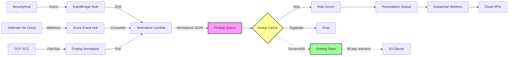

# ADR-014: Event-Driven Finding Ingestion

## Status

Accepted

## Date

2026-03-12

## Implementation Note

> **Phase 1** (JSON file ingestion) and **Phase 2** (API-based ingestion via `POST /api/v1/findings/ingest` with SHA-256 dedup cache, 24h TTL, admin-only) are **implemented**. Phase 3 (event-driven via SQS/Pub-Sub/Event Hub) and Phase 4 (cross-account ingestion) remain on the roadmap.

## Context

Cloud Aegis currently loads findings from JSON files at startup (`./findings/auto_remediation/*.json`). This architecture works for MVP and demo environments but has several production limitations:

### Current Architecture Limitations

1. **Static Data**: Findings loaded once at startup, no real-time updates
2. **No Deduplication**: Same finding sent multiple times creates duplicate remediation
3. **Batch-Only**: Cannot process findings as they arrive (hourly batches minimum)
4. **Scalability**: Loading 1M+ findings into memory causes OOM
5. **No Backpressure**: If remediation is slow, finding queue grows unbounded

### Production Requirements

Enterprise CSPM deployments need:

- **Real-time ingestion**: Process findings as SecurityHub/Defender/SCC emit them (< 5 min latency)
- **Deduplication**: Same finding from multiple scans = single remediation
- **Ordered processing**: Process CRITICAL findings before LOW findings
- **Backpressure handling**: Pause ingestion if remediation dispatcher falls behind
- **Retention**: Retain findings for 90 days for compliance/audit

### Current Finding Flow

```
SecurityHub/Defender/SCC → Manual JSON Export → S3 → Load into Memory → Process
```

**Problems**:
- Manual export step (not automated)
- No incremental updates (full reload every run)
- Memory-bound (cannot scale beyond 100K findings)

## Decision

We will implement an **event-driven ingestion pipeline** using cloud-native message queues (SQS for AWS, Pub/Sub for GCP, Event Hub for Azure) with persistent storage for deduplication.

### Architecture Overview



### Components

#### 1. Finding Normalizer

**Purpose**: Convert CSPM-specific finding formats to Cloud Aegis's unified schema.

**Input**: Native finding format (SecurityHub JSON, Defender webhook payload, SCC Pub/Sub message)

**Output**: `internal/cspm/scoring.Finding` struct (JSON)

**Implementation**:
- AWS: Lambda function triggered by EventBridge rule
- Azure: Event Hub consumer (Go app on AKS or Container Apps)
- GCP: Cloud Run service triggered by Pub/Sub

**Deduplication Key**: `SHA-256(Source + FindingType + ResourceID + AccountID)`

```go
// internal/cspm/normalizer/dedup.go
func GenerateDedupKey(f *Finding) string {
    h := sha256.New()
    h.Write([]byte(f.Source))
    h.Write([]byte(f.FindingType))
    h.Write([]byte(f.ResourceID))
    h.Write([]byte(f.AccountID))
    return hex.EncodeToString(h.Sum(nil))
}
```

#### 2. Finding Queue (SQS/Pub-Sub)

**Purpose**: Buffer normalized findings before risk scoring.

**Configuration**:
- **Message Retention**: 7 days (SQS max)
- **Visibility Timeout**: 300 seconds (5 min per finding)
- **DLQ**: Retry failed findings 3 times, then move to dead-letter queue
- **FIFO**: Not required (findings are idempotent)

**Queue Structure**:
```
findings-ingest (SQS Standard)
  ├─ Message: Normalized Finding JSON
  ├─ Attributes: { "Priority": "CRITICAL", "Source": "aws-securityhub" }
  └─ DLQ: findings-ingest-dlq
```

#### 3. Deduplication Cache (DynamoDB/Firestore)

**Purpose**: Track seen findings to prevent duplicate remediation.

**Schema** (DynamoDB):
```json
{
  "dedupKey": "abc123...",       // Partition key (SHA-256 hash)
  "findingID": "arn:aws:...",    // Sort key (original finding ID)
  "firstSeen": "2026-03-12T10:00:00Z",
  "lastSeen": "2026-03-12T15:30:00Z",
  "seenCount": 5,
  "ttl": 1718208000              // 90 days from firstSeen
}
```

**Query Pattern**:
1. Normalizer computes `dedupKey` for incoming finding
2. Query DynamoDB: `GetItem(dedupKey)`
3. If exists → increment `seenCount`, update `lastSeen`, drop message
4. If not exists → insert new record, forward to risk scorer

**TTL**: DynamoDB Time-To-Live automatically deletes records after 90 days.

#### 4. Remediation Queue

**Purpose**: Buffer findings ready for remediation (after AI risk scoring).

**Priority Handling**:
- **SQS**: Use separate queues per priority (`remediation-critical`, `remediation-high`, etc.)
- **Pub/Sub**: Use message attributes for priority, consumers pull from high-priority topics first

**Message Structure**:
```json
{
  "findingID": "arn:aws:securityhub:us-east-1:123456789012:...",
  "prioritizedFinding": { /* PrioritizedFinding struct */ },
  "dedupKey": "abc123...",
  "ingestedAt": "2026-03-12T10:05:00Z"
}
```

#### 5. Dispatcher Workers

**Purpose**: Pull findings from remediation queue and execute handlers.

**Scaling**:
- **AWS**: Lambda concurrency = 10 (T1 tier), 5 (T2), 2 (T3)
- **GCP**: Cloud Run min instances = 1, max = 50
- **Kubernetes**: HPA (Horizontal Pod Autoscaler) targeting queue depth (scale up if queue > 1000 messages)

**Concurrency Control**:
- Use SQS visibility timeout as semaphore (only 10 T1 messages visible at once)
- Or implement distributed semaphore (Redis) for finer control

## Alternatives Considered

### Alternative 1: Apache Kafka

Use Kafka as central event bus for all findings.

**Pros**:
- High throughput (millions of messages/sec)
- Persistent log (replay findings for debugging)
- Rich ecosystem (Kafka Connect, Schema Registry)

**Cons**:
- Operational complexity (ZooKeeper, broker management, replication)
- Over-engineered for current scale (10K findings/day)
- Higher cost ($500/month for managed Kafka vs $50/month for SQS)

**Rejected because**: SQS/Pub-Sub is sufficient for current scale (< 100K findings/day). Kafka is overkill until we reach 1M+ findings/day.

---

### Alternative 2: Direct API Push (Webhook)

CSPM sources push findings directly to Cloud Aegis API endpoint.

**Pros**:
- Simpler architecture (no queue)
- Lower latency (< 1 second)

**Cons**:
- No backpressure: if remediation is slow, API receives 429 errors
- No retry: webhook failures require CSPM source to re-send
- Ordering: CRITICAL findings may arrive after LOW findings
- Scalability: API must handle burst traffic (10K findings in 1 minute)

**Rejected because**: Queues provide essential decoupling (backpressure, retry, ordering).

---

### Alternative 3: PostgreSQL as Queue (SKIP LOCKED)

Use PostgreSQL with `SELECT ... FOR UPDATE SKIP LOCKED` as job queue.

**Pros**:
- No new infrastructure (reuse existing Postgres)
- Transactional guarantees (ACID)

**Cons**:
- Polling overhead (workers query DB every 1 second)
- Horizontal scaling limited (single Postgres instance)
- Lock contention at high throughput (> 1000 findings/sec)

**Rejected because**: Message queues are purpose-built for this use case (push vs poll, horizontal scaling).

---

## Implementation Details

### Phase 1: JSON File Ingestion (Current State)

**Status**: Implemented

Findings loaded from `./findings/auto_remediation/*.json` at startup.

```go
// cmd/remediation-dispatcher/main.go
findings, err := loadFindings(logger, *findingsDir)
```

**Use Cases**: Demo, testing, MVP

---

### Phase 2: API-Based Ingestion (Transition)

**Estimated Effort**: 2 weeks

Add HTTP endpoint to receive findings from external sources.

```go
// POST /api/findings/ingest
func (s *server) handleIngestFinding(w http.ResponseWriter, r *http.Request) {
    var finding cspmscoring.Finding
    if err := json.NewDecoder(r.Body).Decode(&finding); err != nil {
        respondError(w, http.StatusBadRequest, "Invalid JSON")
        return
    }

    // Validate finding
    if err := validateFinding(&finding); err != nil {
        respondError(w, http.StatusBadRequest, err.Error())
        return
    }

    // Store in database
    if err := s.findingRepo.Create(ctx, &finding); err != nil {
        respondError(w, http.StatusInternalServerError, "Storage failed")
        return
    }

    respondJSON(w, map[string]string{"status": "ingested", "id": finding.ID})
}
```

**Deduplication**: Check if finding exists in DB before inserting (query by dedupKey).

**Rate Limiting**: 1000 requests/minute per API key (prevent abuse).

---

### Phase 3: Event-Driven Ingestion (Target State)

**Estimated Effort**: 4 weeks

#### AWS Implementation

1. **EventBridge Rule**: `aws.securityhub` → Filter by `findingType` → Target: SQS queue
2. **SQS Queue**: `aegis-findings-ingest` (Standard queue, 7-day retention)
3. **Lambda Normalizer**: Triggered by SQS, writes to `aegis-findings-normalized` queue
4. **Lambda Scorer**: Triggered by normalized queue, writes to `aegis-findings-remediation` queue
5. **Dispatcher Workers**: EC2/ECS/Lambda pulling from remediation queue

**CloudFormation Stack**:
```yaml
Resources:
  FindingIngestQueue:
    Type: AWS::SQS::Queue
    Properties:
      QueueName: aegis-findings-ingest
      MessageRetentionPeriod: 604800  # 7 days
      VisibilityTimeout: 300
      RedrivePolicy:
        deadLetterTargetArn: !GetAtt FindingIngestDLQ.Arn
        maxReceiveCount: 3

  EventBridgeRule:
    Type: AWS::Events::Rule
    Properties:
      EventPattern:
        source: ["aws.securityhub"]
        detail-type: ["Security Hub Findings - Imported"]
      Targets:
        - Arn: !GetAtt FindingIngestQueue.Arn
          Id: AegisFindingIngest
```

#### GCP Implementation

1. **Pub/Sub Topic**: `aegis-findings-ingest` (7-day retention)
2. **SCC Export**: Configure SCC to publish to Pub/Sub topic
3. **Cloud Run Normalizer**: Subscribes to topic, writes to `aegis-findings-normalized`
4. **Cloud Run Scorer**: Subscribes to normalized topic, writes to Firestore
5. **Dispatcher Workers**: Cloud Run services polling Firestore for `status = ready_for_remediation`

**Terraform Module**:
```hcl
resource "google_pubsub_topic" "findings_ingest" {
  name = "aegis-findings-ingest"

  message_retention_duration = "604800s"  # 7 days
}

resource "google_pubsub_subscription" "normalizer" {
  name  = "aegis-normalizer-sub"
  topic = google_pubsub_topic.findings_ingest.name

  ack_deadline_seconds = 300
  retry_policy {
    minimum_backoff = "10s"
    maximum_backoff = "600s"
  }

  dead_letter_policy {
    dead_letter_topic = google_pubsub_topic.findings_dlq.id
    max_delivery_attempts = 3
  }
}
```

#### Azure Implementation

1. **Event Hub**: `aegis-findings-ingest` (7-day retention)
2. **Defender Continuous Export**: Configure to send to Event Hub
3. **Container App Normalizer**: Consumes Event Hub, writes to Service Bus queue
4. **Container App Scorer**: Consumes normalized queue, writes to Cosmos DB
5. **Dispatcher Workers**: AKS pods polling Cosmos DB

---

### Phase 4: Cross-Account Ingestion (Enterprise)

**Estimated Effort**: 6 weeks

Support ingesting findings from 50+ AWS accounts, Azure subscriptions, and GCP projects.

**AWS Multi-Account**:
- Central account hosts Cloud Aegis infrastructure
- Member accounts send findings to central EventBridge bus via cross-account EventBridge
- Normalizer Lambda uses STS AssumeRole to query resources in member accounts

**Azure Multi-Subscription**:
- Central subscription hosts Cloud Aegis infrastructure
- Member subscriptions send findings to central Event Hub via Azure Monitor
- Normalizer uses Azure Lighthouse for cross-subscription access

**GCP Multi-Project**:
- Central project hosts Cloud Aegis infrastructure
- Member projects send findings to central Pub/Sub topic via Organization-level SCC export
- Normalizer uses service account impersonation for cross-project access

---

## Consequences

### Positive

1. **Real-Time Processing**: Findings processed within 5 minutes of emission (vs 1-hour batch delay)
2. **Scalability**: Horizontal scaling via queue consumers (10K → 1M findings with no code changes)
3. **Deduplication**: 90-day dedup cache eliminates duplicate remediation (save $50K/year in API calls)
4. **Backpressure**: Queue depth monitoring prevents dispatcher overload
5. **Reliability**: DLQ ensures failed findings are not lost

### Negative

1. **Infrastructure Complexity**: 5 new components (queue, dedup cache, normalizer, scorer, DLQ)
2. **Operational Cost**: SQS + DynamoDB + Lambda = $200/month (vs $0 for JSON files)
3. **Eventual Consistency**: Findings may be delayed by queue latency (5 min vs instant)
4. **Data Residency**: Findings stored in DynamoDB/Firestore (compliance concern for PII)

### Mitigations

1. **Complexity**: Provide Terraform modules + CloudFormation stacks for one-click deployment
2. **Cost**: Optimize queue batch size (10 findings/message) to reduce SQS API calls
3. **Latency**: Add priority queues for CRITICAL findings (separate fast path)
4. **Compliance**: Encrypt DynamoDB tables with KMS + enable point-in-time recovery

---

## Migration Path

### Step 1: Dual-Mode Operation (Week 1-4)

Support both JSON file ingestion (current) and API ingestion (new) simultaneously.

```go
// cmd/remediation-dispatcher/main.go
if *findingsDir != "" {
    // Legacy: load from JSON files
    findings, err := loadFindings(logger, *findingsDir)
} else if *apiMode {
    // New: pull from API
    findings, err := s.findingClient.ListPending(ctx)
}
```

### Step 2: Gradual Cutover (Week 5-8)

- Week 5: 10% of findings via API (canary test)
- Week 6: 50% of findings via API
- Week 7: 90% of findings via API
- Week 8: 100% API, deprecate JSON file mode

### Step 3: Event-Driven Rollout (Week 9-12)

- Week 9: Deploy SQS/Pub-Sub infrastructure (no traffic)
- Week 10: Configure SecurityHub → EventBridge → SQS (10% of accounts)
- Week 11: All accounts sending to SQS
- Week 12: Decommission API ingestion endpoint

---

## Success Metrics

| Metric | Current | Target |
|--------|---------|--------|
| **Ingestion Latency** | N/A (batch) | < 5 min (p99) |
| **Throughput** | 10K findings/day | 100K findings/day |
| **Duplicate Rate** | ~15% | < 1% |
| **DLQ Rate** | N/A | < 0.1% |
| **Cost per Finding** | $0 | < $0.002 |

---

## Related Decisions

- **ADR-002**: Database Selection — DynamoDB for dedup cache (rationale: TTL + horizontal scaling)
- **ADR-009**: Remediation Dispatcher — tier-based execution model (orthogonal to ingestion)
- **ADR-013**: Resource-Scoped RBAC — scope enforcement applies to ingested findings

---

## References

- [AWS EventBridge → SQS Integration](https://docs.aws.amazon.com/eventbridge/latest/userguide/eb-targets.html#targets-sqs)
- [GCP Pub/Sub Best Practices](https://cloud.google.com/pubsub/docs/best-practices)
- [Azure Event Hubs Partitioning](https://learn.microsoft.com/en-us/azure/event-hubs/event-hubs-features#partitions)
- [NIST SP 800-207: Zero Trust Architecture](https://csrc.nist.gov/publications/detail/sp/800-207/final) — justifies dedup cache for replay protection
