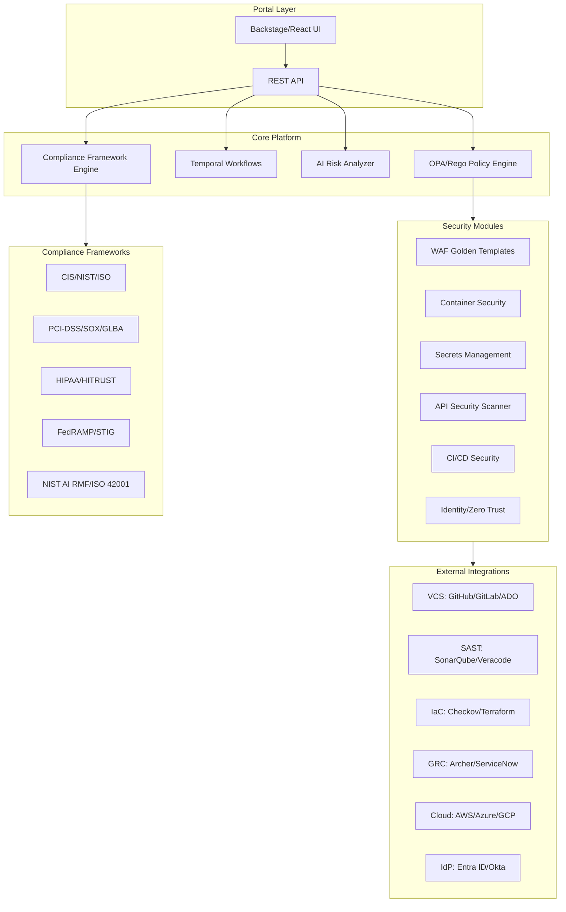
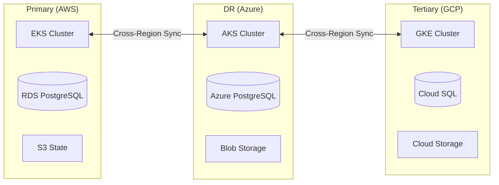

# High-Level Design: CloudForge Enterprise Cloud Governance Platform

| Property | Value |
| --- | --- |
| Version | 2.0 |
| Author | Liem Vo-Nguyen |
| Date | January 2026 |
| Status | Active |
| LinkedIn | [linkedin.com/in/liemvonguyen](https://linkedin.com/in/liemvonguyen) |

### Related Documents

| Document | Description |
|----------|-------------|
| [Detailed Design Document (DDD)](./DDD.md) | Implementation-level technical specifications |
| [Component Rationale](./component-rationale.md) | Technology selection with cost analysis |
| [DR/BC Plan](../DR-BC.md) | Disaster Recovery and Business Continuity |
| [Pitch Deck](../pitch-deck.md) | Executive presentation |

---

## 1. Executive Summary

CloudForge is an Enterprise Cloud Governance Platform that provides:
- Self-service cloud resource provisioning with built-in governance guardrails
- Multi-framework compliance mapping (CIS, NIST, ISO, PCI-DSS, HIPAA, etc.)
- AI-powered risk analysis and toxic combination detection
- CI/CD security scanning integration (SonarQube, Checkov, Veracode)
- VCS integration (GitHub, GitLab, Azure DevOps)
- Identity and Zero Trust policy enforcement (Entra ID, Okta)

### 1.1 Business Drivers

- Enable self-service infrastructure provisioning without bypassing security controls
- Enforce policy-as-code guardrails across multi-cloud environments (AWS, Azure, GCP)
- Integrate with enterprise GRC tools (RSA Archer, ServiceNow) for exception management
- Provide comprehensive compliance mapping across 20+ frameworks
- AI-powered contextual risk scoring beyond static severity
- CI/CD pipeline security with SAST/DAST/IaC scanning

---

## 2. Architecture Overview

### 2.1 Component Summary

| Component | Purpose | Technology |
| --- | --- | --- |
| Portal Layer | Self-service UI for requests and dashboards | Backstage / React |
| Orchestration Engine | Workflow management for approvals and provisioning | Temporal |
| Policy Engine | Evaluate requests against governance rules | OPA / Rego |
| AI Risk Analyzer | Contextual risk scoring, toxic combo detection | Claude Opus 4.5 / GPT-4 |
| Compliance Engine | Multi-framework compliance mapping and assessment | Go |
| WAF Module | Golden templates and compliance scanning | Go |
| Container Security | Image scanning, runtime security | Go + Trivy |
| Secrets Management | Multi-cloud secrets with rotation | Go |
| API Security | OpenAPI analysis, vulnerability detection | Go |
| CI/CD Security | Pipeline and dependency scanning | Go |
| Identity Module | Zero Trust policy enforcement, RBAC | Go |
| VCS Integration | GitHub/GitLab/Azure DevOps APIs | Go |
| SAST Integration | SonarQube, Veracode, Checkov | Go |
| GRC Integration | Archer, ServiceNow ticketing | Go |

---

## 3. Compliance Framework Engine

### 3.1 Supported Frameworks

| Sector | Frameworks |
| --- | --- |
| General | CIS Benchmarks v8, NIST CSF 2.0, ISO 27001:2022, ISO 27017 |
| Cloud | AWS Security Best Practices, GCP CIS v2, Azure MCSB |
| Healthcare | HIPAA Security Rule, HITRUST CSF v11 |
| Finance | PCI-DSS 4.0, SOX ITGC, GLBA Safeguards Rule, FFIEC |
| Government | NIST 800-53 Rev 5, FedRAMP, DISA STIGs |
| AI/ML | NIST AI RMF 1.0, ISO 42001:2023 |

### 3.2 Finding Schema

Comprehensive finding schema including:

| Field Category | Key Fields |
| --- | --- |
| Identification | ID, Source, Type, Title, Description |
| Resource | ResourceType, ResourceID, Platform, CloudProvider, Region |
| On-Prem | Hostname, SerialNumber, IPAddress, AssetTag |
| Environment | EnvironmentType (prod/non-prod), AccountID, VPC |
| Severity | StaticSeverity, AIRiskScore, AIRiskLevel, CVSS, EPSS |
| Vulnerability | CVEs (with hyperlinks), CWEs, ExploitAvailable |
| Compliance | ComplianceMappings (framework, control, section, URL) |
| Ownership | TechnicalContact, ServiceName, LineOfBusiness, Team |
| Workflow | Status, FalsePositive, TicketID, DueDate, SLABreachDate |
| Deduplication | DeduplicationKey, CanonicalRuleID, RelatedRules |

### 3.3 AI-Powered Analysis

- **Contextual Risk Scoring**: Environment, exploitability, blast radius
- **Toxic Combination Detection**: Identifies high-risk finding combinations
- **Misconfiguration Analysis**: Root cause, impact, remediation steps
- **Vulnerability Analysis**: Exploit likelihood, attack surface, priority

### 3.4 Deduplication Logic

When a finding is captured by multiple rules:
1. Generate deduplication key from resource + rule + finding details
2. Map rule to canonical rule using equivalence mappings
3. Keep most specific/relevant rule based on priority hierarchy
4. Link related rules as references

---

## 4. CI/CD Security Module

### 4.1 VCS Providers

| Provider | Features |
| --- | --- |
| GitHub/GitHub Enterprise | Repos, PRs, Actions, Dependabot alerts, Check runs |
| GitLab | Projects, MRs, Pipelines, Vulnerability findings |
| Azure DevOps | Repos, PRs, Pipelines, Advanced Security alerts |

### 4.2 SAST/DAST Tools

| Tool | Type | Integration |
| --- | --- | --- |
| SonarQube/SonarCloud | SAST | API-based project/issue retrieval |
| Checkov | IaC | CLI execution with JSON parsing |
| Veracode | SAST/DAST | HMAC-authenticated API |

---

## 5. Identity and Zero Trust Module

### 5.1 Identity Providers

| Provider | Capabilities |
| --- | --- |
| Microsoft Entra ID | User/Group management, Risk scoring, PIM integration |
| Okta | User/Group management, Role assignment |

### 5.2 Zero Trust Policies

- Block high-risk sign-ins
- Require MFA for sensitive operations
- Device compliance verification
- Contextual access decisions

---

## 6. Deployment Architecture

### 6.1 Multi-Cloud Support

### 6.2 High Availability

- Active-Active across 2+ regions
- Database replication with automatic failover
- State synchronization via distributed consensus
- < 1 minute RTO for compute failures

---

## 7. Security Considerations

### 7.1 Authentication & Authorization

- OIDC/WIF for cloud provider access
- Mutual TLS for service-to-service
- RBAC with least privilege
- API keys rotated via secrets management

### 7.2 Data Protection

- Encryption at rest (AES-256)
- Encryption in transit (TLS 1.3)
- Secrets in cloud-native vaults (AWS Secrets Manager, Azure Key Vault, GCP Secret Manager)

---

## 8. Monitoring & Observability

| Component | Tool |
| --- | --- |
| Metrics | Prometheus + Grafana |
| Logging | Structured JSON (zap) to ELK/Splunk |
| Tracing | OpenTelemetry |
| Alerting | PagerDuty/Opsgenie integration |

---

## 9. API Reference

### 9.1 Core Endpoints

| Endpoint | Method | Description |
| --- | --- | --- |
| /api/v1/findings | GET/POST | List/create findings |
| /api/v1/findings/{id}/compliance | GET | Get compliance mappings |
| /api/v1/findings/{id}/risk | GET | Get AI risk assessment |
| /api/v1/compliance/frameworks | GET | List available frameworks |
| /api/v1/compliance/frameworks/{id}/controls | GET | List framework controls |
| /api/v1/cicd/scan | POST | Trigger CI/CD security scan |
| /api/v1/identity/evaluate | POST | Evaluate Zero Trust policy |

---

## Appendix A: Technology Stack

| Category | Technology |
| --- | --- |
| Language | Go 1.22 |
| API Framework | Chi / Gin |
| Database | PostgreSQL 16 |
| Cache | Redis |
| Orchestration | Temporal |
| Policy Engine | OPA / Rego |
| AI | Anthropic Claude Opus 4.5, OpenAI GPT-4 |
| IaC | Terraform |
| Container Runtime | Kubernetes (EKS/AKS/GKE) |

---

## Appendix B: Diagram Formats

**Note on LucidChart Import**: Mermaid diagrams are rendered as static images when imported to LucidChart. For editable diagrams:

1. **Recommended**: Create directly in LucidChart or use draw.io
2. **Export**: Use draw.io XML format for cross-platform compatibility
3. **Alternative**: Use PlantUML with LucidChart import extension

Architecture diagrams in this document use Mermaid for GitHub rendering and can be recreated in LucidChart for presentation purposes.
