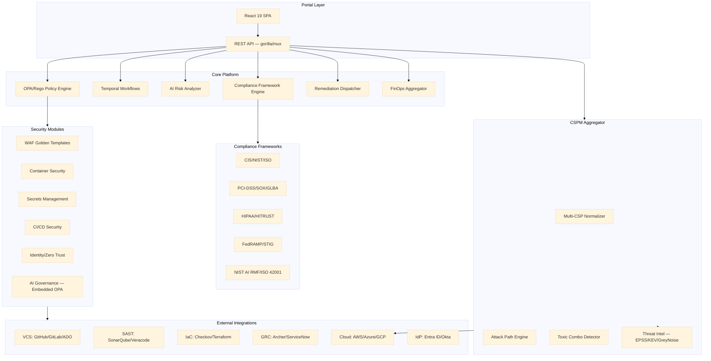
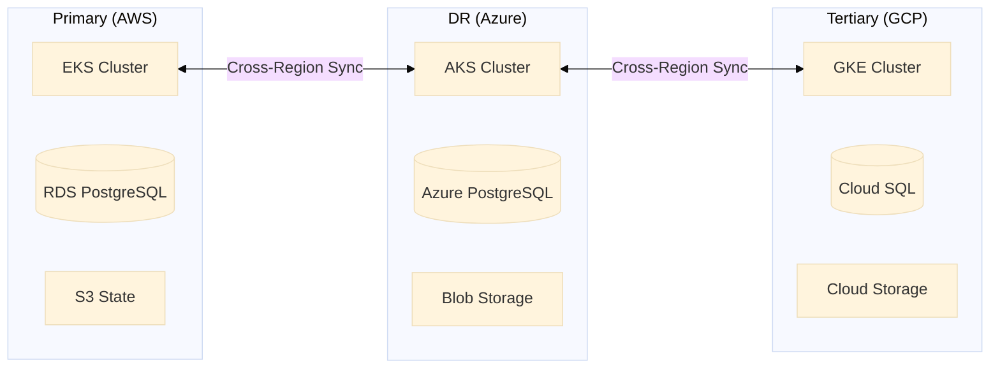

# High-Level Design: CloudForge Enterprise Cloud Governance Platform

| Property | Value |
| --- | --- |
| Version | 3.0 |
| Author | Liem Vo-Nguyen |
| Date | March 2026 |
| Status | Active |
| LinkedIn | [linkedin.com/in/liemvonguyen](https://linkedin.com/in/liemvonguyen) |

### Related Documents

| Document | Description |
|----------|-------------|
| [Detailed Design Document (DDD)](./DDD.md) | Implementation-level technical specifications |
| [Component Rationale](./component-rationale.md) | Technology selection with cost analysis |
| [DR/BC Plan](../DR-BC.md) | Disaster Recovery and Business Continuity |
| [Pitch Deck](../pitch-deck.md) | Executive presentation |
| [ADRs](../adr/) | Architecture Decision Records (ADR-001 through ADR-014) |
| [Runbooks](../runbooks/README.md) | Operational procedures (9 runbooks) |

---

## 1. Executive Summary

CloudForge is an Enterprise Cloud Governance Platform that provides:
- Self-service cloud resource provisioning with built-in governance guardrails
- Cloud Security Posture Management (CSPM) with multi-cloud aggregation
- Multi-framework compliance mapping (CIS, NIST, ISO, PCI-DSS, HIPAA, etc.)
- AI-powered risk analysis and toxic combination detection
- Attack path computation and visualization
- Automated remediation with rollback capabilities
- CI/CD security scanning integration (SonarQube, Checkov, Veracode)
- VCS integration (GitHub, GitLab, Azure DevOps)
- Identity and Zero Trust policy enforcement (Entra ID, Okta)
- FinOps cost management with budget alerting
- AI governance with embedded OPA policy engine

### 1.1 Business Drivers

- Enable self-service infrastructure provisioning without bypassing security controls
- Enforce policy-as-code guardrails across multi-cloud environments (AWS, Azure, GCP)
- Integrate with enterprise GRC tools (RSA Archer, ServiceNow) for exception management
- Provide comprehensive compliance mapping across 20+ frameworks
- AI-powered contextual risk scoring beyond static severity
- CI/CD pipeline security with SAST/DAST/IaC scanning
- Reduce mean time to remediation through automated security fixes
- Control cloud costs with multi-cloud FinOps aggregation and budget alerting

---

## 2. Architecture Overview

```mermaid
%%{init: {'theme': 'base', 'themeVariables': {'fontFamily': 'Georgia'}}}%%
flowchart TB
    subgraph Portal["Portal Layer"]
        UI[React 19 SPA]
        API[REST API — gorilla/mux]
    end

    subgraph Core["Core Platform"]
        PolicyEngine[OPA/Rego Policy Engine]
        Orchestration[Temporal Workflows]
        AIAnalyzer[AI Risk Analyzer]
        ComplianceEngine[Compliance Framework Engine]
        RemediationEngine[Remediation Dispatcher]
        FinOpsEngine[FinOps Aggregator]
    end

    subgraph CSPM["CSPM Aggregator"]
        Normalizer[Multi-CSP Normalizer]
        AttackPath[Attack Path Engine]
        ToxicCombo[Toxic Combo Detector]
        ThreatIntel[Threat Intel — EPSS/KEV/GreyNoise]
    end

    subgraph Security["Security Modules"]
        WAF[WAF Golden Templates]
        Container[Container Security]
        Secrets[Secrets Management]
        CICD[CI/CD Security]
        Identity[Identity/Zero Trust]
        AIGov[AI Governance — Embedded OPA]
    end

    subgraph Integrations["External Integrations"]
        VCS[VCS: GitHub/GitLab/ADO]
        SAST[SAST: SonarQube/Veracode]
        IaC[IaC: Checkov/Terraform]
        GRC[GRC: Archer/ServiceNow]
        Cloud[Cloud: AWS/Azure/GCP]
        IdP[IdP: Entra ID/Okta]
    end

    subgraph Compliance["Compliance Frameworks"]
        General[CIS/NIST/ISO]
        Finance[PCI-DSS/SOX/GLBA]
        Health[HIPAA/HITRUST]
        Gov[FedRAMP/STIG]
        AI[NIST AI RMF/ISO 42001]
    end

    UI --> API
    API --> PolicyEngine
    API --> Orchestration
    API --> AIAnalyzer
    API --> ComplianceEngine
    API --> RemediationEngine
    API --> FinOpsEngine
    API --> CSPM

    PolicyEngine --> Security
    ComplianceEngine --> Compliance
    Security --> Integrations
    CSPM --> Cloud
    CSPM --> ThreatIntel
```

### 2.1 Component Summary

| Component | Purpose | Technology |
| --- | --- | --- |
| Portal Layer | Self-service UI for requests and dashboards | React 19 / Vite 7 / Tailwind CSS v4 / shadcn/ui |
| REST API | HTTP API server with RBAC and rate limiting | Go 1.25 / gorilla/mux |
| Orchestration Engine | Workflow management for approvals and provisioning | Temporal |
| Policy Engine | Evaluate requests against governance rules (dual-OPA) | OPA / Rego (external server + embedded Go library) |
| AI Risk Analyzer | Contextual risk scoring, toxic combo detection | Claude Opus 4.6 / GPT-4 |
| Compliance Engine | Multi-framework compliance mapping and assessment | Go |
| CSPM Aggregator | Multi-cloud finding normalization and enrichment | Go (AWS/Azure/GCP SDK clients) |
| Attack Path Engine | In-memory BFS graph computation | Go + ReactFlow (frontend) |
| Toxic Combo Detector | 4-pattern toxic combination detection | Go |
| Threat Intelligence | EPSS, CISA KEV, GreyNoise enrichment | Go (HTTP clients with caching) |
| Remediation Dispatcher | Automated security fix execution with rollback | Go (10 handlers, 8 domains, 3 tiers) |
| FinOps Aggregator | Multi-cloud cost aggregation and budget alerting | Go (AWS/Azure/GCP cost APIs) |
| WAF Module | Golden templates and compliance scanning | Go |
| Container Security | Image scanning, admission control | Go |
| Secrets Management | Multi-cloud secrets with rotation lifecycle | Go |
| CI/CD Security | Pipeline and dependency scanning | Go |
| Identity Module | Zero Trust policy enforcement, RBAC | Go (Okta/Entra ID) |
| AI Governance | Embedded OPA for AI agent tool/data-flow control | Go + OPA library |
| VCS Integration | GitHub/GitLab/Azure DevOps APIs | Go |
| SAST Integration | SonarQube, Veracode, Checkov | Go |
| GRC Integration | Archer, ServiceNow ticketing | Go (provider pattern) |

---

## 3. Compliance Framework Engine

### 3.1 Supported Frameworks

| Sector | Frameworks |
| --- | --- |
| General | CIS Benchmarks v8, NIST CSF 2.0, ISO 27001:2022, ISO 27017 |
| Cloud | AWS Security Best Practices, GCP CIS v2, Azure MCSB |
| Healthcare | HIPAA Security Rule, HITRUST CSF v11 |
| Finance | PCI-DSS 4.0, SOX ITGC, GLBA Safeguards Rule, FFIEC |
| Government | NIST 800-53 Rev 5, FedRAMP, DISA STIGs, CMMC |
| AI/ML | NIST AI RMF 1.0, ISO 42001:2023 |
| Automotive | ISO 21434, UN ECE R155, TISAX |

### 3.2 Finding Schema

Comprehensive finding schema including:

| Field Category | Key Fields |
| --- | --- |
| Identification | ID, Source, Type, Title, Description |
| Resource | ResourceType, ResourceID, Platform, CloudProvider, Region |
| On-Prem | Hostname, SerialNumber, IPAddress, AssetTag |
| Environment | EnvironmentType (prod/non-prod), AccountID, VPC |
| Severity | StaticSeverity, AIRiskScore, AIRiskLevel, CVSS, EPSS |
| Vulnerability | CVEs (with hyperlinks), CWEs, ExploitAvailable |
| Compliance | ComplianceMappings (framework, control, section, URL) |
| Ownership | TechnicalContact, ServiceName, LineOfBusiness, Team |
| Workflow | Status, FalsePositive, TicketID, DueDate, SLABreachDate |
| Deduplication | DeduplicationKey, CanonicalRuleID, RelatedRules |
| Attack Path | AttackPathContext, BlastRadius, ToxicComboFlag, MITRETactic |

### 3.3 AI-Powered Analysis

- **Contextual Risk Scoring**: Environment, exploitability, blast radius
- **Toxic Combination Detection**: 4 patterns (public storage, IAM+noMFA, internet+CVE, SG+DB)
- **Misconfiguration Analysis**: Root cause, impact, remediation steps
- **Vulnerability Analysis**: Exploit likelihood, attack surface, priority
- **Blast Radius Computation**: Account/VPC/transit reachability analysis
- **False Positive/Negative Detection**: 3 FP suppression + 3 FN escalation rules

### 3.4 Deduplication Logic

When a finding is captured by multiple rules:
1. Generate deduplication key from resource + rule + finding details
2. Map rule to canonical rule using equivalence mappings
3. Keep most specific/relevant rule based on priority hierarchy
4. Link related rules as references

---

## 4. CI/CD Security Module

### 4.1 VCS Providers

| Provider | Features |
| --- | --- |
| GitHub/GitHub Enterprise | Repos, PRs, Actions, Dependabot alerts, Check runs |
| GitLab | Projects, MRs, Pipelines, Vulnerability findings |
| Azure DevOps | Repos, PRs, Pipelines, Advanced Security alerts |

### 4.2 SAST/DAST Tools

| Tool | Type | Integration |
| --- | --- | --- |
| SonarQube/SonarCloud | SAST | API-based project/issue retrieval |
| Checkov | IaC | CLI execution with JSON parsing |
| Veracode | SAST/DAST | HMAC-authenticated API |

---

## 5. Identity and Zero Trust Module

### 5.1 Identity Providers

| Provider | Capabilities |
| --- | --- |
| Microsoft Entra ID | User/Group management, Risk scoring, PIM integration |
| Okta | User/Group management, Role assignment |

### 5.2 RBAC Model

Four backend roles enforce API access control:

| Role | Description | Scope |
| --- | --- | --- |
| Admin | Tenant administrator | Full access: all endpoints, user management, audit log |
| Operator | SecOps team | Read/update: findings, remediations, compliance, exceptions |
| Requester | End user | Read + submit: own exceptions, catalog browsing |
| Viewer | Read-only observer (rank 0) | GET only: /findings, /compliance/frameworks, /agents + traces |

See [ADR-006](../adr/ADR-006-authentication.md) for the full RBAC design. See [ADR-013](../adr/ADR-013-resource-scoped-rbac.md) for resource-scoped RBAC (ABAC) with `ResourceScope` in JWT claims.

### 5.3 Zero Trust Policies

- Block high-risk sign-ins
- Require MFA for sensitive operations
- Device compliance verification
- Contextual access decisions

---

## 6. Remediation Dispatcher

### 6.1 Architecture

The remediation dispatcher provides automated security fix execution with a tiered execution model:

| Tier | Handler Types | Concurrency | Timeout |
|------|--------------|-------------|---------|
| T1 (Auto-Safe) | Network ACLs, Storage ACLs | 10 parallel | 30s |
| T2 (Verify) | Compute config, IAM key rotation | 5 parallel | 120s |
| T3 (Change Window) | OS patching, key rotation | 2 parallel | 600s |

### 6.2 Handlers (10 across 8 domains)

| Domain | Handler | Cloud Provider |
|--------|---------|---------------|
| Network | BlockPublicSSH (SSH/RDP) | AWS |
| Storage | S3PublicAccessBlock | AWS |
| Compute | IMDSv2Enforcement | AWS |
| Identity | IAMKeyRotation | AWS |
| Security Services | GuardDutyEnablement | AWS |
| Security Services | AzureDefender (stub) | Azure |
| Secrets | RotationGuidance (manual) | Multi-cloud |
| Patching | SSMPatchCompliance (query-only) | AWS |

### 6.3 Rollback

State snapshots are stored in S3/GCS before every remediation. Rollback window: 48 hours.

See [ADR-009](../adr/ADR-009-remediation-dispatcher.md) for the full architecture decision.

---

## 7. Attack Path Analysis

### 7.1 Computation Engine

In-memory BFS graph engine that builds an adjacency graph from loaded findings at startup:

- **Nodes**: Resources extracted from findings (keyed by resource_id)
- **Edges**: Inferred relationships (same account + compatible resource types)
- **Traversal**: BFS from entry points (internet-exposed) to targets (data stores)
- **Max depth**: 4 hops

### 7.2 API

| Endpoint | Method | Description |
| --- | --- | --- |
| /api/v1/attack-paths | GET | Paginated attack paths (default 20/page, max 100) |
| /api/v1/attack-paths/{id} | GET | Single path with full finding details |
| /api/v1/attack-paths/stats | GET | Coverage stats (findings in paths vs isolated) |

See [ADR-008](../adr/ADR-008-attack-path-computation.md) for the architecture decision.

---

## 8. FinOps Cost Management

### 8.1 Components

| Component | Package | Description |
|-----------|---------|-------------|
| Cost Aggregator | `internal/finops/aggregator/` | AWS/Azure/GCP cost API clients |
| Anomaly Detection | `internal/finops/anomaly/` | ML-based spend anomaly alerting |
| Chargeback Engine | `internal/finops/chargeback/` | Tag-based cost allocation + CSV export |
| Budget Monitor | `internal/finops/alerting/` | Slack + PagerDuty budget alerts |
| Cost Estimation | `internal/finops/estimation.go` | 21-resource lookup table |
| Reporter | `internal/finops/reporter/` | Showback/chargeback reports |

### 8.2 Budget Alerting

Budget alerts are sent via two channels:
- **Slack**: Block Kit formatted messages
- **PagerDuty**: Events API v2 integration

See [ADR-010](../adr/ADR-010-finops-cost-aggregation.md) for the architecture decision.

---

## 9. Deployment Architecture

### 9.1 Multi-Cloud Support

```mermaid
%%{init: {'theme': 'base', 'themeVariables': {'fontFamily': 'Georgia'}}}%%
flowchart LR
    subgraph Primary["Primary (AWS)"]
        EKS[EKS Cluster]
        RDS[(RDS PostgreSQL)]
        S3[S3 State]
    end

    subgraph DR["DR (Azure)"]
        AKS[AKS Cluster]
        PostgresAz[(Azure PostgreSQL)]
        Blob[Blob Storage]
    end

    subgraph Tertiary["Tertiary (GCP)"]
        GKE[GKE Cluster]
        CloudSQL[(Cloud SQL)]
        GCS[Cloud Storage]
    end

    EKS <-->|Cross-Region Sync| AKS
    AKS <-->|Cross-Region Sync| GKE
```

### 9.2 Terraform Modules

| Module | Path | Providers |
|--------|------|-----------|
| Compute | `deploy/terraform/modules/compute/` | Cloud Run, ECS Fargate, Azure Container Apps |
| Database | `deploy/terraform/modules/database/` | Cloud SQL, RDS, Azure PostgreSQL |
| Redis | `deploy/terraform/modules/redis/` | Memorystore, ElastiCache, Azure Cache |
| Network | `deploy/terraform/modules/network/` | AWS VPC, Azure VNet, GCP VPC |

Environments: `dev`, `staging`, `prod` in `deploy/terraform/environments/`.

### 9.3 High Availability

- Active-Active across 2+ regions
- Database replication with automatic failover
- State synchronization via distributed consensus
- < 1 minute RTO for compute failures

---

## 10. Security Considerations

### 10.1 Authentication & Authorization

- JWT authentication (HS256/RS256, JWKS caching)
- OIDC federation (Okta, Entra ID) with mock fallback for development
- RBAC middleware (Admin, Operator, Requester roles)
- API rate limiting (Redis-backed, tier-based: anonymous/free/basic/professional/enterprise)
- OIDC/WIF for cloud provider access

### 10.2 Data Protection

- Encryption at rest (AES-256)
- Encryption in transit (TLS 1.3)
- Secrets in cloud-native vaults (AWS Secrets Manager, Azure Key Vault, GCP Secret Manager)

---

## 11. Monitoring & Observability

### 11.1 Telemetry Stack

| Component | Tool | Purpose |
| --- | --- | --- |
| Metrics | Prometheus + Grafana | System and application metrics |
| Logging | Structured JSON (zap) to ELK/Splunk | Centralized log aggregation |
| Tracing | OpenTelemetry | Distributed tracing across services |
| Alerting | PagerDuty/Opsgenie | Incident notification |

### 11.2 Key Metrics

| Metric | Description | Alert Threshold |
| --- | --- | --- |
| `cloudforge_http_requests_total` | Total HTTP requests by method/path/status | - |
| `cloudforge_http_request_duration_seconds` | Request latency histogram | P99 > 500ms |
| `cloudforge_findings_processed_total` | Findings processed by source/type/severity | - |
| `cloudforge_ai_analysis_duration_seconds` | AI analysis duration | P99 > 30s |
| `cloudforge_health_status` | Component health (1=healthy, 0=unhealthy) | Any 0 |
| `cloudforge_rate_limit_hits_total` | Rate limit violations | >100/min |

### 11.3 Health Endpoints

| Endpoint | Purpose | Response |
| --- | --- | --- |
| `/health` | Detailed health check | All components with latency |
| `/healthz` | Kubernetes liveness probe | `{"status": "alive"}` |
| `/ready` | Kubernetes readiness probe | Full component health status |
| `/metrics` | Prometheus metrics | Prometheus format |

### 11.4 Troubleshooting

Built-in troubleshooting capabilities provide remediation suggestions for common issues:

- **Database connection failures**: Connection pooling, credential verification
- **Redis connection issues**: Endpoint verification, memory analysis
- **AI provider timeouts**: Fallback provider activation, rate limit handling
- **High memory/CPU usage**: Profiling endpoints at `/debug/pprof/`

See [Technical Runbooks](../runbooks/README.md) for detailed operational procedures.

---

## 12. API Reference

### 12.1 Core Endpoints

| Endpoint | Method | RBAC | Description |
| --- | --- | --- | --- |
| /api/v1/findings | GET | operator, admin | List findings |
| /api/v1/findings/{id} | GET | operator, admin | Get finding detail |
| /api/v1/findings/{id}/enrich | POST | operator, admin | Enrich finding with AI |
| /api/v1/compliance/frameworks | GET | operator, admin | List available frameworks |
| /api/v1/attack-paths | GET | operator, admin | List attack paths (paginated) |
| /api/v1/attack-paths/stats | GET | operator, admin | Attack path coverage stats |
| /api/v1/attack-paths/{id} | GET | operator, admin | Get attack path detail |
| /api/v1/remediations | GET | operator, admin | List remediations |
| /api/v1/remediations/{id} | GET | operator, admin | Get remediation detail |
| /api/v1/remediations/{id}/execute | POST | admin | Execute remediation |
| /api/v1/costs/summary | GET | operator, admin | Get cost summary |
| /api/v1/exceptions | POST | admin | Create exception |
| /api/v1/exceptions/{id} | GET | operator, admin | Get exception |
| /api/v1/exceptions/mine | GET | requester+ | Get my exceptions |
| /api/v1/exceptions/pending | GET | operator, admin | Pending approvals |
| /api/v1/exceptions/expiring | GET | operator, admin | Expiring exceptions |
| /api/v1/exceptions/{id}/approve | POST | admin | Submit approval |
| /api/v1/validate/exception | POST | operator, admin | Validate exception against policy |
| /api/v1/agents | GET | operator, admin | List AI agents |
| /api/v1/agents/{id} | GET | operator, admin | Get agent detail |
| /api/v1/agents/{id}/traces | GET | operator, admin | Get agent traces |
| /api/v1/audit-log | GET | admin | List audit log |
| /api/v1/users | GET | admin | List users |
| /api/v1/catalog/modules | GET | operator, admin | List catalog modules |
| /api/v1/policies | GET | operator, admin | List policies |
| /api/v1/workflows | GET | operator, admin | List workflows |
| /api/v1/workflows/{id} | GET | operator, admin | Get workflow |
| /api/v1/workflows/{id}/approve | POST | admin | Approve workflow |
| /api/v1/container/scan | GET | operator, admin | Scan container |
| /api/v1/container/admission | GET | operator, admin | Check admission |
| /api/v1/secrets | GET | operator, admin | List secrets |
| /api/v1/secrets/scan | POST | operator, admin | Scan for secrets (content in request body) |
| /api/v1/secrets/{path} | GET | operator, admin | Get secret |
| /api/v1/waf/templates | GET | operator, admin | List WAF templates |
| /api/v1/waf/compliance/{templateId} | GET | operator, admin | Validate WAF compliance |
| /api/v1/identity/users | GET | operator, admin | List identity users |
| /api/v1/identity/users/{id}/risk | GET | operator, admin | Get user risk score |
| /api/v1/ai/nlq | POST | operator, admin | Natural language query |
| /api/v1/containers | GET | operator, admin | Container security topology |
| /api/v1/ai/usage | GET | admin | AI budget status (monthly spend vs cap) |

---

## Appendix A: Technology Stack

| Category | Technology |
| --- | --- |
| Language | Go 1.25 |
| API Framework | gorilla/mux |
| Frontend | React 19 / Vite 7 / Tailwind CSS v4 / shadcn/ui |
| Database | PostgreSQL 16 |
| Cache | Redis |
| Orchestration | Temporal |
| Policy Engine | OPA / Rego |
| AI | Anthropic Claude Opus 4.6, OpenAI GPT-4 |
| IaC | Terraform |
| Container Runtime | Kubernetes (EKS/AKS/GKE) |
| Observability | OpenTelemetry, Prometheus, zap |
| Identity | Okta, Microsoft Entra ID (OIDC) |
| Deployment | Cloudflare Pages (frontend), Docker (backend) |

---

## Appendix B: Diagram Formats

**Note on LucidChart Import**: Mermaid diagrams are rendered as static images when imported to LucidChart. For editable diagrams:

1. **Recommended**: Create directly in LucidChart or use draw.io
2. **Export**: Use draw.io XML format for cross-platform compatibility
3. **Alternative**: Use PlantUML with LucidChart import extension

Architecture diagrams in this document use Mermaid for GitHub rendering and can be recreated in LucidChart for presentation purposes.

---

## Document History

| Version | Date | Author | Changes |
|---------|------|--------|---------|
| 3.1 | March 2026 | L. Vo-Nguyen | Added Viewer role to RBAC table, updated ADR count (009-014), added POST /api/v1/ai/nlq + GET /api/v1/containers + GET /api/v1/ai/usage to API reference, changed /secrets/scan from GET to POST |
| 3.0 | March 2026 | L. Vo-Nguyen | Updated tech stack (Go 1.25, gorilla/mux, React 19), added remediation/attack path/FinOps/CSPM sections, full API reference from routes.go, corrected RBAC model, added ADR cross-references |
| 2.0 | January 2026 | L. Vo-Nguyen | Architecture overview, compliance engine, CI/CD, identity, deployment |
| 1.0 | January 2026 | L. Vo-Nguyen | Initial HLD |
