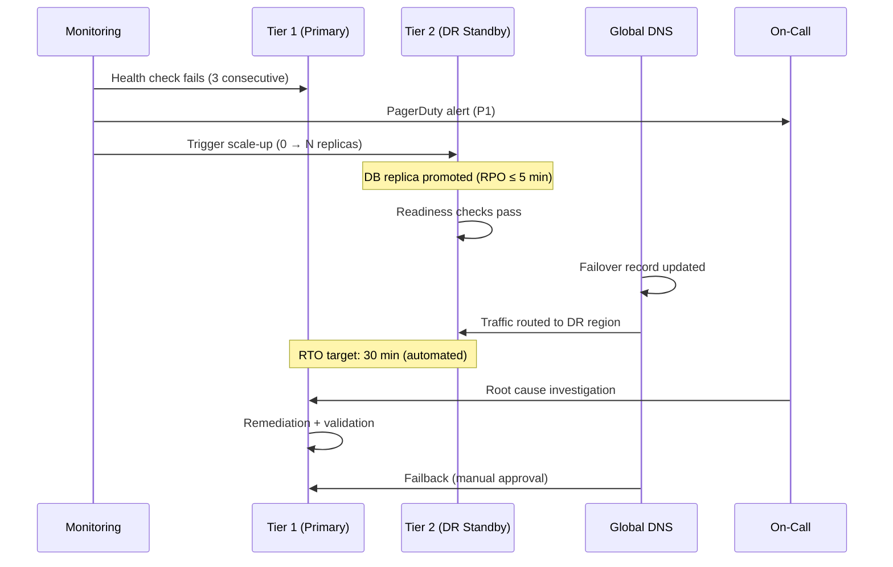

# CloudForge - Disaster Recovery & Business Continuity

**Version:** 2.1
**Author:** Liem Vo-Nguyen
**Last Updated:** March 20, 2026

---

## Executive Summary

This document outlines the DR/BC strategy for CloudForge, an enterprise cloud governance platform, across AWS, Azure, and GCP deployments. Version 2.0 expands coverage to include global deployment architecture, compliance-driven deployment models (GDPR, PCI-DSS, HIPAA, SOX, FedRAMP), enhanced SLA targets with alerting thresholds, component-level restore procedures, data retention and archival policies, and a cross-cloud failover matrix.

CloudForge manages cloud security posture, policy enforcement, and AI-driven remediation for enterprise customers. Availability and data integrity are non-negotiable: a failure in CloudForge means undetected misconfigurations in customer environments.

---

## Recovery Objectives

| Metric | Target | Description |
|--------|--------|-------------|
| **RTO** | 2 hours | Maximum acceptable downtime (automated: 30 min) |
| **RPO** | 5 minutes | Maximum acceptable data loss |
| **MTTR** | 1 hour | Average time to restore service |
| **MTBF** | 720 hours | Minimum mean time between failures |



---

## Service Criticality

| Component | Criticality | RTO | RPO | Notes |
|-----------|-------------|-----|-----|-------|
| Policy Engine (OPA) | Critical | 30 min | N/A | Stateless; bundle restored from Git |
| GRC Integration | High | 1 hour | 5 min | State in external GRC system |
| Template Engine | Critical | 30 min | N/A | Templates versioned in Git |
| API Gateway | Critical | 15 min | N/A | Stateless; redeploy from image |
| Request Workflow | High | 1 hour | 5 min | State in PostgreSQL |
| Temporal Orchestration | High | 1 hour | 5 min | Temporal cluster + Cassandra |
| PostgreSQL | Critical | 30 min | 5 min | Primary data store |
| Redis Cache | Medium | 15 min | N/A | Stateless; warms on traffic |
| AI Provider Proxy | High | 1 hour | N/A | Failover to secondary provider |
| Secrets (KMS/Vault) | Critical | 30 min | N/A | Hardware-backed; cross-region replica |

---

## Global Deployment Architecture

### Deployment Strategy by Region Tier

```
Tier 1 — Primary Production (Active)
  |-- Serves all live traffic
  |-- Full stack: API, OPA, Temporal, PostgreSQL, Redis
  |-- 3+ availability zones
  |-- 99.9% SLA commitment

Tier 2 — DR Region (Warm Standby)
  |-- Database replica in sync (RPO: 5 min)
  |-- K8s cluster pre-provisioned, pods at 0 replicas
  |-- Scale-up time: < 10 minutes
  |-- Activated on Tier 1 failure

Tier 3 — Edge (Policy Evaluation Only)
  |-- Read-only OPA bundle replicated
  |-- Latency < 50ms for policy decisions in region
  |-- No writes; stateless
```

### Active-Active vs Active-Passive Decision Matrix

| Customer Requirement | Architecture | Primary/DR Pair | Rationale |
|---------------------|--------------|-----------------|-----------|
| < 5ms regional failover | Active-Active | Dual primary | Zero-downtime; double cost |
| Data sovereignty (EU) | Active-Passive | eu-west-1 / eu-central-1 | GDPR compliance |
| Cost-optimized | Active-Passive | Primary + cold standby | 60% cost reduction |
| Government / FedRAMP | GovCloud only | us-gov-west-1 / us-gov-east-1 | Regulatory boundary |
| Global enterprise | Active-Active per continent | 3x primary (US/EU/APAC) | Latency + sovereignty |

### Global Load Balancing

```
[Client Request]
       |
       v
+------+---------------------------------------+
|  Global Traffic Management Layer             |
|  AWS: Route 53 Latency Routing               |
|  Azure: Traffic Manager (Performance)        |
|  GCP: Cloud DNS + Global Load Balancer       |
|                                              |
|  Health probe: GET /health (every 10s)       |
|  Failover threshold: 3 consecutive failures  |
+------+---------------------------------------+
       |
  +----+----+
  |         |
  v         v
AWS        Azure / GCP
Primary    Primary
```

**Failover TTL Strategy:**
- Health check interval: 10 seconds
- Failure threshold: 3 consecutive failures
- DNS TTL: 30 seconds (low to enable fast cutover)
- Propagation estimate: 60-90 seconds globally

### Cross-Region Database Replication per CSP

| CSP | Primary | DR Region | Replication Method | Lag Target | Failover Method |
|-----|---------|-----------|-------------------|------------|-----------------|
| AWS | us-west-2 | us-east-1 | RDS Multi-AZ + Read Replica | < 5s | RDS Promoted Replica |
| Azure | westus2 | eastus | Azure SQL Failover Group | < 5s | Auto-failover group |
| GCP | us-west1 | us-east1 | Cloud SQL HA + Regional Replica | < 5s | Cloud SQL promotion |
| AWS EU | eu-west-1 | eu-central-1 | RDS Cross-Region Replica | < 10s | Manual promotion |

**Cross-CSP Replication (Active-Active customers):**
- PostgreSQL logical replication via pg_logical (async, eventual consistency)
- Conflict resolution: last-write-wins with vector clocks per tenant
- Replication lag monitored via `pg_stat_replication`; alert at > 30s

### CDN Strategy for Portal UI

| CSP Deployment | CDN Solution | Cache TTL | Origin Shield |
|----------------|-------------|-----------|---------------|
| AWS | CloudFront | Static: 1yr / API: 0 | Regional Edge Cache |
| Azure | Azure Front Door | Static: 1yr / API: 0 | Edge PoP closest to origin |
| GCP | Cloud CDN | Static: 1yr / API: 0 | Cloud CDN origin shield |

**Cache Invalidation on Deploy:**
```bash
# AWS
aws cloudfront create-invalidation --distribution-id $CF_ID --paths "/*"

# Azure
az afd endpoint purge --resource-group $RG --profile-name $AFD --endpoint-name $EP \
  --domains "*" --content-paths "/*"

# GCP
gcloud compute url-maps invalidate-cdn-cache $URL_MAP --path "/*"
```

### Edge Policy Evaluation (Low-Latency OPA)

OPA policy bundles are replicated to edge nodes for sub-50ms policy decisions without
a round trip to the primary region.

```
Git Repository (Policy Source of Truth)
         |
         | git push (CI/CD)
         v
  OPA Bundle Builder
  (signed bundle: .tar.gz + .sig)
         |
         +-- AWS S3 (us-west-2)
         |       |-- replicates to us-east-1, eu-west-1
         +-- Azure Blob (westus2)
         |       |-- geo-replicates to eastus, westeurope
         +-- GCP GCS (us-west1)
                 |-- dual-region: us (nam4), europe-west (eur4)

Edge OPA Sidecar:
  - Polls bundle endpoint every 60s
  - Verifies bundle signature (Ed25519)
  - In-memory decision cache: 30s TTL
  - Decision log shipped async to central Kafka
```

---

## Multi-Cloud DR Architecture

### AWS Deployment

```
AWS Primary (us-west-2)
├── EKS Cluster (3 nodes, 3 AZ)
│   ├── aegis-api (3 replicas)
│   ├── aegis-opa (2 replicas)
│   ├── temporal-server (2 replicas)
│   └── aegis-worker (2 replicas)
├── RDS PostgreSQL (Multi-AZ, r6g.large)
├── ElastiCache Redis (cluster mode)
├── S3 (versioned, cross-region replication ON)
└── Secrets Manager (cross-region replication)

        Cross-Region Replication (async, < 5s lag)
                        │
                        ▼
AWS DR (us-east-1)
├── EKS Cluster (3 nodes, pre-provisioned, 0 pods)
├── RDS Read Replica (promote on failover)
├── ElastiCache (cold standby)
└── S3 Replica (read-only until failover)
```

### Azure Deployment

```
Azure Primary (West US 2)
├── AKS Cluster (3 nodes, 3 AZ)
│   ├── aegis-api (3 replicas)
│   ├── aegis-opa (2 replicas)
│   ├── temporal-server (2 replicas)
│   └── aegis-worker (2 replicas)
├── Azure SQL (Geo-Replicated, Business Critical)
├── Azure Cache for Redis (zone-redundant)
├── Blob Storage (GRS — geo-redundant)
└── Key Vault (geo-replicated)

        Geo-Replication (auto-failover group)
                │
                ▼
Azure DR (East US)
├── AKS Cluster (3 nodes, 0 pods)
├── SQL Failover Group (secondary, readable)
├── Redis (cold standby)
└── Blob GRS Secondary (read-only endpoint)
```

### GCP Deployment

```
GCP Primary (us-west1)
├── GKE Cluster (3 nodes, multi-zone)
│   ├── aegis-api (3 replicas)
│   ├── aegis-opa (2 replicas)
│   ├── temporal-server (2 replicas)
│   └── aegis-worker (2 replicas)
├── Cloud SQL (Regional HA, postgres 15)
├── Memorystore Redis (HA)
├── GCS (dual-region: NAM4)
└── Secret Manager (global with replication policy)

        Regional Replication
                │
                ▼
GCP DR (us-east1)
├── GKE Cluster (3 nodes, 0 pods)
├── Cloud SQL Regional Replica
├── Memorystore (cold standby)
└── GCS Dual-region (both regions readable)
```

---

## Multi-Cloud Failover Matrix

### Cross-Cloud Failover Paths

| Source Cloud | Target Cloud | Data Sync Mechanism | DNS Migration | Est. Switchover |
|-------------|-------------|--------------------|--------------|--------------------|
| AWS | Azure | pg_logical replication + S3 → Blob sync | Route 53 CNAME → Traffic Manager | 45-90 min |
| Azure | GCP | pg_logical replication + Blob → GCS sync | Traffic Manager → Cloud DNS | 45-90 min |
| GCP | AWS | pg_logical replication + GCS → S3 sync | Cloud DNS → Route 53 | 45-90 min |
| AWS | GCP | pg_logical replication + S3 → GCS sync | Route 53 CNAME → Cloud DNS | 45-90 min |

### Cross-Cloud Failover: AWS → Azure

```
Step 1: Verify Azure DR database lag < 60s
        (monitor via aegis_replication_lag_seconds metric)

Step 2: Scale up AKS cluster in Azure DR region
        kubectl scale deploy --replicas=3 -n aegis (all deployments)

Step 3: Promote Azure SQL secondary to primary
        az sql failover-group set-primary --name aegis-fg \
          --resource-group $RG --server $AZURE_DR_SERVER

Step 4: Restore OPA bundle from Azure Blob
        (bundle already replicated; OPA sidecars pick up on next poll)

Step 5: Update Azure Key Vault secrets from export
        (pre-staged encrypted export in Blob Storage)

Step 6: Migrate DNS — Route 53 CNAME → Azure Traffic Manager FQDN
        TTL switch: 30s record TTL set 24h prior to any planned failover

Step 7: Smoke test via synthetic monitor (Checkly / CloudWatch Synthetics)

Step 8: Notify customers via status page (status.aegis.io)
```

**Data Sync Mechanisms:**
- PostgreSQL: pg_logical extension; replication slot on primary writes WAL to target
- Object storage: rclone sync job (runs every 5 min); bidirectional diff only
- Secrets: cross-cloud secret export encrypted with per-customer BYOK key
- Kubernetes state: Velero backup restored from cloud-neutral object store (S3 or Blob or GCS)

### Cross-Cloud Failover: Azure → GCP

```
Step 1: Verify GCP Cloud SQL replica lag < 60s
Step 2: Scale GKE cluster to target replica counts
Step 3: Promote Cloud SQL replica: gcloud sql instances promote-replica aegis-dr
Step 4: Sync Blob → GCS via rclone (delta sync)
Step 5: Restore secrets to GCP Secret Manager
Step 6: Update DNS: Traffic Manager profile → Cloud DNS managed zone
Step 7: Smoke test and notify
```

### Cross-Cloud Failover: GCP → AWS

```
Step 1: Verify RDS replica lag < 60s
Step 2: Scale EKS node group to 3 nodes; deploy pods
Step 3: Promote RDS Read Replica: aws rds promote-read-replica
Step 4: Sync GCS → S3 via rclone (delta sync)
Step 5: Restore secrets to AWS Secrets Manager
Step 6: Update DNS: Cloud DNS → Route 53
Step 7: Smoke test and notify
```

**Estimated Switchover Times by Phase:**

| Phase | Duration | Activity |
|-------|----------|----------|
| Detection + alert | 2-5 min | Health check failures trigger PagerDuty |
| Decision + auth | 5-10 min | On-call confirms, runbook initiated |
| Database promotion | 5-15 min | Replica lag drain + promotion |
| K8s scale-up | 5-10 min | Pods running and passing readiness |
| DNS propagation | 1-3 min | Low-TTL records propagate |
| Smoke test | 5-10 min | Synthetic checks pass |
| **Total** | **23-53 min** | Within 2-hour RTO |

---

## Compliance-Driven Deployment Models

### GDPR (EU/EEA)

**Scope:** Any CloudForge tenant processing findings that contain or reference personal data of EU/EEA residents.

**Data Residency Requirements:**

| Data Type | Must Stay In | Storage | Transfer Allowed? |
|-----------|-------------|---------|-------------------|
| Findings with EU PII | EU region | eu-west-1, eu-central-1 | No — SCCs required |
| Audit logs | EU region | Same as above | No |
| Customer credentials | EU region | EU KMS | No |
| Anonymized telemetry | Any | Global | Yes |
| OPA policy bundles | Any (no PII) | Global CDN | Yes |

**Recommended Region Pairs:**

| CSP | Primary | DR |
|-----|---------|-----|
| AWS | eu-west-1 (Ireland) | eu-central-1 (Frankfurt) |
| Azure | westeurope (Netherlands) | germanywestcentral |
| GCP | europe-west1 (Belgium) | europe-west3 (Frankfurt) |

**Right to Erasure (Article 17) Pipeline:**

```
Customer DPO submits erasure request
          |
          v
CloudForge Admin API: DELETE /api/v1/tenants/{id}/subjects/{subject_id}
          |
          +-- Mark findings as "erasure_pending" in PostgreSQL
          +-- Queue erasure job in Temporal workflow
          |
          v
Temporal: EraseSubjectWorkflow
  1. Soft-delete all findings referencing subject_id
  2. Purge from Redis cache (SCAN + DEL)
  3. Write immutable audit record: who requested, what was erased, when
  4. Trigger S3/Blob/GCS object version deletion for exported reports
  5. Emit erasure completion event to GRC system
          |
          v
Audit trail retained (pseudonymized: "data erased per Art.17 request #XYZ")
Retention: 7 years (legal obligation to prove erasure occurred)
```

**AI Provider Implications (Claude API / Anthropic):**
- CloudForge sends finding metadata to Claude API for AI analysis
- GDPR Article 28 requires a Data Processing Agreement (DPA) with Anthropic
- EU customers: configure `ai.provider.endpoint` to Anthropic EU endpoint when available; otherwise SCC applies
- Finding payloads sent to AI: strip PII before transmission (regex + NLP PII scrubber in `internal/ai/sanitizer.go`)
- Data sent to AI is never stored by CloudForge; Anthropic zero-data-retention policy applies

**Cross-Border Transfer Mechanisms:**

| Scenario | Mechanism | Status |
|----------|-----------|--------|
| EU → US (Claude API) | Standard Contractual Clauses (SCCs) | Required |
| EU → US (monitoring) | SCCs + adequacy assessment | Required |
| UK → EU | UK IDTA addendum to SCCs | Required post-Brexit |
| Switzerland → EU | Swiss nFADP + SCCs | Required |

**DPO Contact Integration:**
- `dpo_contact` field in tenant configuration (stored in `tenants` table)
- Erasure request notifications auto-sent to DPO email on completion
- Annual DPIA review reminder scheduled via Temporal cron workflow

---

### PCI-DSS (Banking / Financial Services)

**Scope:** Tenants where CloudForge scans environments that host, process, or transmit cardholder data (Cardholder Data Environment — CDE).

**Critical Note:** CloudForge does NOT store payment card data. However, findings may reference CDE resources (EC2 instances, network segments, S3 buckets in-scope for PCI). These findings are treated as PCI-sensitive.

**Network Segmentation:**

```
+----------------------------+     +---------------------------+
|  CloudForge Control Plane  |     |  Customer CDE             |
|  (PCI-adjacent, not CDE)   |     |  (PCI scope)              |
|                            |     |                           |
|  API Gateway               |     |  CloudForge Agent         |
|  OPA Policy Engine         |<--->|  (read-only scanner)      |
|  AI Analysis               |     |  Findings pushed via TLS  |
|  Remediation Executor      |     |                           |
+----------------------------+     +---------------------------+
         |
         | Findings stored (no raw PAN data)
         v
   PostgreSQL (PCI-adjacent schema)
   Encryption: AES-256-GCM at rest
   TLS 1.2+ in transit (TLS 1.3 preferred)
```

**Encryption Requirements:**

| Layer | Requirement | Implementation |
|-------|------------|----------------|
| Data in transit | TLS 1.2 minimum (TLS 1.3 preferred) | NGINX/Envoy TLS policy |
| Data at rest (DB) | AES-256 | RDS/Azure SQL/Cloud SQL transparent encryption |
| Data at rest (Object) | AES-256 | S3 SSE-KMS / Azure SSE / GCS CMEK |
| Backup encryption | AES-256 | KMS-encrypted snapshots |
| Key management | HSM-backed KMS | AWS CloudHSM / Azure Dedicated HSM / Cloud HSM |
| BYOK | Customer-managed keys | KMS key import or BYOK |

**Key Management:**
- Key rotation: automatic, every 365 days (configurable to 90 days for PCI)
- Key hierarchy: Master Key (HSM) → Data Encryption Key (KMS) → Per-record key
- Key deletion: 7-day waiting period minimum; requires dual-person authorization

**Access Logging (Tamper-Evident Audit Trail):**
- All API requests logged to append-only log store (S3 with Object Lock / Azure Immutable Blob / GCS WORM)
- Log fields: timestamp, user_id, tenant_id, action, resource, source_ip, result
- Log integrity: SHA-256 hash chain; each log entry references previous entry hash
- Log retention: 1 year immediately accessible, 3 years archived (PCI Req 10.7)
- Log export: CloudWatch Logs Insights / Azure Monitor / Cloud Logging

**Vulnerability Management SLAs (PCI Req 6.3.3):**

| Severity | Max Time to Remediate | CloudForge Finding Priority | Alert Channel |
|----------|-----------------------|----------------------------|---------------|
| Critical (CVSS 9.0-10.0) | 1 day | P1 | PagerDuty (immediate) |
| High (CVSS 7.0-8.9) | 7 days | P2 | PagerDuty (business hours) |
| Medium (CVSS 4.0-6.9) | 30 days | P3 | Jira ticket |
| Low (CVSS 0.1-3.9) | 90 days | P4 | Weekly digest |

**Segregation of Duties in Deployment Pipeline:**

| Role | Can Deploy to Staging | Can Deploy to Prod | Can Approve Prod |
|------|----------------------|-------------------|-----------------|
| Developer | Yes | No | No |
| Senior Engineer | Yes | No | Yes (1 of 2) |
| Release Manager | Yes | No | Yes (2 of 2) |
| CI/CD Service Account | Yes | Yes (requires 2 approvals) | No |

- Production deployments require 2 approvals from senior engineers + release manager
- No self-approval: the person who raises the PR cannot be one of the two approvers
- All approvals recorded in GitHub PR audit trail + shipped to SIEM

**Annual Penetration Testing:**
- Scope: CloudForge API, OPA policy engine, Temporal orchestration, agent communication channel
- Provider: QSA-approved penetration testing firm
- Frequency: Annual + after significant infrastructure changes (PCI Req 11.4.1)
- Findings remediated per vulnerability SLAs above
- Reports retained for 3 years

---

### HIPAA (Healthcare)

**Scope:** Tenants in healthcare; findings may contain resource metadata that includes PHI (e.g., EC2 tag `Environment=PHI-production`, RDS instance name `ehr-database-prod`).

**PHI Handling in Findings:**

CloudForge scans cloud resource configurations, not data content. However, resource names, tags, and descriptions may contain PHI indicators. CloudForge treats any finding from a HIPAA-designated tenant as PHI-adjacent.

| Data Category | CloudForge Treatment |
|--------------|---------------------|
| Resource names/tags | Masked in UI if PHI pattern detected (regex: `hipaa_pii_patterns.yaml`) |
| Finding descriptions | Sanitized before AI analysis |
| Audit logs | Encrypted, HIPAA-tenant-specific log group |
| Exports / reports | Encrypted PDF, delivered via secure channel only |

**Business Associate Agreements (BAA):**

| Provider | BAA Required | CloudForge Commitment |
|----------|-------------|----------------------|
| AWS | Yes — AWS BAA | EKS, RDS, S3, Secrets Manager in BAA scope |
| Azure | Yes — Azure BAA | AKS, Azure SQL, Blob, Key Vault in BAA scope |
| GCP | Yes — GCP BAA | GKE, Cloud SQL, GCS, Secret Manager in BAA scope |
| Anthropic (Claude API) | Yes — if PHI sent | PII scrubber active; zero-retention API agreement |
| Datadog / observability | Yes — if logs contain PHI | Sanitize logs before export |

**Recommended HIPAA Regions (HITRUST-Certified):**

| CSP | Primary | DR |
|-----|---------|-----|
| AWS | us-east-1 (HITRUST) | us-west-2 (HITRUST) |
| Azure | eastus (HITRUST) | westus2 (HITRUST) |
| GCP | us-central1 (HIPAA eligible) | us-east1 (HIPAA eligible) |

**Audit Controls:**
- All access to HIPAA-tenant data logged (including read operations)
- Modification tracking: PostgreSQL row-level audit via `pgaudit` extension
- Log access reviewed monthly by compliance officer
- Audit logs: 6 years retention (HIPAA § 164.530(j))

**Emergency Access Procedures (Break-Glass):**
```
Break-glass scenario: PHI-tenant data access required outside normal authorization

1. On-call engineer submits break-glass request via PagerDuty runbook
2. System generates time-limited (4h) elevated credential via Vault dynamic secrets
3. ALL actions during break-glass session logged with "break_glass" tag
4. Session auto-terminates after 4 hours
5. Post-incident review within 24 hours
6. Compliance officer notified within 1 business day
```

**Encryption Requirements (stricter than PCI):**
- Encryption required for all PHI-adjacent data at rest AND in transit
- Key rotation: every 90 days (vs 365 for standard)
- Backup encryption: customer-managed keys only (no CSP-managed keys for PHI tenants)
- Log encryption: separate KMS key per HIPAA tenant

---

### SOX (Financial Reporting)

**Scope:** Publicly traded companies using CloudForge to manage their cloud security posture. SOX § 404 requires controls over financial reporting systems; CloudForge findings about financial infrastructure fall under SOX scope.

**Change Management Audit Trails:**

All changes to CloudForge configuration, policies, and remediation actions for SOX tenants must be immutably logged:

| Change Type | Audit Fields | Storage |
|------------|-------------|---------|
| Policy update | who, what changed, before/after diff, approver | Append-only S3/Blob/GCS |
| Remediation action | who triggered, what was changed in customer account, timestamp, result | Append-only |
| User access change | who was granted/revoked, approver, timestamp | Append-only |
| Configuration change | before/after JSON diff, approver | Append-only |

**Immutability Implementation:**
- AWS: S3 Object Lock (Compliance mode, retention locked to 7 years)
- Azure: Azure Blob Immutable Storage (time-based retention policy)
- GCP: GCS Retention Policy (locked, 7-year minimum)

**Segregation of Duties (SOX § 302 / § 404):**

| Control | Requirement | Implementation |
|---------|------------|----------------|
| Policy changes | 2-person rule | PR requires 2 approvals; CI blocks single-approver merges |
| Remediation approval | Separate proposer and approver | Temporal workflow: proposal step + approval step are different roles |
| Data deletion | Dual authorization | DeleteFinding requires `initiated_by` + `approved_by` ≠ same user |
| Production access | Just-in-time | Vault dynamic credentials; no standing prod access |

**Data Retention Requirements:**
- Financial-related findings: 7 years (SOX § 802)
- Audit logs: 7 years
- Change records: 7 years
- Email/communications re: material findings: 7 years (coordinate with email archival system)

**Tamper-Evident Audit Logs:**
```
Each audit log entry contains:
  {
    "id":         "ulid",
    "timestamp":  "RFC3339",
    "tenant_id":  "uuid",
    "actor_id":   "uuid",
    "action":     "string",
    "resource":   "string",
    "before":     "json (optional)",
    "after":      "json (optional)",
    "prev_hash":  "sha256 of previous entry",
    "hash":       "sha256 of this entry"
  }

Hash chain verification:
  aegis-audit verify --tenant $TENANT_ID --from $START --to $END
  Exit 0 = chain intact. Exit 1 = tamper detected (triggers P1 incident).
```

---

### FedRAMP (US Government)

**Scope:** US federal agencies and contractors using CloudForge for cloud governance.

**FedRAMP High vs Moderate:**

| Aspect | FedRAMP Moderate | FedRAMP High |
|--------|-----------------|--------------|
| Impact level | Moderate (most civilian agencies) | High (DoD, intelligence, critical infra) |
| Availability req | 99.9% | 99.99% |
| Backup retention | 90 days | 1 year |
| Encryption | FIPS 140-2 validated | FIPS 140-2 Level 3 (hardware) |
| Audit log retention | 3 years | 5 years |
| Incident response | 1 hour notification | 1 hour notification + DoD SIPR |

**GovCloud Deployment Requirements:**

```
AWS GovCloud (us-gov-west-1) — Primary
├── EKS (GovCloud endpoint)
├── RDS PostgreSQL (FedRAMP High authorized)
├── S3 (GovCloud, FIPS endpoints)
├── KMS (FIPS 140-2 validated HSM)
└── CloudTrail (all API calls, immutable)

        Cross-Region Replication (GovCloud only)
                        │
                        ▼
AWS GovCloud (us-gov-east-1) — DR
├── EKS (standby)
├── RDS Read Replica
└── S3 Replica
```

**FIPS 140-2 Validated Encryption:**
- All cryptographic operations use FIPS 140-2 validated modules
- AWS: FIPS endpoints (`*.fips.amazonaws.com`) used for all API calls
- TLS: only FIPS-approved cipher suites (AES-128-GCM-SHA256, AES-256-GCM-SHA384)
- Golang: compiled with `GOFLAGS=-tags fips` using `go-boring` (BoringCrypto)
- Key management: AWS CloudHSM (FIPS 140-2 Level 3) for key generation and storage

**Continuous Monitoring (ConMon):**

| Control | Frequency | Tooling | Report Target |
|---------|-----------|---------|--------------|
| Vulnerability scanning | Weekly | Tenable / Qualys | AO (Authorizing Official) |
| Configuration compliance | Daily | CloudForge OPA | FedRAMP PMO |
| Access log review | Monthly | CloudWatch + SIEM | ISSO |
| Penetration testing | Annual | FedRAMP-approved 3PAO | JAB |
| Security control assessment | Annual | 3PAO | FedRAMP PMO |
| Incident reporting | Per-incident | US-CERT / CISA | Within 1 hour |

**POA&M (Plan of Action & Milestones) Integration:**
- CloudForge findings auto-generate POA&M draft entries for FedRAMP tenants
- POA&M fields: weakness, source (finding_id), risk level, scheduled completion, milestones
- Exported monthly as Excel/CSV for upload to FedRAMP PMO system
- All POA&M items tracked in Temporal workflow with deadline alerting

---

## Enhanced SLA Targets

| Metric | Target | Measurement Method | Alert Threshold | Critical Threshold |
|--------|--------|-------------------|-----------------|--------------------|
| API Availability | 99.9% | Synthetic monitoring (Checkly, 1-min interval) | < 99.5% | < 99.0% |
| API Latency (p50) | < 100ms | Prometheus histogram `http_request_duration_seconds` | > 200ms | > 500ms |
| API Latency (p99) | < 500ms | Prometheus histogram | > 1s | > 2s |
| Policy Evaluation | < 50ms | OPA decision log `decision_id` latency | > 200ms | > 500ms |
| Finding Ingestion | < 5s | End-to-end trace (agent → API → DB committed) | > 30s | > 120s |
| AI Analysis | < 5s | Provider latency (Claude API p95) | > 15s | > 30s |
| Remediation (Tier 1 — auto) | < 5 min | Executor metrics: remediation_duration_seconds | > 15 min | > 30 min |
| Remediation (Tier 2 — approved) | < 1 hour | Executor metrics | > 2 hours | > 4 hours |
| DR Failover (automated) | < 30 min | DR test results (quarterly) | > 1 hour | > 2 hours |
| Database Recovery (PITR) | < 15 min | Backup restore test (monthly) | > 30 min | > 1 hour |
| Data Freshness | < 15 min | Last sync timestamp vs `now()` | > 1 hour | > 4 hours |
| Secrets Rotation | < 1 hour post-incident | Rotation workflow duration | > 2 hours | > 4 hours |
| OPA Bundle Propagation | < 60s | Bundle poll log: last_applied vs git SHA | > 5 min | > 15 min |

**SLA Tier Summary:**

| Tier | Uptime | Monthly Downtime | Use Case |
|------|--------|-----------------|---------|
| Platinum | 99.99% | 4.4 minutes | FedRAMP High, HIPAA critical |
| Gold | 99.9% | 43.8 minutes | Standard enterprise (default) |
| Silver | 99.5% | 3.6 hours | Dev/staging environments |

**CloudForge Production Target:** Gold (99.9%) standard; Platinum available for regulated deployments.

**Prometheus Alert Rules (abbreviated):**
```yaml
groups:
  - name: aegis-sla
    rules:
      - alert: APILatencyP99High
        expr: histogram_quantile(0.99, http_request_duration_seconds_bucket) > 1
        for: 5m
        labels:
          severity: warning
      - alert: APIAvailabilityLow
        expr: avg_over_time(up{job="aegis-api"}[5m]) < 0.995
        for: 2m
        labels:
          severity: critical
      - alert: OPALatencyHigh
        expr: opa_decision_duration_seconds_p99 > 0.2
        for: 5m
        labels:
          severity: warning
      - alert: FindingIngestionStale
        expr: time() - aegis_last_finding_ingested_timestamp > 1800
        for: 1m
        labels:
          severity: critical
```

---

## Backup Strategy

### Database Backups

| Database | Method | Frequency | Retention | Location |
|----------|--------|-----------|-----------|----------|
| PostgreSQL | Point-in-time recovery (WAL archival) | Continuous | 7 days PITR | Same region |
| PostgreSQL | Daily snapshot | Daily 02:00 UTC | 30 days | Cross-region |
| PostgreSQL | Monthly archive | Monthly | 1 year (standard), 7 years (SOX/HIPAA) | Glacier/Archive |
| Policy configs | GitOps | Real-time (every commit) | Infinite | Git (multi-remote) |
| Temporal state | Native Temporal backup | Hourly | 48 hours hot, 7 days cold | Cross-region bucket |

### Application State

| Component | Method | Frequency | Retention |
|-----------|--------|-----------|-----------|
| Kubernetes state | Velero (restic) | Every 4 hours | 7 days |
| OPA policies | Git sync | Real-time | Infinite |
| Templates | Git sync | Real-time | Infinite |
| Redis state | RDB snapshot | Hourly | 24 hours |
| Secrets (Vault) | Vault snapshot | Every 6 hours | 30 days |

---

## Detailed Restore Procedures

### 1. PostgreSQL Point-in-Time Recovery

```bash
# AWS RDS PITR
aws rds restore-db-instance-to-point-in-time \
  --source-db-instance-identifier aegis-primary \
  --target-db-instance-identifier aegis-restore-$(date +%Y%m%d%H%M) \
  --restore-time "2026-02-27T14:30:00Z" \
  --db-instance-class db.r6g.large \
  --no-multi-az \
  --tags Key=purpose,Value=dr-restore

# Wait for available status
aws rds wait db-instance-available \
  --db-instance-identifier aegis-restore-$(date +%Y%m%d%H%M)

# Verify row counts post-restore
psql $RESTORE_DSN -c "
  SELECT
    'findings' AS table_name, COUNT(*) AS rows FROM findings
  UNION ALL
  SELECT 'tenants', COUNT(*) FROM tenants
  UNION ALL
  SELECT 'audit_logs', COUNT(*) FROM audit_logs;
"
```

**Verification Checklist — PostgreSQL:**
- [ ] Row counts within expected range (compare to pre-incident snapshot)
- [ ] Latest finding timestamp within RPO window (< 5 min of incident)
- [ ] All foreign key constraints valid (`pg_constraint` check)
- [ ] pgaudit logging active on restored instance
- [ ] Connection pooler (PgBouncer) updated to point to restored instance
- [ ] Application connection test: `aegis-api health --check-db`

### 2. Redis Cache Warming Strategy

Redis is treated as a non-persistent cache. On restore, the cache is cold and will warm
organically as traffic is served. However, certain hot-path caches can be pre-warmed to
reduce initial latency spike.

```bash
# Step 1: Verify Redis is reachable
redis-cli -h $REDIS_HOST ping

# Step 2: Pre-warm policy decision cache (most critical for latency)
# Run the policy warm-up job; reads top-N tenants from DB and pre-evaluates
kubectl -n aegis exec deploy/aegis-worker -- \
  aegis-cli cache warm-policies --top-tenants 100

# Step 3: Pre-warm tenant config cache
kubectl -n aegis exec deploy/aegis-worker -- \
  aegis-cli cache warm-tenants

# Step 4: Monitor cache hit rate
redis-cli -h $REDIS_HOST info stats | grep keyspace_hits
# Target: > 80% hit rate within 15 minutes of warm-up
```

**Verification Checklist — Redis:**
- [ ] Redis cluster up: `redis-cli cluster info | grep cluster_state:ok`
- [ ] Policy cache warm-up job completed without errors
- [ ] API latency p99 within SLA after warm-up (< 500ms)

### 3. OPA Policy Bundle Restore from Git

OPA bundles are the source of truth for all policy decisions. They are stored in Git and
distributed via signed bundle archives. Restore is a pull from Git, not a backup restore.

```bash
# Step 1: Verify Git remote is reachable
git -C /opt/aegis/policies ls-remote origin

# Step 2: Pull latest policy bundle
git -C /opt/aegis/policies fetch --all
git -C /opt/aegis/policies checkout origin/main -- .

# Step 3: Build and sign bundle
opa build -b /opt/aegis/policies -o bundle.tar.gz
openssl dgst -sha256 -sign /etc/aegis/bundle-signing-key.pem \
  bundle.tar.gz > bundle.tar.gz.sig

# Step 4: Upload to bundle distribution endpoint
aws s3 cp bundle.tar.gz s3://$OPA_BUNDLE_BUCKET/aegis/bundle.tar.gz
aws s3 cp bundle.tar.gz.sig s3://$OPA_BUNDLE_BUCKET/aegis/bundle.tar.gz.sig

# Step 5: Force immediate poll on all OPA sidecars
kubectl -n aegis rollout restart deploy/aegis-opa

# Step 6: Verify bundle loaded
kubectl -n aegis exec deploy/aegis-opa -- \
  curl -s http://localhost:8181/v1/data/aegis | jq '.result | keys'
```

**Verification Checklist — OPA:**
- [ ] Bundle SHA matches Git HEAD: `opa inspect bundle.tar.gz | grep revision`
- [ ] All expected policy namespaces present in `GET /v1/data/aegis`
- [ ] Policy decision test: `opa eval -d bundle.tar.gz 'data.aegis.aws.s3.deny'`
- [ ] Decision log shipping to Kafka: `kafka-console-consumer --topic opa-decisions`

### 4. Kubernetes State Restore (Velero)

```bash
# Step 1: List available backups
velero backup get --namespace velero | grep aegis

# Step 2: Restore latest successful backup
BACKUP_NAME=$(velero backup get --namespace velero -o json | \
  jq -r '.items | map(select(.status.phase=="Completed")) |
         sort_by(.metadata.creationTimestamp) | last | .metadata.name')

velero restore create aegis-restore-$(date +%Y%m%d%H%M) \
  --from-backup $BACKUP_NAME \
  --namespace-mappings aegis:aegis \
  --wait

# Step 3: Verify restore status
velero restore describe aegis-restore-* | grep -E "Phase|Errors|Warnings"

# Step 4: Check all pods are running
kubectl -n aegis get pods --watch
# Wait for all pods: Running, 0 restarts
```

**Velero Backup Schedule (configured in cluster):**
```yaml
apiVersion: velero.io/v1
kind: Schedule
metadata:
  name: aegis-hourly
  namespace: velero
spec:
  schedule: "0 */4 * * *"
  template:
    includedNamespaces:
      - aegis
    storageLocation: default
    ttl: 168h0m0s   # 7 days
    snapshotVolumes: true
```

**Verification Checklist — Kubernetes:**
- [ ] All deployments at expected replica count
- [ ] All pods pass readiness probes
- [ ] PersistentVolumeClaims bound
- [ ] ConfigMaps and Secrets present
- [ ] Service endpoints resolving

### 5. Temporal Workflow State Recovery

```bash
# Step 1: Restore Temporal namespace from backup
# Temporal uses Cassandra or PostgreSQL as backend; backup is DB-level

# If using Temporal Cloud (SaaS): namespace is managed; contact Temporal support
# If self-hosted: restore underlying Cassandra/PostgreSQL first, then restart Temporal server

# Step 2: Verify Temporal server is healthy
tctl --address $TEMPORAL_ADDR cluster health

# Step 3: Check open workflows
tctl --namespace aegis workflow list --status open | head -20

# Step 4: Identify workflows stuck due to worker unavailability
tctl --namespace aegis workflow list \
  --status open --query "WorkflowType='RemediationWorkflow'" | wc -l

# Step 5: Resume stuck workflows (workers reconnect automatically once running)
# Workflows paused during outage will resume from last checkpoint on worker restart
kubectl -n aegis rollout restart deploy/aegis-worker

# Step 6: Verify workflow progress
tctl --namespace aegis workflow list --status running | \
  awk '{print $1}' | head -5 | while read wf_id; do
    tctl --namespace aegis workflow show --workflow_id $wf_id | tail -5
  done
```

**Verification Checklist — Temporal:**
- [ ] Temporal server healthy: `tctl cluster health` returns OK
- [ ] All namespaces registered: `tctl namespace list`
- [ ] Worker task queue polled: check worker log `"Started polling taskQueue"`
- [ ] No workflows in `WORKFLOW_EXECUTION_STATUS_TIMED_OUT` > 5 min after restore
- [ ] Cron workflows rescheduled (check next scheduled run time)

### 6. Secret Rotation Post-Restore

After any DR event, all secrets are considered potentially compromised and must be rotated.

```bash
# Rotation order (dependency-aware):
# 1. Database passwords  (other services depend on these)
# 2. API keys (external providers)
# 3. Internal service tokens
# 4. Customer-facing API keys (notify customers)

# Step 1: Rotate DB password
aws secretsmanager rotate-secret \
  --secret-id aegis/postgresql/password \
  --rotation-lambda-arn $ROTATION_LAMBDA_ARN

# Step 2: Rotate AI provider key (Anthropic API key)
# Generate new key in Anthropic console, then:
aws secretsmanager put-secret-value \
  --secret-id aegis/ai/anthropic-api-key \
  --secret-string "$NEW_ANTHROPIC_KEY"

# Step 3: Restart services to pick up new secrets (if using static secret mounts)
kubectl -n aegis rollout restart deploy/aegis-api
kubectl -n aegis rollout restart deploy/aegis-worker

# Step 4: Verify new secrets are active
kubectl -n aegis exec deploy/aegis-api -- \
  aegis-cli auth test --all-providers
```

**Verification Checklist — Secrets:**
- [ ] All rotated secrets marked with `rotated_at` tag in Secrets Manager
- [ ] Old secret versions disabled (not deleted — needed for audit)
- [ ] All services restarted and healthy post-rotation
- [ ] External API keys tested (DB, AI provider, GRC integrations)
- [ ] Customer API keys rotated (if customer keys were in scope); customers notified

### 7. DNS Cutover Procedures

```bash
# Pre-cutover: lower TTL 24 hours before planned failover
# Set TTL to 30 seconds on primary A/CNAME records

# AWS Route 53 — switch to DR
aws route53 change-resource-record-sets \
  --hosted-zone-id $ZONE_ID \
  --change-batch '{
    "Changes": [{
      "Action": "UPSERT",
      "ResourceRecordSet": {
        "Name": "api.cloudforge.lvonguyen.com",
        "Type": "CNAME",
        "TTL": 30,
        "ResourceRecords": [{"Value": "'$DR_LOAD_BALANCER_DNS'"}]
      }
    }]
  }'

# Verify propagation (wait up to 60s)
for i in {1..12}; do
  RESOLVED=$(dig +short api.cloudforge.lvonguyen.com)
  echo "[$i] api.cloudforge.lvonguyen.com -> $RESOLVED"
  [ "$RESOLVED" = "$DR_LOAD_BALANCER_DNS" ] && echo "Propagated" && break
  sleep 5
done

# Post-failover: restore TTL to 300s (after confirming DR is stable)
```

**Verification Checklist — DNS:**
- [ ] DNS resolves to DR endpoint from 3+ geographic locations (use `dig` from different regions)
- [ ] TLS certificate valid for DR endpoint (`openssl s_client -connect api.cloudforge.lvonguyen.com:443`)
- [ ] Synthetic monitor passes from DR endpoint (Checkly check green)
- [ ] CDN cache purged and serving from DR origin

---

## Failover Procedures

### Automated Failover (RTO: 30 min)

**Triggers:**
- Primary region health check fails 3 consecutive times (30s interval = 90s detection)
- Database connection failure > 5 minutes
- Kubernetes API unavailable > 5 minutes
- Replication lag > 60 seconds (pre-emptive failover before data loss risk)

**Automated Steps:**
1. Traffic Manager / Route 53 health check detects failure
2. DNS weight shifted to DR endpoint (TTL: 30s)
3. Temporal: `FailoverWorkflow` triggered via Temporal Cloud event
4. Database replica promoted (automated failover group / RDS promotion)
5. K8s pods scaled up in DR region via GitOps (ArgoCD sync with `--force`)
6. OPA bundle verified loaded in DR
7. On-call notified via PagerDuty

### Manual Failover (RTO: 2 hours)

1. Notify stakeholders (status page update: "Investigating degraded service")
2. Drain primary gracefully (`kubectl drain` with 30s grace period)
3. Verify DR database replication lag < target RPO
4. Promote DR database (CSP-specific command; see Restore Procedures above)
5. Scale up DR Kubernetes (apply manifests or trigger ArgoCD sync)
6. Restore secrets if needed (see Restore Procedures §6)
7. Update DNS / load balancer (see Restore Procedures §7)
8. Verify OPA policies loaded in DR
9. Warm Redis cache (see Restore Procedures §2)
10. Run smoke test suite: `make smoke-test ENV=dr`
11. Update status page: "Service restored, monitoring"
12. Document incident in Incident log (PagerDuty post-mortem)

---

## Quarterly DR Testing

| Quarter | Test Type | Scope | Success Criteria |
|---------|-----------|-------|-----------------|
| Q1 | Tabletop exercise | Full scenario walkthrough | All team members know roles |
| Q2 | Database failover | DB only (no traffic switch) | PITR completed < 15 min |
| Q3 | Full failover simulation | Complete (traffic + DB + K8s) | RTO met, zero data loss |
| Q4 | Chaos engineering | Random component injection | System self-heals within RTO |

### DR Test Execution Checklist

**Before Test:**
- [ ] Notify all stakeholders (test window agreed; no production changes during test)
- [ ] Pre-check: primary region fully healthy
- [ ] Pre-check: DR region cold (0 pods, DB in replica state)
- [ ] Baseline metrics captured (current p99 latency, finding count, audit log tail)

**During Test:**
- [ ] Simulate failure (block traffic or terminate primary nodes)
- [ ] Track time from failure injection to automated detection
- [ ] Track time from detection to DR serving traffic
- [ ] Verify all verification checklists in Restore Procedures section

**After Test:**
- [ ] Confirm RTO met (< 2 hours manual, < 30 min automated)
- [ ] Confirm RPO met (< 5 min data loss)
- [ ] OPA policies functional in DR
- [ ] GRC integrations restored
- [ ] Template deployments working
- [ ] Rollback to primary successful
- [ ] Test report filed in incident management system
- [ ] Action items for any failures logged as P2 tickets

---

## Data Retention & Archival

### Retention Schedule by Data Type

| Data Type | Active Retention | Archive Retention | Total | Trigger |
|-----------|-----------------|-------------------|-------|---------|
| Findings (standard) | 2 years (hot) | 5 years (cold) | 7 years | Compliance default |
| Findings (SOX tenants) | 2 years (hot) | 5 years (cold) | 7 years | SOX § 802 |
| Findings (HIPAA tenants) | 2 years (hot) | 4 years (cold) | 6 years | HIPAA 45 CFR § 164 |
| Audit logs | 1 year (hot) | 6 years (cold) | 7 years | SOX / PCI requirement |
| Remediation state snapshots | 90 days (hot) | 275 days (cold) | 1 year | Operational |
| Policy decision logs (OPA) | 90 days (hot) | 275 days (cold) | 1 year | Operational |
| Session / access logs | 90 days (hot) | 9 months (cold) | 1 year | PCI Req 10.7 |
| Customer-uploaded configs | Indefinite (active) | Archived on tenant offboard | — | Contract |
| Backup snapshots | 30 days (daily) | 11 months (monthly) | 1 year | Operational |

### Archival Storage Tiers by CSP

| CSP | Active (Hot) | Archive (Cold) | Deep Archive | Retrieval Time (Deep) |
|-----|-------------|---------------|-------------|----------------------|
| AWS | S3 Standard | S3-IA / Glacier Instant | S3 Glacier Flexible Retrieval | 3-5 hours |
| Azure | Blob Hot | Blob Cool | Blob Archive | 15+ hours |
| GCP | GCS Standard | GCS Nearline | GCS Coldline | Minutes (Coldline) |

### Data Lifecycle Automation

**AWS S3 Lifecycle Policy (applied to `aegis-findings-{tenant}` buckets):**

```json
{
  "Rules": [
    {
      "ID": "findings-lifecycle",
      "Status": "Enabled",
      "Filter": { "Prefix": "findings/" },
      "Transitions": [
        { "Days": 730,  "StorageClass": "STANDARD_IA" },
        { "Days": 1825, "StorageClass": "GLACIER_IR" }
      ],
      "Expiration": { "Days": 2555 }
    },
    {
      "ID": "audit-log-lifecycle",
      "Status": "Enabled",
      "Filter": { "Prefix": "audit-logs/" },
      "Transitions": [
        { "Days": 365,  "StorageClass": "STANDARD_IA" },
        { "Days": 730,  "StorageClass": "GLACIER_IR" }
      ],
      "Expiration": { "Days": 2555 }
    }
  ]
}
```

**GCP GCS Lifecycle Policy:**

```json
{
  "lifecycle": {
    "rule": [
      {
        "action": { "type": "SetStorageClass", "storageClass": "NEARLINE" },
        "condition": { "age": 730 }
      },
      {
        "action": { "type": "SetStorageClass", "storageClass": "COLDLINE" },
        "condition": { "age": 1825 }
      },
      {
        "action": { "type": "Delete" },
        "condition": { "age": 2555 }
      }
    ]
  }
}
```

**PostgreSQL Archival (findings table):**

```sql
-- Scheduled via Temporal cron: runs monthly at 03:00 UTC
-- Archives findings older than 2 years to cold storage table

INSERT INTO findings_archive
  SELECT * FROM findings
  WHERE created_at < NOW() - INTERVAL '2 years'
    AND archived_at IS NULL;

UPDATE findings
  SET archived_at = NOW()
  WHERE created_at < NOW() - INTERVAL '2 years'
    AND archived_at IS NULL;

-- findings_archive is backed up to Glacier/Coldline via separate lifecycle rule
-- findings table retains only active records (last 2 years) for query performance
```

### Deletion and Erasure

- **Standard deletion:** findings soft-deleted (deleted_at timestamp); hard-deleted after 90 days
- **GDPR erasure:** immediate hard delete + audit record (see GDPR section)
- **Tenant offboarding:** all tenant data deleted within 30 days of contract termination; certificate of deletion issued
- **Backup purge:** expired backups deleted per lifecycle policy; S3 Object Lock prevents premature deletion for SOX/HIPAA tenants

---

## DR Cost Summary (Monthly)

| Component | AWS | Azure | GCP |
|-----------|-----|-------|-----|
| K8s standby (pre-provisioned nodes) | $75 | $0 | $75 |
| Database replica | $150 | $140 | $130 |
| Storage replication | $25 | $25 | $20 |
| Velero backup storage | $10 | $10 | $8 |
| Cross-region data transfer | $20 | $15 | $15 |
| **Total (same-CSP DR)** | **$280** | **$190** | **$248** |
| Cross-cloud replication (pg_logical + rclone) | +$50 | +$50 | +$50 |
| **Total (cross-cloud DR enabled)** | **$330** | **$240** | **$298** |

**Notes:**
- FedRAMP GovCloud adds ~30% premium to AWS line items
- PCI/HIPAA HSM costs (CloudHSM / Dedicated HSM): +$1,500-$2,000/month per CSP
- Platinum SLA (99.99%) requires active-active architecture: ~3x standard DR cost

---

## Document History

| Version | Date | Author | Changes |
|---------|------|--------|---------|
| 1.0 | January 2026 | Liem Vo-Nguyen | Initial release |
| 2.0 | February 27, 2026 | Liem Vo-Nguyen | Global deployment architecture, compliance-driven models (GDPR/PCI/HIPAA/SOX/FedRAMP), enhanced SLA targets, detailed restore procedures, data retention & archival, cross-cloud failover matrix |
| 2.1 | March 20, 2026 | Liem Vo-Nguyen | Renamed CloudForge to CloudForge; deployment tier naming refresh |

---

## Author

**Liem Vo-Nguyen**
- LinkedIn: linkedin.com/in/liemvonguyen
