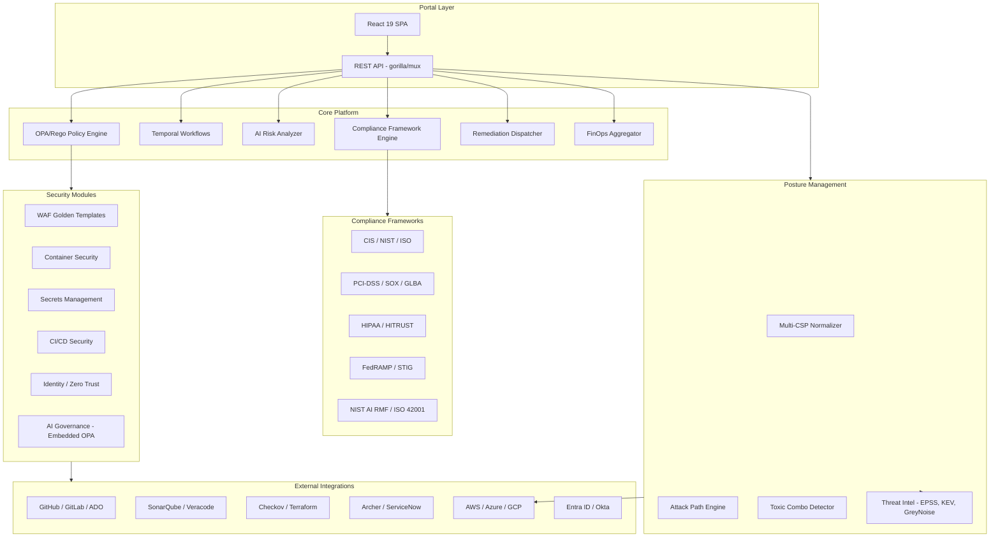
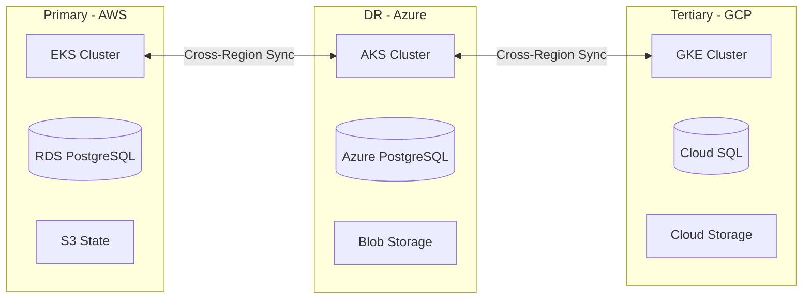
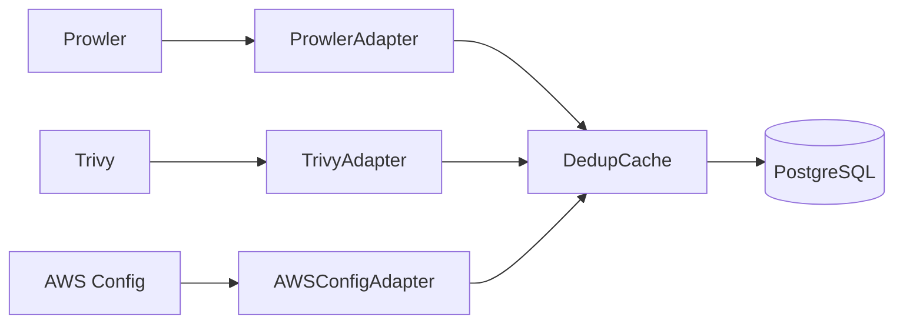
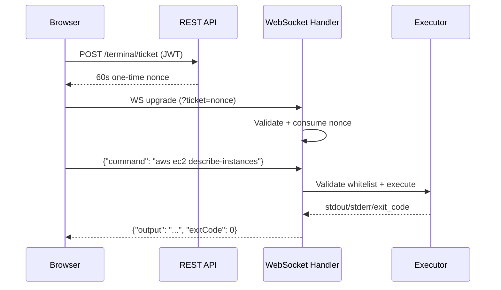
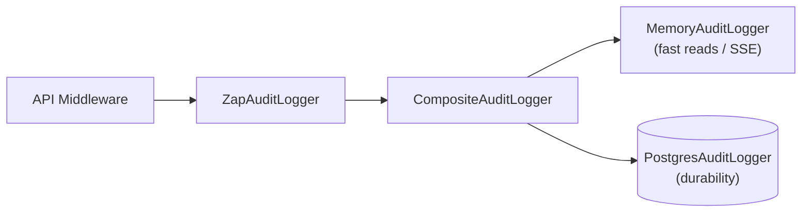
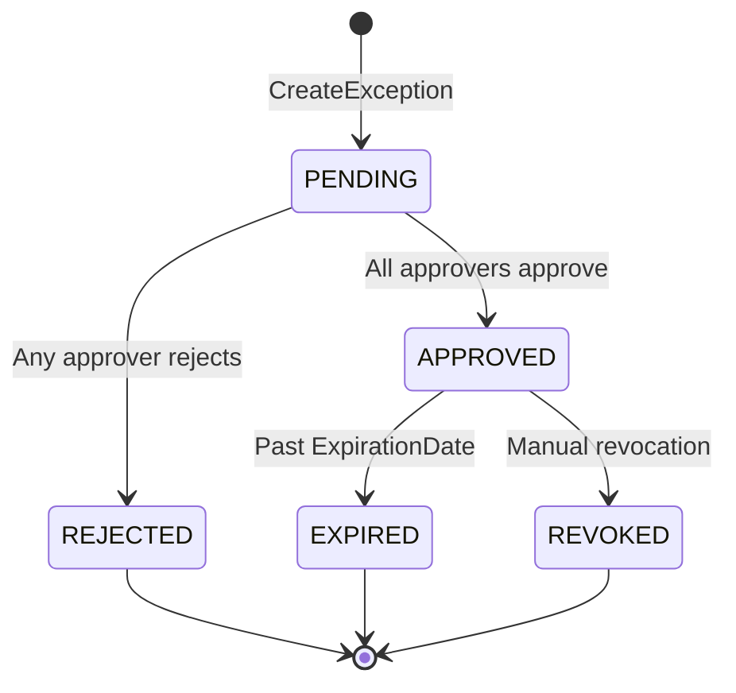

# High-Level Design: Aegis Enterprise Cloud Governance Platform

| Property | Value |
| --- | --- |
| Version | 4.0 |
| Author | Liem Vo-Nguyen |
| Date | March 2026 |
| Status | Active |
| LinkedIn | [linkedin.com/in/liemvonguyen](https://linkedin.com/in/liemvonguyen) |

### Related Documents

| Document | Description |
|----------|-------------|
| [Detailed Design Document (DDD)](./DDD.md) | Implementation-level technical specifications |
| [Component Rationale](./adr/component-rationale.md) | Technology selection with cost analysis |
| [DR/BC Plan](./DR-BC.md) | Disaster Recovery and Business Continuity |
| [Pitch Deck](https://github.com/lvonguyen/cloudforge/blob/main/docs/archive/pitch-deck.md) | Executive presentation |
| [ADRs](./adr/adr-index.md) | Architecture Decision Records (ADR-001 through ADR-020) |
| [Runbooks](../runbooks/01-deployment.md) | Operational procedures (9 runbooks) |

---

## 1. Executive Summary

Aegis is an enterprise cloud governance platform that provides:
- Self-service cloud resource provisioning with built-in governance guardrails
- Cloud Security Posture Management (CSPM) with multi-cloud aggregation
- Multi-framework compliance mapping (CIS, NIST, ISO, PCI-DSS, HIPAA, etc.)
- AI-powered risk analysis and toxic combination detection
- Attack path computation and visualization
- Automated remediation with rollback capabilities
- CI/CD security scanning integration (SonarQube, Checkov, Veracode)
- VCS integration (GitHub, GitLab, Azure DevOps)
- Identity and Zero Trust policy enforcement (Entra ID, Okta)
- FinOps cost management with budget alerting
- AI governance with embedded OPA policy engine

### 1.1 Business Drivers

- Enable self-service infrastructure provisioning without bypassing security controls
- Enforce policy-as-code guardrails across multi-cloud environments (AWS, Azure, GCP)
- Integrate with enterprise GRC tools (RSA Archer, ServiceNow) for exception management
- Provide comprehensive compliance mapping across 20+ frameworks
- AI-powered contextual risk scoring beyond static severity
- CI/CD pipeline security with SAST/DAST/IaC scanning
- Reduce mean time to remediation through automated security fixes
- Control cloud costs with multi-cloud FinOps aggregation and budget alerting

---

## 2. Architecture Overview



### 2.1 Component Summary

| Component | Purpose | Technology |
| --- | --- | --- |
| Portal Layer | Self-service UI for requests and dashboards | React 19 / Vite 7 / Tailwind CSS v4 / shadcn/ui |
| REST API | HTTP API server with RBAC and rate limiting | Go 1.25 / gorilla/mux |
| Orchestration Engine | Workflow management for approvals and provisioning | Temporal |
| Policy Engine | Evaluate requests against governance rules (dual-OPA) | OPA / Rego (external server + embedded Go library) |
| AI Risk Analyzer | Contextual risk scoring, toxic combo detection | Claude Opus 4.6 / GPT-4 / AWS Bedrock |
| Compliance Engine | Multi-framework compliance mapping and assessment | Go |
| Posture Management | Multi-cloud finding normalization and enrichment | Go (AWS/Azure/GCP SDK clients) |
| Graph Query Engine | Multi-hop graph traversal (zero-ETL over PostgreSQL) | PuppyGraph Enterprise (Gremlin / openCypher) |
| Attack Path Engine | In-memory BFS graph computation | Go + ReactFlow (frontend) |
| Toxic Combo Detector | 4-pattern toxic combination detection | Go |
| Threat Intelligence | EPSS, CISA KEV, GreyNoise enrichment | Go (HTTP clients with caching) |
| Remediation Dispatcher | Automated security fix execution with rollback | Go (18 handlers, 12 domains, 3 tiers) |
| FinOps Aggregator | Multi-cloud cost aggregation and budget alerting | Go (AWS/Azure/GCP cost APIs) |
| WAF Module | Golden templates and compliance scanning | Go |
| Container Security | Image scanning, admission control | Go |
| Secrets Management | Multi-cloud secrets with rotation lifecycle | Go |
| CI/CD Security | Pipeline and dependency scanning | Go |
| Identity Module | Zero Trust policy enforcement, RBAC | Go (Okta/Entra ID) |
| AI Governance | Embedded OPA for AI agent tool/data-flow control | Go + OPA library |
| VCS Integration | GitHub/GitLab/Azure DevOps APIs | Go |
| SAST Integration | SonarQube, Veracode, Checkov | Go |
| GRC Integration | Archer, ServiceNow ticketing | Go (provider pattern) |

---

## 3. Compliance Framework Engine

### 3.1 Supported Frameworks

| Sector | Frameworks |
| --- | --- |
| General | CIS Benchmarks v8, NIST CSF 2.0, ISO 27001:2022, ISO 27017 |
| Cloud | AWS Security Best Practices, GCP CIS v2, Azure MCSB |
| Healthcare | HIPAA Security Rule, HITRUST CSF v11 |
| Finance | PCI-DSS 4.0, SOX ITGC, GLBA Safeguards Rule, FFIEC |
| Government | NIST 800-53 Rev 5, FedRAMP, DISA STIGs, CMMC |
| AI/ML | NIST AI RMF 1.0, ISO 42001:2023 |
| Automotive | ISO 21434, UN ECE R155, TISAX |

### 3.2 Finding Schema

Comprehensive finding schema including:

| Field Category | Key Fields |
| --- | --- |
| Identification | ID, Source, Type, Title, Description |
| Resource | ResourceType, ResourceID, Platform, CloudProvider, Region |
| On-Prem | Hostname, SerialNumber, IPAddress, AssetTag |
| Environment | EnvironmentType (prod/non-prod), AccountID, VPC |
| Severity | StaticSeverity, AIRiskScore, AIRiskLevel, CVSS, EPSS |
| Vulnerability | CVEs (with hyperlinks), CWEs, ExploitAvailable |
| Compliance | ComplianceMappings (framework, control, section, URL) |
| Ownership | TechnicalContact, ServiceName, LineOfBusiness, Team |
| Workflow | Status, FalsePositive, TicketID, DueDate, SLABreachDate |
| Deduplication | DeduplicationKey, CanonicalRuleID, RelatedRules |
| Attack Path | AttackPathContext, BlastRadius, ToxicComboFlag, MITRETactic |

### 3.3 AI-Powered Analysis

- **Contextual Risk Scoring**: Environment, exploitability, blast radius
- **Toxic Combination Detection**: 4 patterns (public storage, IAM+noMFA, internet+CVE, SG+DB)
- **Misconfiguration Analysis**: Root cause, impact, remediation steps
- **Vulnerability Analysis**: Exploit likelihood, attack surface, priority
- **Blast Radius Computation**: Account/VPC/transit reachability analysis
- **False Positive/Negative Detection**: 3 FP suppression + 3 FN escalation rules

### 3.4 Deduplication Logic

When a finding is captured by multiple rules:
1. Generate deduplication key from resource + rule + finding details
2. Map rule to canonical rule using equivalence mappings
3. Keep most specific/relevant rule based on priority hierarchy
4. Link related rules as references

---

## 4. CI/CD Security Module

### 4.1 VCS Providers

| Provider | Features |
| --- | --- |
| GitHub/GitHub Enterprise | Repos, PRs, Actions, Dependabot alerts, Check runs |
| GitLab | Projects, MRs, Pipelines, Vulnerability findings |
| Azure DevOps | Repos, PRs, Pipelines, Advanced Security alerts |

### 4.2 SAST/DAST Tools

| Tool | Type | Integration |
| --- | --- | --- |
| SonarQube/SonarCloud | SAST | API-based project/issue retrieval |
| Checkov | IaC | CLI execution with JSON parsing |
| Veracode | SAST/DAST | HMAC-authenticated API |

---

## 5. Identity and Zero Trust Module

### 5.1 Identity Providers

| Provider | Capabilities |
| --- | --- |
| Microsoft Entra ID | User/Group management, Risk scoring, PIM integration |
| Okta | User/Group management, Role assignment |

### 5.2 RBAC Model

Four backend roles enforce API access control:

| Role | Description | Scope |
| --- | --- | --- |
| Admin | Tenant administrator | Full access: all endpoints, user management, audit log |
| Operator | SecOps team | Read/update: findings, remediations, compliance, exceptions |
| Requester | End user | Read + submit: own exceptions, catalog browsing |
| Viewer | Read-only observer (rank 0) | GET only: /findings, /compliance/frameworks, /agents + traces |

See [ADR-006](./adr/ADR-006-authentication.md) for the full RBAC design. See [ADR-013](./adr/ADR-013-resource-scoped-rbac.md) for resource-scoped RBAC (ABAC) with `ResourceScope` in JWT claims.

### 5.3 Zero Trust Policies

- Block high-risk sign-ins
- Require MFA for sensitive operations
- Device compliance verification
- Contextual access decisions

---

## 6. Remediation Dispatcher

### 6.1 Architecture

The remediation dispatcher provides automated security fix execution with a tiered execution model:

| Tier | Handler Types | Concurrency | Timeout |
|------|--------------|-------------|---------|
| T1 (Auto-Safe) | Network ACLs, Storage ACLs | 10 parallel | 30s |
| T2 (Verify) | Compute config, IAM key rotation | 5 parallel | 120s |
| T3 (Change Window) | OS patching, key rotation | 2 parallel | 600s |

### 6.2 Handlers (18 across 12 domains)

| Domain | Handler | Tier | Cloud Provider |
|--------|---------|------|---------------|
| Network | BlockPublicSSH | T1 | AWS (EC2 Security Groups) |
| Network | BlockOpenPort | T1 | AWS (EC2 Security Groups) |
| Network | RestrictDefaultSG | T1 | AWS (EC2 Security Groups) |
| Network | EnforceSSL | T2 | AWS (RDS/ELB) |
| Storage | BlockPublicS3 | T1 | AWS (S3) |
| Compute | EnforceIMDSv2 | T2 | AWS (EC2) |
| Identity | RotateIAMKeys | T2 | AWS (IAM) |
| Identity | RestrictExcessivePerms | T2 | AWS (IAM) |
| Security Services | GuardDutyEnablement | T1 | AWS (GuardDuty) |
| Security Services | AzureDefender (stub) | T1 | Azure (Defender for Storage) |
| Monitoring | EnableCloudTrail | T2 | AWS (CloudTrail) |
| Monitoring | EnableGCPAuditLogs | T2 | GCP (Cloud Audit Logs) |
| Config | EnableAWSConfig | T2 | AWS (Config) |
| Container | DisablePrivilegedPods | T2 | Kubernetes |
| Database | EnableRDSEncryption | T3 | AWS (RDS) |
| Encryption | RotateKMSKey | T3 | AWS (KMS) |
| Secrets | RotateExposedSecret (manual) | T3 | Multi-cloud |
| Patching | OSPatch (query-only) | T3 | AWS (SSM) |

### 6.3 Rollback

State snapshots are stored in S3/GCS before every remediation. Rollback window: 48 hours.

See [ADR-009](./adr/ADR-009-remediation-dispatcher.md) for the full architecture decision.

---

## 7. Attack Path Analysis

### 7.1 Computation Engine

In-memory BFS graph engine that builds an adjacency graph from loaded findings at startup:

- **Nodes**: Resources extracted from findings (keyed by resource_id)
- **Edges**: Inferred relationships (same account + compatible resource types)
- **Traversal**: BFS from entry points (internet-exposed) to targets (data stores)
- **Max depth**: 4 hops

### 7.2 Graph Query Engine (PuppyGraph)

For multi-hop traversal queries beyond the BFS engine (e.g., "find all findings reachable from identity X within 3 hops"), Aegis integrates PuppyGraph Enterprise as a zero-ETL graph query layer over the existing PostgreSQL data store. PuppyGraph supports both Gremlin and openCypher query languages and is accessed via `POST /api/v1/graph/query`. The existing Go BFS engine is retained as a fallback when the PuppyGraph service is unavailable (feature flag: `PUPPYGRAPH_URL`). See [ADR-015](./adr/ADR-015-graph-query-engine.md) for the full architecture decision.

### 7.3 API

| Endpoint | Method | Description |
| --- | --- | --- |
| /api/v1/attack-paths | GET | Paginated attack paths (default 20/page, max 100) |
| /api/v1/attack-paths/{id} | GET | Single path with full finding details |
| /api/v1/attack-paths/stats | GET | Coverage stats (findings in paths vs isolated) |

See [ADR-008](./adr/ADR-008-attack-path-computation.md) for the architecture decision.

---

## 8. FinOps Cost Management

### 8.1 Components

| Component | Package | Description |
|-----------|---------|-------------|
| Cost Aggregator | `internal/finops/aggregator/` | AWS/Azure/GCP cost API clients |
| Anomaly Detection | `internal/finops/anomaly/` | ML-based spend anomaly alerting |
| Chargeback Engine | `internal/finops/chargeback/` | Tag-based cost allocation + CSV export |
| Budget Monitor | `internal/finops/alerting/` | Slack + PagerDuty budget alerts |
| Cost Estimation | `internal/finops/estimation.go` | 21-resource lookup table |
| Reporter | `internal/finops/reporter/` | Showback/chargeback reports |

### 8.2 Budget Alerting

Budget alerts are sent via two channels:
- **Slack**: Block Kit formatted messages
- **PagerDuty**: Events API v2 integration

See [ADR-010](./adr/ADR-010-finops-cost-aggregation.md) for the architecture decision.

---

## 9. Deployment Architecture

### 9.1 Multi-Cloud Support



### 9.2 Terraform Modules

| Module | Path | Providers |
|--------|------|-----------|
| Compute | `deploy/terraform/modules/compute/` | Cloud Run, ECS Fargate, Azure Container Apps |
| Database | `deploy/terraform/modules/database/` | Cloud SQL, RDS, Azure PostgreSQL |
| Redis | `deploy/terraform/modules/redis/` | Memorystore, ElastiCache, Azure Cache |
| Network | `deploy/terraform/modules/network/` | AWS VPC, Azure VNet, GCP VPC |
| IAM | `deploy/terraform/modules/iam/` | GCP SA, AWS IAM Roles, Azure Managed Identity |
| Monitoring | `deploy/terraform/modules/monitoring/` | Cloud Monitoring, CloudWatch, Azure Monitor |
| Secrets | `deploy/terraform/modules/secrets/` | GCP Secret Manager, AWS Secrets Manager, Azure Key Vault |
| PuppyGraph | `deploy/terraform/modules/puppygraph/` | AWS EC2 (POC) |

Environments: `dev`, `staging`, `prod` in `deploy/terraform/environments/`.

### 9.3 High Availability

- Active-Active across 2+ regions
- Database replication with automatic failover
- State synchronization via distributed consensus
- < 1 minute RTO for compute failures

---

## 10. Security Considerations

### 10.1 Authentication & Authorization

- JWT authentication (HS256/RS256, JWKS caching)
- OIDC federation (Okta, Entra ID) with mock fallback for development
- RBAC middleware (Admin, Operator, Requester roles)
- API rate limiting (Redis-backed, tier-based: anonymous/free/basic/professional/enterprise)
- OIDC/WIF for cloud provider access

### 10.2 Data Protection

- Encryption at rest (AES-256)
- Encryption in transit (TLS 1.3)
- Secrets in cloud-native vaults (AWS Secrets Manager, Azure Key Vault, GCP Secret Manager)

---

## 11. Monitoring & Observability

### 11.1 Telemetry Stack

| Component | Tool | Purpose |
| --- | --- | --- |
| Metrics | Prometheus + Grafana | System and application metrics |
| Logging | Structured JSON (zap) to ELK/Splunk | Centralized log aggregation |
| Tracing | OpenTelemetry | Distributed tracing across services |
| Alerting | PagerDuty/Opsgenie | Incident notification |

### 11.2 Key Metrics

| Metric | Description | Alert Threshold |
| --- | --- | --- |
| `aegis_http_requests_total` | Total HTTP requests by method/path/status | - |
| `aegis_http_request_duration_seconds` | Request latency histogram | P99 > 500ms |
| `aegis_findings_processed_total` | Findings processed by source/type/severity | - |
| `aegis_ai_analysis_duration_seconds` | AI analysis duration | P99 > 30s |
| `aegis_health_status` | Component health (1=healthy, 0=unhealthy) | Any 0 |
| `aegis_rate_limit_hits_total` | Rate limit violations | >100/min |

### 11.3 Health Endpoints

| Endpoint | Purpose | Response |
| --- | --- | --- |
| `/health` | Detailed health check | All components with latency |
| `/healthz` | Kubernetes liveness probe | `{"status": "alive"}` |
| `/ready` | Kubernetes readiness probe | Full component health status |
| `/metrics` | Prometheus metrics | Prometheus format |

### 11.4 Troubleshooting

Built-in troubleshooting capabilities provide remediation suggestions for common issues:

- **Database connection failures**: Connection pooling, credential verification
- **Redis connection issues**: Endpoint verification, memory analysis
- **AI provider timeouts**: Fallback provider activation, rate limit handling
- **High memory/CPU usage**: Profiling endpoints at `/debug/pprof/`

See [Technical Runbooks](../runbooks/01-deployment.md) for detailed operational procedures.

---

## 12. API Reference

### 12.1 Core Endpoints

| Endpoint | Method | RBAC | Description |
| --- | --- | --- | --- |
| /api/v1/findings | GET | operator, admin | List findings |
| /api/v1/findings/{id} | GET | operator, admin | Get finding detail |
| /api/v1/findings/{id}/enrich | POST | operator, admin | Enrich finding with AI |
| /api/v1/compliance/frameworks | GET | operator, admin | List available frameworks |
| /api/v1/attack-paths | GET | operator, admin | List attack paths (paginated) |
| /api/v1/attack-paths/stats | GET | operator, admin | Attack path coverage stats |
| /api/v1/attack-paths/{id} | GET | operator, admin | Get attack path detail |
| /api/v1/remediations | GET | operator, admin | List remediations |
| /api/v1/remediations/{id} | GET | operator, admin | Get remediation detail |
| /api/v1/remediations/{id}/execute | POST | admin | Execute remediation |
| /api/v1/costs/summary | GET | operator, admin | Get cost summary |
| /api/v1/exceptions | POST | admin | Create exception |
| /api/v1/exceptions/{id} | GET | operator, admin | Get exception |
| /api/v1/exceptions/mine | GET | requester+ | Get my exceptions |
| /api/v1/exceptions/pending | GET | operator, admin | Pending approvals |
| /api/v1/exceptions/expiring | GET | operator, admin | Expiring exceptions |
| /api/v1/exceptions/{id}/approve | POST | admin | Submit approval |
| /api/v1/validate/exception | POST | operator, admin | Validate exception against policy |
| /api/v1/agents | GET | operator, admin | List AI agents |
| /api/v1/agents/{id} | GET | operator, admin | Get agent detail |
| /api/v1/agents/{id}/traces | GET | operator, admin | Get agent traces |
| /api/v1/audit-log | GET | admin | List audit log |
| /api/v1/users | GET | admin | List users |
| /api/v1/catalog/modules | GET | operator, admin | List catalog modules |
| /api/v1/policies | GET | operator, admin | List policies |
| /api/v1/workflows | GET | operator, admin | List workflows |
| /api/v1/workflows/{id} | GET | operator, admin | Get workflow |
| /api/v1/workflows/{id}/approve | POST | admin | Approve workflow |
| /api/v1/container/scan | GET | operator, admin | Scan container |
| /api/v1/container/admission | GET | operator, admin | Check admission |
| /api/v1/secrets | GET | operator, admin | List secrets |
| /api/v1/secrets/scan | POST | operator, admin | Scan for secrets (content in request body) |
| /api/v1/secrets/{path} | GET | operator, admin | Get secret |
| /api/v1/waf/templates | GET | operator, admin | List WAF templates |
| /api/v1/waf/compliance/{templateId} | GET | operator, admin | Validate WAF compliance |
| /api/v1/identity/users | GET | operator, admin | List identity users |
| /api/v1/identity/users/{id}/risk | GET | operator, admin | Get user risk score |
| /api/v1/ai/nlq | POST | operator, admin | Natural language query |
| /api/v1/containers | GET | operator, admin | Container security topology |
| /api/v1/ai/usage | GET | admin | AI budget status (monthly spend vs cap) |

---

## 13. Data Ingestion Pipeline

### 13.1 Architecture

The ingestion subsystem normalizes findings from multiple cloud security scanners into a canonical format and deduplicates them before persistence.



### 13.2 Scanner Adapters

Each scanner implements the `ScannerAdapter` interface (`Parse(ctx, data) → []NormalizedFinding`):

| Adapter | Source | Severity Resolution |
|---------|--------|-------------------|
| ProwlerAdapter | Prowler JSON | Vendor severity via `normalizeSeverity()` |
| TrivyAdapter | Trivy JSON | Vendor severity via `normalizeSeverity()` |
| AWSConfigAdapter | AWS Config rules | Heuristic (rule name keywords: "root-account"/"mfa" → CRITICAL) |

Severity is canonicalized to CRITICAL/HIGH/MEDIUM/LOW. INFORMATIONAL findings are intentionally dropped.

### 13.3 Deduplication

In-memory SHA-256 keyed cache with TTL-based eviction:

- **Key**: SHA-256 of `source \x00 sourceFindingID \x00 resourceID \x00 accountID` (null-byte delimiters prevent field-split collisions)
- **Atomic check-and-insert**: `CheckOrInsert()` acquires a write lock and returns both duplicate status and existing entry
- **Background eviction**: goroutine on configurable interval, cancelled via context

---

## 14. Ticket Integration System

### 14.1 Provider Architecture

Remediation workflows route findings to external ticket/project management systems via the `TicketProvider` interface:

| Provider | Auth | Description Format | ID Validation |
|----------|------|--------------------|---------------|
| Jira | Basic (API token) | Atlassian Document Format (ADF) | `^[A-Z][A-Z0-9_]+-\d+$` |
| Asana | Bearer (PAT) | Plain text | `^\d+$` |
| Azure DevOps | PAT | HTML (escaped) | `^\d+$` |
| Mock | None | In-memory | Any |

All REST clients implement exponential backoff with max 3 retries on 429/5xx responses. Configuration loaded from environment variables via `ConfigFromEnv()`.

### 14.2 Risk-Aware Routing

The `RoutingEngine` maps finding severity and attack graph signals to ticket priority and SLA:

| Input Condition | Priority | Team | SLA |
|----------------|----------|------|-----|
| CRITICAL + choke-point | Urgent | incident-response | 4 hours |
| CRITICAL | Urgent | security-ops | 24 hours |
| HIGH | High | security-ops | 72 hours |
| MEDIUM | Normal | platform-eng | 7 days |
| LOW (fallback) | Low | backlog | 30 days |

Routing rules are first-match-wins with a configurable rule set (`RoutingRule` with match function + decision).

---

## 15. Webhook Delivery System

### 15.1 Architecture

Outbound webhook engine delivers Aegis events to registered HTTP endpoints with HMAC-SHA256 signing.

### 15.2 Event Types

| Event Type | Trigger |
|-----------|---------|
| `finding.created` | New finding ingested |
| `finding.resolved` | Finding marked resolved |
| `compliance.drift` | Compliance posture change |
| `attack_path.new` | New attack path discovered |
| `exception.approved` | Exception request approved |
| `deploy.preview` | Deploy preview ready |

Endpoints subscribe to specific event types or receive all events (empty filter = all).

### 15.3 Security

- **HMAC signing**: `X-Aegis-Signature` header with SHA-256 HMAC when endpoint has a secret
- **SSRF protection (2-layer)**: (1) URL validation at registration rejects non-HTTPS, private IPs, localhost, metadata endpoints; (2) `safeDialContext()` rejects private/link-local IPs after DNS resolution (DNS rebinding defense)
- **SA-106**: HTTPS-only enforcement for webhook URLs

### 15.4 Delivery

Asynchronous fan-out: `DeliverAsync()` spawns goroutines per matching endpoint. Each delivery attempt is tracked with HTTP status code and duration. HTTP client timeout: 10 seconds.

---

## 16. Integrated Operations Terminal

### 16.1 Architecture

WebSocket-based interactive terminal for running read-only cloud CLI commands from the browser UI.



### 16.2 Security Controls

| Control | Implementation |
|---------|---------------|
| Authentication | Two-phase ticket system (SA-002): JWT → 60s nonce → WS upgrade |
| Authorization | RBAC: operator or admin only |
| Command whitelist | Read-only cloud CLI subcommands only (aws, gcloud, az, kubectl, terraform, trivy) |
| Shell injection | Metacharacter rejection (`\|;&$\`><(){}!#\n\r`) before parsing |
| Dangerous flags | Blocks `--endpoint-url`, `--profile`, `--impersonate-service-account` |
| Environment | `safeEnv()` strips all env vars except PATH, HOME=/tmp, TERM |
| Limits | 30s timeout, 512KB output, 4KB message, 2 sessions/user, 5min idle |
| Audit | All connect/execute/denied events logged via `audit.AuditLogger` |
| Mock fallback | Returns realistic demo output when binary not on PATH |

---

## 17. Resource Query Language (RQL)

### 17.1 Grammar

Hand-written lexer and recursive-descent parser for filtering findings and resources:

```
query      = condition { ("AND" | "OR") condition }
condition  = field operator value
field      = identifier { "." identifier }
operator   = "=" | "!=" | ">" | ">=" | "<" | "<="
value      = quoted_string | unquoted_word
```

### 17.2 Evaluation

- **Field access**: Decoupled via `FieldAccessor` function (dependency injection)
- **Precedence**: Left-to-right, AND binds tighter than OR. No parenthesized grouping.
- **String comparison**: Case-insensitive for `=` and `!=`
- **Numeric comparison**: Via `strconv.ParseFloat` for `>`, `>=`, `<`, `<=`
- **Ordered fields**: Inverted comparison for severity-like fields (CRITICAL=1 < HIGH=2), so `severity >= HIGH` matches CRITICAL and HIGH

---

## 18. Attack Surface Management

### 18.1 Architecture

External-facing asset discovery that scans domains for hosts, services, ports, and TLS certificates via the `ASMScanner` interface.

### 18.2 Asset Model

| Component | Fields |
|-----------|--------|
| Asset | Hostname, IP, Services, Certificates, FirstSeen, LastSeen |
| ExposedService | Port, Protocol (HTTP/HTTPS/SSH/DNS/SMTP/FTP), Banner, TLS flag |
| Certificate | Subject, Issuer, NotBefore, NotAfter, SANs |

Current implementation provides a deterministic mock scanner (SHA-256 domain seed for reproducible demo data). Real scanner implementations plug in behind the same `ASMScanner` interface.

---

## 19. Multi-Tenancy

### 19.1 Tenant Resolution

Request-scoped tenant resolution via middleware with a 3-level cascade:

| Priority | Source | Restriction |
|----------|--------|-------------|
| 1 (highest) | JWT `tenant_id` claim | Any authenticated user |
| 2 | `X-Tenant-ID` header | Admin role only |
| 3 | Subdomain extraction from Host header | Any request |

When no tenant is resolved, defaults to `("default", "")` for single-tenant backward compatibility. `nil` store disables multi-tenancy (middleware becomes a no-op).

### 19.2 Tenant Configuration

Per-tenant configuration includes:

| Area | Config |
|------|--------|
| Branding | CompanyName, ProductName, LogoPath, PrimaryColor, AccentColor |
| Auth | OIDC provider (okta/entra_id/auth0/mock), Issuer, ClientID, Audience |
| Modules | Enabled feature modules |
| Rate Limits | RequestsPerMinute, BurstSize |

In-memory store (Phase 3 prototype). Postgres-backed store planned for Phase 4.

---

## 20. AI Governance

### 20.1 Architecture

Agent governance framework with in-process embedded OPA policy engine (microsecond-level evaluation, not HTTP sidecar). Provides agent registry, observability tracing, threat modeling (STRIDE + MITRE ATLAS), and maturity assessment.

### 20.2 Policy Engine

Two base policies embedded as Go constants:

| Policy | Controls |
|--------|----------|
| BaseToolAccessPolicy | Tool allowlist/blocklist, rate limiting, forbidden parameter patterns |
| BaseDataFlowPolicy | Classification-based destination control, source restrictions, PII redaction |

Policies are compiled at load time via `rego.PreparedEvalQuery` for sub-millisecond evaluation. Returns structured `Decision` with Allow, Reasons, Violations, and EvalTimeUs.

### 20.3 Observability Model

| Component | Purpose |
|-----------|---------|
| AgentTrace | Full execution trace per agent invocation |
| Span | Individual operation (types: llm, retrieval, tool, chain, agent, policy) |
| SecuritySignal | Injection attempts, data exfiltration, tool abuse, privilege escalation |
| TraceMetrics | Aggregated performance and cost metrics |

LLM spans track token counts and cost. Retrieval spans track vector similarity scores. Tool spans include inline policy decisions.

---

## 21. Audit System

### 21.1 Architecture

Tamper-evident, append-only audit logging with SHA-256 integrity hashes and multiple backend support.



### 21.2 Event Taxonomy

Domain.Verb format across 12 domains:

| Domain | Example Actions |
|--------|----------------|
| exception | create, approve, reject, expire, revoke |
| finding | create, update, remediate, suppress |
| remediation | execute, rollback |
| terminal | connect, execute, denied |
| agent | invoke, complete, fail |
| deploy_preview | create, promote |
| user | login, logout, role_change |
| secret | rotate, access, scan |

### 21.3 Integrity

`computeHash()` produces SHA-256 of all content fields with null-byte delimiters. Stored as `IntegrityHash` on every `AuditEntry`. Postgres backend includes automatic `tenant_id` scoping via `tenant.IDFromContext()`.

---

## 22. GRC Integration

### 22.1 Provider Architecture

Policy exception lifecycle management via the `GRCProvider` interface (8 methods). Factory pattern (`NewProvider(Config)`) creates the appropriate backend:

| Provider | Backend | Status |
|----------|---------|--------|
| Memory | In-memory map | Demo/test |
| Postgres | PostgreSQL | Self-hosted production |
| ServiceNow | ServiceNow GRC REST API | Enterprise |
| Archer | RSA Archer REST API | Stub (documented) |

### 22.2 Exception Lifecycle



Approval chain: multi-level (SECURITY_LEAD → GRC_ANALYST → CISO). Empty approval chain does NOT auto-approve. `ValidateException()` is the integration point with the policy engine — called before provisioning.

### 22.3 Security

- Credentials loaded from environment variables at init (never stored in config structs)
- ServiceNow query injection prevention: `snowSafeInput` regex `^[a-zA-Z0-9._@\-]+$` + URL encoding
- ServiceNow OAuth token caching with double-check locking pattern
- All HTTP response bodies limited to 1MB via `io.LimitReader`
- Postgres queries use parameterized placeholders (`$N`) and `pq.Array()` for batch operations
- All Postgres queries include `tenant_id` scoping

See [ADR-007](./adr/ADR-007-grc-integration.md) for the architecture decision.

---

## Appendix A: Technology Stack

| Category | Technology |
| --- | --- |
| Language | Go 1.25 |
| API Framework | gorilla/mux |
| Frontend | React 19 / Vite 7 / Tailwind CSS v4 / shadcn/ui |
| Database | PostgreSQL 16 |
| Cache | Redis |
| Orchestration | Temporal |
| Policy Engine | OPA / Rego |
| AI | Anthropic Claude Opus 4.6, OpenAI GPT-4, AWS Bedrock (production enrichment) |
| IaC | Terraform |
| Container Runtime | Kubernetes (EKS/AKS/GKE) |
| Observability | OpenTelemetry, Prometheus, zap |
| Identity | Okta, Microsoft Entra ID (OIDC) |
| Deployment | Cloudflare Pages (frontend), Fly.io (backend) |

---

## Appendix B: Diagram Formats

**Note on LucidChart Import**: Mermaid diagrams are rendered as static images when imported to LucidChart. For editable diagrams:

1. **Recommended**: Create directly in LucidChart or use draw.io
2. **Export**: Use draw.io XML format for cross-platform compatibility
3. **Alternative**: Use PlantUML with LucidChart import extension

Architecture diagrams in this document use Mermaid for GitHub rendering and can be recreated in LucidChart for presentation purposes.

---

## Document History

| Version | Date | Author | Changes |
|---------|------|--------|---------|
| 4.0 | March 2026 | L. Vo-Nguyen | Expanded from 12 to 22 sections: added Data Ingestion (13), Ticket Integration (14), Webhooks (15), Terminal (16), RQL (17), ASM (18), Multi-Tenancy (19), AI Governance (20), Audit (21), GRC (22) |
| 3.1 | March 2026 | L. Vo-Nguyen | Added Viewer role to RBAC table, updated ADR count (009-014), added POST /api/v1/ai/nlq + GET /api/v1/containers + GET /api/v1/ai/usage to API reference, changed /secrets/scan from GET to POST |
| 3.0 | March 2026 | L. Vo-Nguyen | Updated tech stack (Go 1.25, gorilla/mux, React 19), added remediation/attack path/FinOps/CSPM sections, full API reference from routes.go, corrected RBAC model, added ADR cross-references |
| 2.0 | January 2026 | L. Vo-Nguyen | Architecture overview, compliance engine, CI/CD, identity, deployment |
| 1.0 | January 2026 | L. Vo-Nguyen | Initial HLD |
