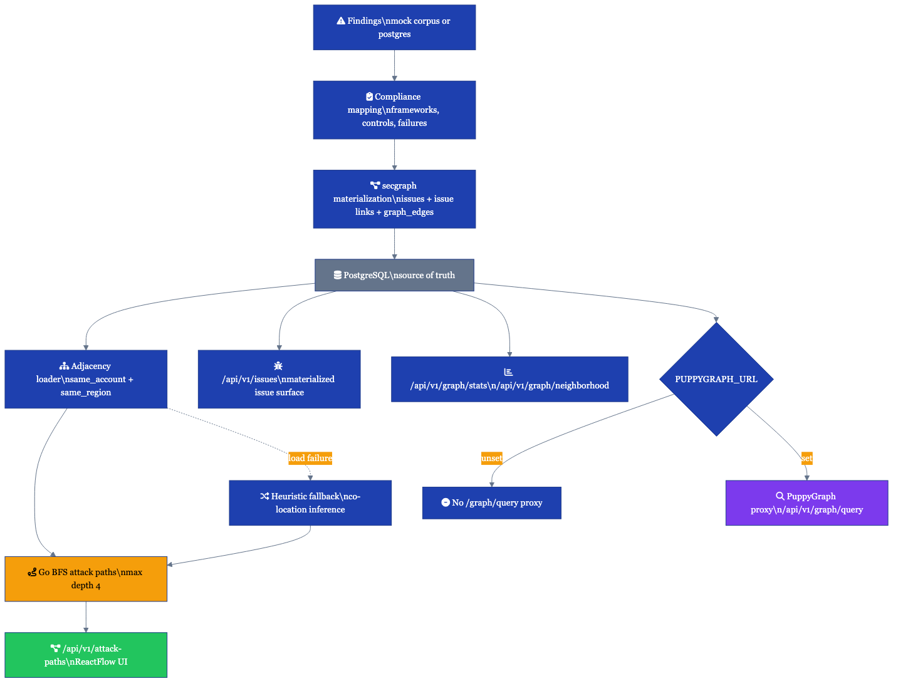
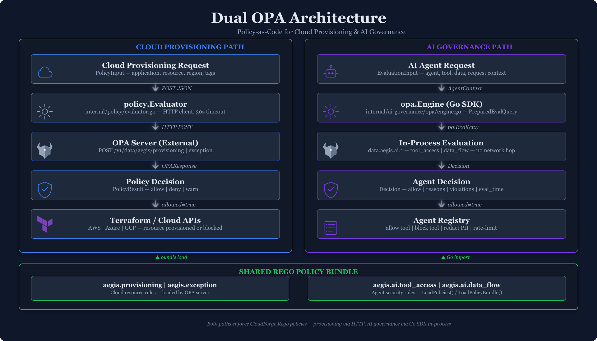
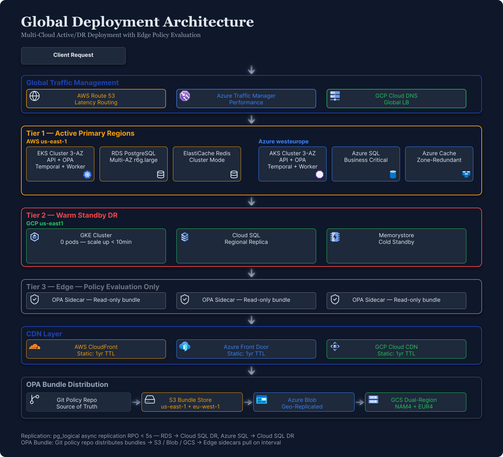
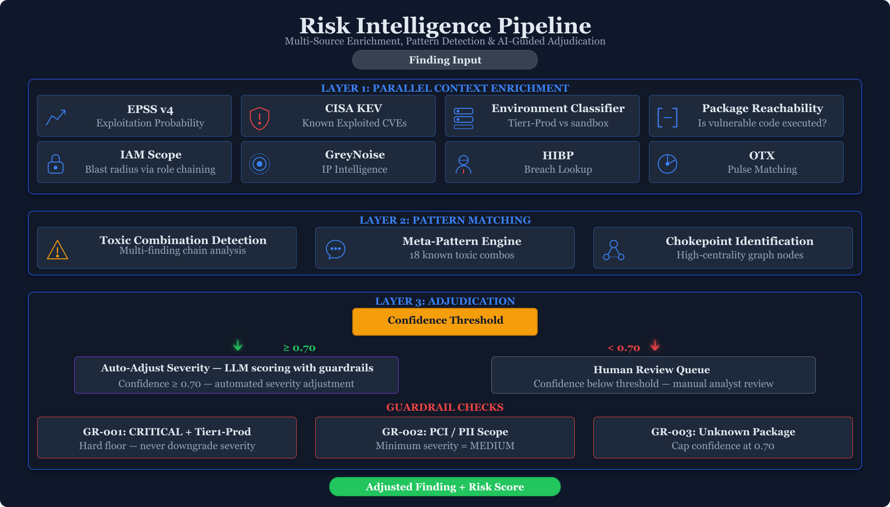

# Architecture Diagrams

Visual reference for CloudForge system architecture and data flows.

Current-state portfolio diagrams and enterprise target/reference diagrams intentionally coexist here. The active public portfolio deployment is lighter than the self-managed multi-region enterprise references.

## System Architecture

The main architecture diagram tracks the current portfolio implementation: posture management, AI risk scoring, policy engine, remediation dispatcher, graph/security analysis, and multi-cloud provider integrations.

## Attack Path + SecGraph Runtime

This detailed current-state diagram shows how findings materialize into secgraph data in PostgreSQL, how adjacency feeds the Go BFS attack-path engine, and where PuppyGraph remains optional rather than runtime-critical.

## Dual-OPA Architecture

Cloud provisioning uses an external OPA server (HTTP POST), while AI governance uses an embedded OPA Go SDK (in-process). Both load from a shared Rego policy bundle.

## Global Deployment

Reference architecture for a self-managed enterprise rollout with multi-region DR, edge policy evaluation, and cross-cloud failover.

## Risk Intelligence Pipeline

Current risk scoring pipeline: threat intel enrichment, contextual scoring, guardrails, and output to dashboards and ticketing.

## Defense Readiness Pipeline

Synthetic defense-adjacent evidence flow for gov-cloud readiness, CMMC/NIST/FedRAMP-style control mapping, and remediation prioritization. This is a demo reference, not a certification claim.

[Mermaid source](defense-readiness-pipeline.mmd)

## Mermaid Source Diagrams

The following diagrams are rendered from Mermaid source files. Click to view full-size.

| Diagram | Description |
|---------|-------------|
| [Compliance Deployment Models](../architecture/HLD.md) | Enterprise compliance reference model |
| [Defense Readiness Pipeline](../architecture/defense-readiness.md) | Synthetic gov-cloud readiness and evidence mapping flow |
| [Cross-Cloud Failover](../architecture/DR-BC.md) | 4-phase failover sequence (detection → DB promotion → compute → DNS) |
| [Deduplication Algorithm](../architecture/HLD.md) | SHA-256 keyed dedup with TTL eviction and rule equivalence mapping |
| [Failover Sequence](../architecture/DR-BC.md) | Self-managed DR failover reference sequence |
| [IaC Deploy Pipeline](../architecture/HLD.md) | Terraform/conftest CI/CD flow |
| [Remediation Dispatcher Flow](../architecture/HLD.md) | Automated remediation routing |
| [Restore Dependency DAG](../architecture/DR-BC.md) | 7-step restore ordering with dependency graph (DB → Redis/OPA → K8s → Temporal → Secrets → DNS) |

## Runbook Diagrams

Operational procedure visualizations embedded in their respective runbooks.

| Diagram | Description |
|---------|-------------|
| [Incident Response](../runbooks/02-incident-response.md) | Severity triage, escalation, containment, resolution |
| [Performance Troubleshooting](../runbooks/04-performance-troubleshooting.md) | Symptom diagnosis decision tree |
| [Secrets Rotation](../runbooks/07-secrets-rotation.md) | Generate, deploy dual-key, validate, revoke |
| [FinOps Budget Alerts](../runbooks/08-finops-budget-alerts.md) | Threshold monitoring, alert routing, remediation |
