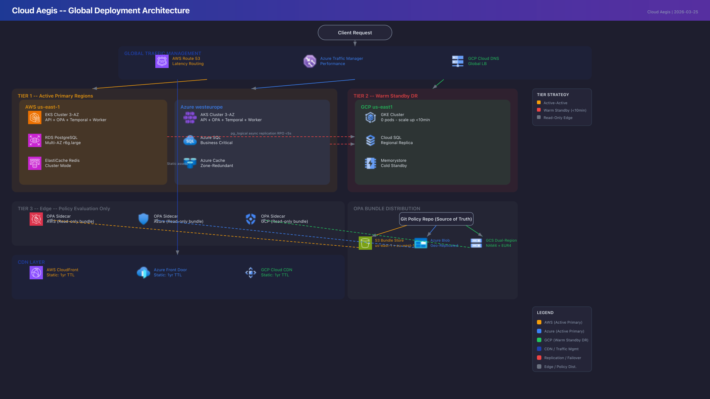
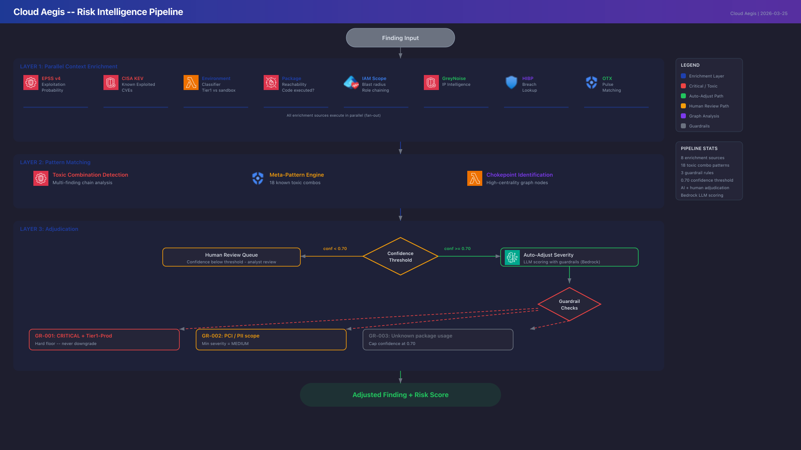

# Architecture Diagrams

Visual reference for CloudForge system architecture and data flows.

## System Architecture

The main architecture diagram shows all platform components: Posture Management, AI risk scoring, policy engine, remediation dispatcher, and multi-cloud provider integrations.

## Dual-OPA Architecture

Cloud provisioning uses an external OPA server (HTTP POST), while AI governance uses an embedded OPA Go SDK (in-process). Both load from a shared Rego policy bundle.

## Global Deployment

Multi-region deployment topology with DR failover across AWS (primary), GCP (warm standby), and edge policy evaluation.

## Risk Intelligence Pipeline

End-to-end risk scoring pipeline: ingestion, normalization, AI enrichment, contextual scoring, and output to dashboards and ticketing.

## Mermaid Source Diagrams

The following diagrams are rendered from Mermaid source files. Click to view full-size.

| Diagram | Description |
|---------|-------------|
| [Compliance Deployment Models](../architecture/HLD.md) | Multi-cloud compliance topology |
| [Failover Sequence](../architecture/DR-BC.md) | DR failover steps and timing |
| [IaC Deploy Pipeline](../architecture/HLD.md) | Terraform/conftest CI/CD flow |
| [Remediation Dispatcher Flow](../architecture/HLD.md) | Automated remediation routing |

## Runbook Diagrams

Operational procedure visualizations embedded in their respective runbooks.

| Diagram | Description |
|---------|-------------|
| [Incident Response](../runbooks/02-incident-response.md) | Severity triage, escalation, containment, resolution |
| [Performance Troubleshooting](../runbooks/04-performance-troubleshooting.md) | Symptom diagnosis decision tree |
| [Secrets Rotation](../runbooks/07-secrets-rotation.md) | Generate, deploy dual-key, validate, revoke |
| [FinOps Budget Alerts](../runbooks/08-finops-budget-alerts.md) | Threshold monitoring, alert routing, remediation |
