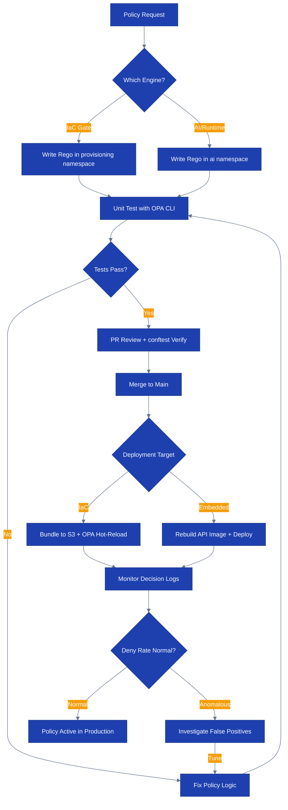

# Runbook: Policy Management

## Overview

This runbook covers policy lifecycle operations for CloudForge, including:
- OPA policy lifecycle (create, test, deploy, monitor, retire)
- Dual-OPA architecture operations (external server + embedded engine)
- Policy bundle management and hot-reload
- IaC policy gate operations
- Rego testing and conftest verification
- Policy decision monitoring and deny rate tracking
- Troubleshooting policy evaluation failures

> Runtime note (April 1, 2026): the live demo does not run a standalone Kubernetes OPA sidecar. IaC policy gates run through `conftest` in CI, while runtime/AI governance policies execute in-process inside the Fly-hosted API.

## Process Flow



## Prerequisites

- [ ] OPA CLI installed (`opa version` >= 0.60.0)
- [ ] conftest installed (`conftest --version` >= 0.47.0)
- [ ] `flyctl` authenticated against the `personal` org
- [ ] CloudForge API token with `policy:manage` scope
- [ ] Access to policy bundle S3 bucket

## Dual-OPA Architecture

CloudForge runs two policy paths serving distinct domains:

| Instance | Type | Namespace | Purpose |
|----------|------|-----------|---------|
| IaC policy gate | `conftest` + Rego bundle in CI | `aegis.provisioning.*` | Terraform plan enforcement |
| Embedded OPA engine | Go library (`internal/ai-governance/opa/engine.go`) | `aegis.ai.*` | AI/runtime policy governance |

```bash
# Validate IaC policies locally
conftest test tfplan.json --policy deploy/policies/rego/provisioning

# Validate the embedded engine through the running API process
fly logs -a cloudforge-api --no-tail | grep -i "policy"
```

## OPA Policy Lifecycle

### 1. Create

All policies live in `deploy/policies/rego/`. Namespace convention:

```
aegis.provisioning.<domain>   # External OPA: S3, EC2, IAM, network
aegis.ai.<domain>             # Embedded OPA: agent access, PII, rate limits
```

**Minimal policy template**:

```rego
# deploy/policies/rego/provisioning/s3_encryption.rego
package aegis.provisioning.s3

import future.keywords.if
import future.keywords.in

default allow := false

allow if {
    input.resource.type == "aws_s3_bucket"
    input.resource.attributes.server_side_encryption_configuration != null
}

deny contains msg if {
    input.resource.type == "aws_s3_bucket"
    input.resource.attributes.server_side_encryption_configuration == null
    msg := sprintf("S3 bucket %v must have server-side encryption enabled", [input.resource.name])
}
```

### 2. Test

```bash
# Unit test the policy
opa test deploy/policies/rego/ -v

# Test a specific file
opa test deploy/policies/rego/provisioning/s3_encryption_test.rego \
  deploy/policies/rego/provisioning/s3_encryption.rego -v

# Evaluate a policy against sample input
opa eval \
  --input deploy/policies/test-fixtures/s3-unencrypted.json \
  --data deploy/policies/rego/ \
  'data.aegis.provisioning.s3.deny'
```

All tests must pass before deploying. Target: 100% rule coverage.

### 3. Deploy

#### External OPA Server (provisioning policies)

```bash
# Build policy bundle
opa build deploy/policies/rego/provisioning/ \
  -o deploy/policies/bundle.tar.gz

# Upload bundle to S3
aws s3 cp deploy/policies/bundle.tar.gz \
  s3://aegis-policy-bundles/provisioning/latest.tar.gz

# Verify bundle checksum
aws s3api head-object \
  --bucket aegis-policy-bundles \
  --key provisioning/latest.tar.gz \
  --query 'ETag'

# Trigger hot-reload
curl -s -X POST http://opa-server:8181/v1/policies/reload \
  -H "Authorization: Bearer $OPA_MGMT_TOKEN"
```

#### Embedded OPA Engine (AI governance policies)

```bash
# Copy Rego files to the embedded engine policy directory
cp deploy/policies/rego/ai/* internal/ai-governance/policies/

# Rebuild and redeploy the live API
fly deploy --remote-only -a cloudforge-api
```

### 4. Monitor

See "Policy Decision Monitoring" section below.

### 5. Retire

```bash
# 1. Mark policy as deprecated in metadata
# Edit deploy/policies/rego/<policy>.rego — add deprecation comment

# 2. Confirm zero evaluations in last 30 days
curl -s 'http://prometheus:9090/api/v1/query?query=
  sum_over_time(aegis_policy_decisions_total{policy="s3_encryption"}[30d])' | jq .

# 3. Remove policy file and update bundle
git rm deploy/policies/rego/provisioning/s3_encryption.rego
git rm deploy/policies/rego/provisioning/s3_encryption_test.rego
git commit -m "chore: retire s3_encryption policy (superseded by s3_security_baseline)"

# 4. Rebuild and upload bundle (see Deploy section)
```

## Policy Bundle Management

### Loading a Bundle

```bash
# Verify bundle integrity before loading
opa inspect deploy/policies/bundle.tar.gz

# Load bundle to external OPA server via REST
curl -s -X PUT http://opa-server:8181/v1/policies/aegis-provisioning \
  --data-binary @deploy/policies/bundle.tar.gz \
  -H "Content-Type: application/gzip"

# Verify loaded
curl -sf http://opa-server:8181/v1/policies | jq '.[].id'
```

### Hot-Reload

External OPA is configured with bundle polling (60s interval). To force immediate reload:

```bash
# Force reload via management API
curl -s http://opa-server:8181/v1/bundles/aegis-provisioning/status | jq .

# Self-managed alternative: restart the OPA sidecar if reload fails
# kubectl rollout restart deployment/opa-server -n aegis
# kubectl rollout status deployment/opa-server -n aegis
```

### Version Pinning

To pin to a specific bundle version instead of `latest`:

```bash
# Upload versioned bundle
aws s3 cp deploy/policies/bundle.tar.gz \
  s3://aegis-policy-bundles/provisioning/v1.2.3.tar.gz

# Update OPA configuration to point to versioned key
kubectl edit configmap opa-config -n aegis
# Change: bundle.resource = "provisioning/v1.2.3.tar.gz"

kubectl rollout restart deployment/opa-server -n aegis
```

## IaC Policy Gate Operations

### Running plan-with-policy.sh Manually

```bash
# Standard usage (terraform plan + conftest check)
./scripts/plan-with-policy.sh \
  --module deploy/terraform/modules/compute \
  --policy-dir deploy/policies/rego/provisioning \
  --workspace staging

# With explicit plan file
terraform -chdir=deploy/terraform/modules/compute plan -out=tfplan.binary
terraform show -json tfplan.binary > tfplan.json
./scripts/plan-with-policy.sh --plan tfplan.json --policy-dir deploy/policies/rego/provisioning
```

### Interpreting conftest Results

```
FAIL - tfplan.json - aegis.provisioning.s3 - S3 bucket my-bucket must have server-side encryption enabled
PASS - tfplan.json - aegis.provisioning.network - ...
2 tests, 1 passed, 1 failed

Exit code: 1
```

A non-zero exit code blocks the Terraform apply in CI. The failing rule package and message identify the exact policy and resource.

```bash
# Run conftest directly with verbose output
conftest test tfplan.json \
  --policy deploy/policies/rego/provisioning \
  --output table \
  --all-namespaces
```

### Adding New Rego Rules

1. Write the rule in the appropriate namespace file
2. Add a test file (`<policy>_test.rego`) with `test_` prefixed test cases
3. Run `opa test deploy/policies/rego/ -v` — all tests must pass
4. Update `scripts/plan-with-policy.sh` if a new policy directory is added
5. Submit PR; CI runs conftest on sample fixtures automatically

### Policy Exception Process

Exceptions are tracked in `deploy/policies/exceptions/exceptions.yaml`:

```yaml
# deploy/policies/exceptions/exceptions.yaml
exceptions:
  - id: EXC-001
    policy: aegis.provisioning.s3
    rule: deny_no_encryption
    resource: legacy-archive-bucket
    justification: "Pre-2024 bucket, migration scheduled Q2 2026"
    approved_by: security-team
    expires: 2026-06-01
    ticket: SEC-1234
```

```bash
# Apply exception (adds resource to policy allow-list)
./scripts/apply-exception.sh --exception-id EXC-001

# Verify exception applied
conftest test tfplan.json \
  --policy deploy/policies/rego/provisioning \
  --data deploy/policies/exceptions/exceptions.yaml
```

## Rego Policy Testing

### Unit Tests

```bash
# Run all policy tests
opa test deploy/policies/rego/ -v

# Run with coverage
opa test deploy/policies/rego/ --coverage | jq '.files | to_entries[] | {file:.key, coverage:.value.coverage}'

# Test a single package
opa test deploy/policies/rego/provisioning/ \
  --filter "aegis.provisioning.s3" -v
```

### conftest Verify

```bash
# Verify all policies against bundled test fixtures
conftest verify \
  --policy deploy/policies/rego/provisioning \
  --update oci://ghcr.io/aegis/policies:latest

# Test against specific input fixture
conftest test deploy/policies/test-fixtures/s3-unencrypted.json \
  --policy deploy/policies/rego/provisioning \
  --namespace aegis.provisioning.s3
```

Expected output: `0 tests failed` before any bundle deployment.

## Policy Decision Monitoring

### Prometheus Metrics

```promql
# Total decisions per second by policy
rate(aegis_policy_decisions_total[5m]) by (policy, result)

# Deny rate by policy (alert threshold: >5%)
rate(aegis_policy_decisions_total{result="deny"}[5m])
/ rate(aegis_policy_decisions_total[5m])
> 0.05

# OPA query latency P99 (alert threshold: >100ms)
histogram_quantile(0.99, rate(aegis_opa_query_duration_seconds_bucket[5m]))
```

### Decision Logs

External OPA logs all decisions to stdout; they are shipped to CloudWatch/GCP Logging.

```bash
# Tail decision logs from OPA sidecar
kubectl logs -n aegis -l app=opa-server -f | jq '{policy:.input.policy, result:.result, resource:.input.resource.id}'

# Count denies by policy in last 1h
kubectl logs -n aegis -l app=opa-server --since=1h | \
  jq -r 'select(.result.deny != null and (.result.deny | length > 0)) | .input.policy' | \
  sort | uniq -c | sort -rn
```

## Troubleshooting Policy Evaluation Failures

### OPA Server Unreachable

**Symptoms**: `policy evaluation error: connection refused` in API logs

**Diagnosis**:
```bash
kubectl get pods -n aegis -l app=opa-server
kubectl logs -n aegis -l app=opa-server --tail=50
```

**Resolution**:
1. Restart OPA sidecar: `kubectl rollout restart deployment/opa-server -n aegis`
2. Verify bundle loaded: `curl -sf http://opa-server:8181/v1/bundles/aegis-provisioning/status`
3. If bundle missing, re-upload from S3 (see Deploy section)

### Unexpected Deny for Known-Good Resource

**Symptoms**: Provisioning blocked for a resource that should pass

**Diagnosis**:
```bash
# Trace the decision
curl -s -X POST http://opa-server:8181/v1/data/aegis/provisioning \
  -H "Content-Type: application/json" \
  -d '{"input": <resource-json>}' | jq .

# Enable explain mode
curl -s -X POST "http://opa-server:8181/v1/data/aegis/provisioning?explain=notes" \
  -H "Content-Type: application/json" \
  -d '{"input": <resource-json>}' | jq .result.explanation
```

**Resolution**:
1. Compare input shape to policy expectations (`opa eval` with `-d` and `-i` flags)
2. Check if an exception is needed (see Policy Exception Process)
3. If a policy logic error, fix the Rego rule, run tests, redeploy bundle

### Embedded Engine Returns Wrong Result

**Symptoms**: AI governance policy allows/denies unexpectedly

**Diagnosis**:
```bash
# Check embedded engine evaluate endpoint
curl -s -X POST https://api.cloudforge.lvonguyen.com/api/v1/policies/evaluate \
  -H "Authorization: Bearer $API_TOKEN" \
  -H "Content-Type: application/json" \
  -d '{"namespace": "aegis.ai.access_control", "input": {"agent_id": "agent-001", "action": "read_secrets"}}' | jq .
```

**Resolution**:
1. Verify the correct Rego files are bundled in the binary (`internal/ai-governance/policies/`)
2. Rebuild and redeploy if policy files were updated outside of normal deploy path
3. If reproducible, write a test case and open a bug

### High OPA Query Latency

**Symptoms**: P99 OPA query latency >100ms, causing API slowdowns

**Diagnosis**:
```bash
# Check OPA profiling
curl -s -X POST "http://opa-server:8181/v1/data/aegis/provisioning?instrument=true" \
  -H "Content-Type: application/json" \
  -d '{"input": {}}' | jq .metrics
```

**Resolution**:
1. Reduce policy complexity — avoid full-document scans in `deny` rules
2. Enable OPA partial evaluation for hot paths
3. Increase OPA replica count if load is the cause: `kubectl scale deployment opa-server --replicas=3 -n aegis`

## Escalation

| Condition | Action |
|-----------|--------|
| OPA down, blocking all provisioning | Page on-call, deploy bypass configmap |
| Policy deploy breaks CI across all PRs | Rollback bundle to previous version |
| Deny rate >20% unexpectedly | Page on-call, investigate rule regression |
| Exception process bypassed | Security incident, page security team |

## Contact Information

- On-Call: PagerDuty
- Platform Team: #platform-support (Slack)
- Security Team: #security-ops (Slack)
