# Runbook: FinOps Budget Alerts

## Overview

This runbook covers operating CloudForge's FinOps budget alerting system, including:
- Budget configuration and threshold management
- Slack and PagerDuty alert channel setup
- Responding to budget threshold breaches
- Cost anomaly investigation
- Chargeback report generation

## Alert Flow



> Runtime note (April 1, 2026): the public demo runs on Fly.io and stores Slack/PagerDuty-style alert credentials in 1Password before syncing them to Fly secrets. `kubectl` configmap edits below are legacy examples for a future self-managed deployment.

## Prerequisites

- [ ] CloudForge API token with `finops:manage` scope
- [ ] `flyctl` authenticated against the `personal` org
- [ ] Slack workspace with incoming webhook configured
- [ ] PagerDuty service with Events API v2 integration key
- [ ] Access to cloud billing consoles (AWS Cost Explorer, Azure Cost Management, GCP Billing)

## Architecture

The FinOps alerting system consists of:

| Component | Package | Purpose |
|-----------|---------|---------|
| BudgetMonitor | `internal/finops/alerting/budget.go` | Monitors budgets against thresholds |
| SlackNotifier | `internal/finops/alerting/slack.go` | Sends Block Kit alerts to Slack |
| PagerDutyNotifier | `internal/finops/alerting/pagerduty.go` | Sends Events API v2 alerts |
| MultiCloudAggregator | `internal/finops/aggregator/` | Fetches cost data from AWS/Azure/GCP |
| AnomalyDetector | `internal/finops/anomaly/` | ML-based spend anomaly detection |

## Configuring Budget Alerts

### Create a Budget

```bash
curl -s -X POST https://api.cloudforge.lvonguyen.com/api/v1/budgets \
  -H "Authorization: Bearer $API_TOKEN" \
  -H "Content-Type: application/json" \
  -d '{
    "name": "Engineering Team Q1",
    "amount": 50000,
    "currency": "USD",
    "period": "monthly",
    "owner": "engineering@company.com",
    "tags": {"team": "engineering", "env": "production"},
    "thresholds": [
      {"percent": 50, "channel": "slack"},
      {"percent": 80, "channel": "slack"},
      {"percent": 90, "channel": "pagerduty"},
      {"percent": 100, "channel": "pagerduty"}
    ]
  }' | jq '{budget_id, name, amount}'
```

### Configure Slack Channel

```bash
# Set Slack webhook URL
# Update the 1Password item backing the Slack webhook ref, then sync Fly secrets
./scripts/fly-sync-runtime-secrets.sh --include-integrations --apply
```

### Configure PagerDuty

```bash
# Set PagerDuty integration key
# Update the 1Password item backing the PagerDuty routing key, then sync Fly secrets
./scripts/fly-sync-runtime-secrets.sh --include-integrations --apply
```

## Responding to Budget Alerts

### 50% Threshold (Informational)

No action required. This is an awareness notification.

### 80% Threshold (Warning)

1. Review current spend by service:
```bash
curl -sf "https://api.cloudforge.lvonguyen.com/api/v1/costs/summary?period=mtd&group_by=service" \
  -H "Authorization: Bearer $API_TOKEN" | jq '.services[] | {service, cost, percent_of_budget}'
```

2. Identify top cost drivers:
```bash
curl -sf "https://api.cloudforge.lvonguyen.com/api/v1/costs/summary?period=mtd&group_by=resource" \
  -H "Authorization: Bearer $API_TOKEN" | jq '.resources | sort_by(-.cost) | .[0:10]'
```

3. Check for cost anomalies:
```bash
curl -sf "https://api.cloudforge.lvonguyen.com/api/v1/costs/anomalies?period=7d" \
  -H "Authorization: Bearer $API_TOKEN" | jq '.anomalies[] | {service, expected, actual, deviation_pct}'
```

### 90% Threshold (Action Required)

1. Identify and stop non-essential resources:
```bash
# Check for idle resources
# AWS
aws ce get-cost-and-usage \
  --time-period Start=$(date -v-7d +%Y-%m-%d),End=$(date +%Y-%m-%d) \
  --granularity DAILY \
  --metrics "UnblendedCost" \
  --group-by Type=DIMENSION,Key=SERVICE \
  --filter '{"Dimensions": {"Key": "RECORD_TYPE", "Values": ["Usage"]}}'
```

2. Review and action rightsizing recommendations:
```bash
curl -sf "https://api.cloudforge.lvonguyen.com/api/v1/costs/recommendations" \
  -H "Authorization: Bearer $API_TOKEN" | jq '.recommendations[] | {resource, current_cost, recommended_cost, savings}'
```

3. Notify budget owner via the original Slack thread.

### 100% Threshold (Critical)

1. Page on-call immediately (PagerDuty auto-triggered).
2. Freeze non-critical provisioning if possible.
3. Escalate to budget owner and their management chain.
4. Schedule a cost review meeting within 24 hours.

## Cost Anomaly Investigation

When an anomaly is detected:

```bash
# 1. Get anomaly details
curl -sf "https://api.cloudforge.lvonguyen.com/api/v1/costs/anomalies/anom-001" \
  -H "Authorization: Bearer $API_TOKEN" | jq .

# 2. Check if it correlates with a deployment
fly releases -a cloudforge-api

# 3. Check if it correlates with a traffic spike
curl -s 'http://prometheus:9090/api/v1/query?query=sum(rate(aegis_http_requests_total[1h]))[7d:1h]'

# 4. Check cloud-native anomaly detection
# AWS
aws ce get-anomalies \
  --date-interval Start=$(date -v-7d +%Y-%m-%d),End=$(date +%Y-%m-%d) \
  --monitor-arn arn:aws:ce::123456789012:anomalymonitor/abc-123
```

## Generating Chargeback Reports

```bash
# Monthly chargeback report (CSV)
curl -sf "https://api.cloudforge.lvonguyen.com/api/v1/costs/chargeback?period=2026-02&format=csv" \
  -H "Authorization: Bearer $API_TOKEN" \
  -o chargeback-2026-02.csv

# JSON format for programmatic consumption
curl -sf "https://api.cloudforge.lvonguyen.com/api/v1/costs/chargeback?period=2026-02&format=json" \
  -H "Authorization: Bearer $API_TOKEN" | jq '.teams[] | {team, total_cost, services}'
```

## Monitoring

### Prometheus Metrics

```promql
# Budget utilization
aegis_finops_budget_utilization_percent by (budget_name)

# Alert send success/failure rate
rate(aegis_finops_alerts_total{status="sent"}[1h])
rate(aegis_finops_alerts_total{status="failed"}[1h])

# Cost data freshness (should be <24h)
time() - aegis_finops_last_sync_timestamp
```

## Escalation

| Condition | Action |
|-----------|--------|
| Budget alert not delivered | Check Slack webhook / PagerDuty key, verify network |
| Cost data stale (>24h) | Check CSP API credentials, verify the Fly app and sync job logs |
| Anomaly false positive | Tune detection thresholds in config |
| Budget exceeded with no alert | Check BudgetMonitor logs, verify threshold config |

## Contact Information

- On-Call: PagerDuty
- FinOps Team: #finops (Slack)
- Platform Team: #platform-support (Slack)
