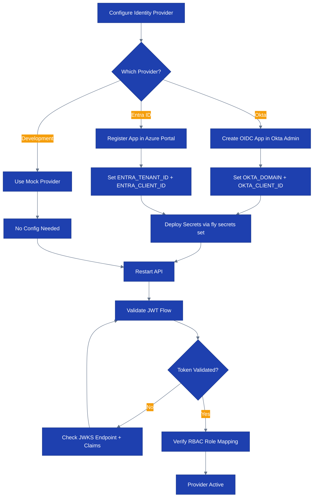

# Runbook: Identity Provider Setup

## Overview

This runbook covers configuring identity providers for CloudForge authentication, including:
- Okta OIDC setup and configuration
- Microsoft Entra ID setup and configuration
- JWT validation configuration
- Mock provider for development
- Troubleshooting authentication issues

> Runtime note (April 1, 2026): the public demo runs on Fly.io + Cloudflare Pages. Configure IdP secrets through 1Password and `fly secrets set`/`fly-sync-runtime-secrets.sh`. The older `kubectl` examples are only relevant to a future self-managed deployment.

> Auth note (April 3, 2026): the frontend currently implements an Okta SPA PKCE callback flow at `https://cloudforge.lvonguyen.com/callback`. The backend validates bearer JWTs via HS256 or JWKS, but it does not host server-managed authorize/callback routes or a cookie-backed BFF session layer.

## Process Flow



## Prerequisites

- [ ] Admin access to Okta Admin Console or Azure Portal (Entra ID)
- [ ] `flyctl` authenticated against the `personal` org
- [ ] CloudForge configuration access (Fly secrets or environment variables)

## Architecture

CloudForge uses config-driven identity provider selection:

```
OKTA_DOMAIN set    --> Okta provider activated
ENTRA_TENANT_ID set --> Entra ID provider activated
Neither set        --> Mock provider (development mode)
```

The server stores active providers in `Server.identityProviders` (`map[string]identity.Provider`). The JWT auth middleware validates tokens against the configured provider's JWKS endpoint.

Current deployed split:
- Frontend login is browser-owned Okta SPA PKCE using `VITE_OKTA_ISSUER`, `VITE_OKTA_CLIENT_ID`, and the `/callback` route.
- Backend API auth is bearer-token validation only: HS256 demo/static tokens or RS256 JWTs via `AEGIS_JWKS_URL` / auto-derived Okta JWKS.
- Server-managed auth routes, refresh-token custody, and `httpOnly` cookie sessions do not exist today.

Compatibility note:
- RBAC group claims still use the `aegis-*` prefix because backend role mapping and some persisted frontend storage keys still depend on it.

Relevant code:
- `cmd/server/main.go` — Provider initialization
- `internal/identity/provider.go` — Provider interface
- `internal/identity/okta.go` — Okta implementation
- `internal/identity/entra_id.go` — Entra ID implementation
- `internal/identity/mock.go` — Mock provider for development

## Okta OIDC Setup

### Step 1: Create Okta Application

1. Go to Okta Admin Console > Applications > Create App Integration
2. Select: OIDC - OpenID Connect
3. Application type: Single-Page Application (preferred) or Web Application if your org requires it
4. Settings:
   - App name: `CloudForge`
   - Grant type: Authorization Code
   - Sign-in redirect URIs: `https://cloudforge.lvonguyen.com/callback`
   - Sign-out redirect URIs: `https://cloudforge.lvonguyen.com`
   - Controlled access: Limit to specific groups

5. Note the following values:
   - Client ID
   - Okta Domain (e.g., `dev-12345.okta.com`)

### Step 2: Configure Groups and Roles

Map Okta groups to CloudForge roles:

| Okta Group | CloudForge Role |
|------------|----------------|
| `aegis-admin` | admin |
| `aegis-operator` | operator |
| `aegis-requester` | requester |

Configure group claim in Okta:
1. Security > API > Authorization Servers > default
2. Claims > Add Claim:
   - Name: `groups`
   - Include in token type: ID Token (Always)
   - Value type: Groups
   - Filter: Starts with `aegis-`

### Step 3: Configure CloudForge

Backend API runtime:

```bash
fly secrets set \
  OKTA_DOMAIN="dev-12345.okta.com" \
  -a cloudforge-api
```

Frontend build-time config:

- `VITE_OKTA_ISSUER=https://dev-12345.okta.com/oauth2/default`
- `VITE_OKTA_CLIENT_ID=0oa...`

The SPA PKCE flow uses the Vite variables above. The backend only needs `OKTA_DOMAIN` to auto-derive the JWKS URL and activate the real Okta provider.

### Step 4: Verify

```bash
# Test token validation
curl -sf https://api.cloudforge.lvonguyen.com/api/v1/findings \
  -H "Authorization: Bearer $OKTA_TOKEN" | jq '.total'
```

## Microsoft Entra ID Setup

### Step 1: Register Application

1. Azure Portal > Entra ID > App registrations > New registration
2. Settings:
   - Name: `CloudForge`
   - Supported account types: Single tenant (or multi-tenant for MSP)
   - Redirect URI: Web > `https://cloudforge.lvonguyen.com/callback`

3. Note: Application (client) ID, Directory (tenant) ID

### Step 2: Configure Authentication

1. Authentication > Add platform > Web
   - Redirect URIs: `https://cloudforge.lvonguyen.com/callback`
   - ID tokens: Check
   - Access tokens: Check

2. Certificates & secrets > New client secret
   - Note the secret value (store in Key Vault)

### Step 3: Configure Token Claims

1. Token configuration > Add groups claim
   - Group types: Security groups
   - Customize token properties: Group ID

2. App roles > Create app role:
   - Display name: `CloudForge Admin`
   - Value: `admin`
   - Allowed member types: Users/Groups

   Repeat for `operator` and `requester`.

### Step 4: Configure CloudForge

```bash
fly secrets set \
  ENTRA_TENANT_ID="xxxxxxxx-xxxx-xxxx-xxxx-xxxxxxxxxxxx" \
  ENTRA_CLIENT_ID="yyyyyyyy-yyyy-yyyy-yyyy-yyyyyyyyyyyy" \
  ENTRA_CLIENT_SECRET="zzz" \
  -a cloudforge-api
```

### Step 5: Verify

```bash
# Test token validation
curl -sf https://api.cloudforge.lvonguyen.com/api/v1/findings \
  -H "Authorization: Bearer $ENTRA_TOKEN" | jq '.total'
```

## Development Mode (Mock Provider)

When neither `OKTA_DOMAIN` nor `ENTRA_TENANT_ID` is set, local development falls back to the mock provider. The deployed Pages demo instead uses demo/static auth mode with the in-app role switcher.

Entra ID support currently applies to backend provider integration and JWT validation. The first-party SPA login flow in `frontend/` is wired for Okta today.

In development mode:
- `AuthProvider` component auto-authenticates as admin
- `ProtectedRoute` skips auth checks when `import.meta.env.DEV` is true
- The dev JWT token is stored in `frontend/.env.development` (gitignored)
- The JWT signing secret is sourced from 1Password (`aegis-dev-jwt-secret`)

```bash
# Verify mock mode
curl -sf http://localhost:8080/health | jq '.components.identity_provider'
# Expected: {"mock": "ok"}

# Use dev header override for role testing
curl -sf http://localhost:8080/api/v1/findings \
  -H "X-Aegis-Role: operator"
```

## JWT Validation Configuration

| Parameter | Description | Default |
|-----------|-------------|---------|
| `JWT_SIGNING_KEY` | HS256 symmetric key | Required (no default) |
| `JWT_ISSUER` | Expected `iss` claim | `aegis` |
| `JWT_AUDIENCE` | Expected `aud` claim | `aegis-api` |
| `JWKS_URL` | JWKS endpoint for RS256 | Auto-configured from IdP |
| `JWKS_CACHE_TTL` | JWKS cache duration | 1 hour |

## Troubleshooting

### Token Validation Fails

**Symptoms**: 401 Unauthorized on all API calls

**Diagnosis**:
```bash
fly logs -a cloudforge-api | rg -i "jwt|auth|token"
```

**Common causes**:
1. **Expired token**: Check `exp` claim with `jwt.io`
2. **Wrong issuer**: Token `iss` doesn't match configured issuer
3. **Wrong audience**: Token `aud` doesn't match configured audience
4. **JWKS unreachable**: Network issue reaching IdP's JWKS endpoint
5. **Clock skew**: Server time differs from IdP time by more than allowed leeway

### Groups Claim Missing

**Symptoms**: Authenticated but 403 Forbidden (role not assigned)

**Diagnosis**:
```bash
# Decode token and check groups claim
echo $TOKEN | cut -d. -f2 | base64 -d 2>/dev/null | jq '.groups'
```

**Resolution**:
1. Verify groups claim is configured in IdP (see setup steps above)
2. Verify user is assigned to the correct group/role in IdP
3. Check that group names match expected patterns (`aegis-admin`, etc.)

### JWKS Cache Stale

**Symptoms**: Tokens from one provider validate, but newly issued tokens fail

**Diagnosis**:
```bash
fly logs -a cloudforge-api | rg "jwks|key rotation"
```

**Resolution**:
```bash
# Force JWKS cache refresh by restarting the Fly app
fly apps restart cloudforge-api
```

## Escalation

| Condition | Action |
|-----------|--------|
| All auth failing after IdP change | Check IdP status page, verify JWKS endpoint |
| Token validation intermittent | Check JWKS cache, verify clock sync |
| Role mapping incorrect | Review group claim configuration in IdP |
| Mock provider active in production | Immediately set OKTA_DOMAIN or ENTRA_TENANT_ID |

## Contact Information

- On-Call: PagerDuty
- Identity Team: #identity-platform (Slack)
- Security Team: #security-ops (Slack)
