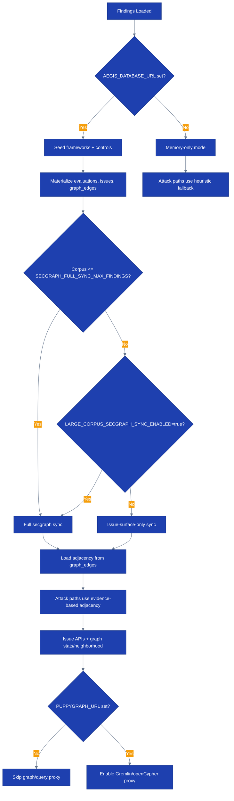

# Runbook: Attack Path and Security Graph Operations

## Overview

This runbook covers operating CloudForge's attack-path and security-graph surfaces, including:
- Secgraph startup and incremental sync behavior
- Attack-path warmup and large-corpus fallback behavior
- Health checks for issue, graph, and attack-path APIs
- Common failure modes when PostgreSQL or PuppyGraph are unavailable
- Verification and escalation steps

> Runtime note (April 6, 2026): the public demo runs on Fly.io + Cloudflare Pages. The current runtime truth is the Go API plus PostgreSQL-backed secgraph. PuppyGraph is optional and feature-flagged. Any `kubectl` examples below apply only to a future self-managed deployment.

## Process Flow



## Prerequisites

- [ ] `flyctl` authenticated against the live app org
- [ ] API token with viewer scope for read checks and operator scope for query endpoints
- [ ] PostgreSQL connectivity if verifying DB-backed secgraph locally
- [ ] `jq` installed for JSON inspection
- [ ] 1Password-backed secret refs available for database and optional PuppyGraph credentials

## Current Runtime Model

The current implementation is not just a design target. It is live in:
- `internal/secgraph/`
- `cmd/server/secgraph_sync.go`
- `cmd/server/attackpath.go`
- `cmd/server/handlers_graph.go`
- `cmd/server/handlers_issues.go`

Key behavior:
- PostgreSQL is the source of truth for frameworks, controls, control evaluations, issues, issue-finding links, and `graph_edges`
- Attack paths use secgraph adjacency when it can be loaded from the database
- If adjacency cannot be loaded, attack paths fall back to the heuristic engine
- Structured graph endpoints (`/graph/stats`, `/graph/neighborhood/...`) are available whenever `AEGIS_DATABASE_URL` is configured
- PuppyGraph is optional and only backs `/graph/query`

## Runtime Controls and Thresholds

| Setting | Default | Purpose |
|--------|---------|---------|
| `AEGIS_DATABASE_URL` | unset | Enables DB-backed secgraph, issues, graph stats, and graph neighborhood APIs |
| `PUPPYGRAPH_URL` | unset | Enables `/api/v1/graph/query` proxy |
| `SECGRAPH_SYNC_TIMEOUT` | `60s` | Startup secgraph sync timeout |
| `SECGRAPH_FULL_SYNC_MAX_FINDINGS` | `10000` | Full secgraph sync threshold |
| `LARGE_CORPUS_SECGRAPH_SYNC_ENABLED` | `false` | Opt-in override for full sync above threshold |
| `SECGRAPH_AUTO_TICKETS` | `false` | Auto-dispatch issue tickets during sync |
| `ATTACK_PATH_WARMUP_MAX_FINDINGS` | `10000` | Warmup threshold for precomputed attack paths |
| `ATTACK_PATH_MAX_FINDINGS` | `5000` | Deferred attack-path candidate cap |
| `ATTACK_PATH_MAX_PER_ACCOUNT` | `125` | Deferred attack-path per-account cap |

## Health Checks

### Step 1: Confirm API and DB-backed secgraph are live

```bash
export API_BASE="https://api.cloudforge.lvonguyen.com"

curl -sf "$API_BASE/healthz" | jq .
curl -sf "$API_BASE/api/v1/issues/stats" -H "Authorization: Bearer $API_TOKEN" | jq .
curl -sf "$API_BASE/api/v1/graph/stats" -H "Authorization: Bearer $API_TOKEN" | jq .
curl -sf "$API_BASE/api/v1/attack-paths/stats" -H "Authorization: Bearer $API_TOKEN" | jq .
```

Expected:
- `/healthz` returns `200`
- `/issues/stats` returns aggregate counts, not `501`
- `/graph/stats` returns vertex/edge counts, not `501`
- `/attack-paths/stats` returns mode, coverage, and path counts

If `/issues/stats` or `/graph/stats` return `501`, the API is running without `AEGIS_DATABASE_URL`.

### Step 2: Verify neighborhood queries

Use a known resource, finding, control, or issue ID from the current corpus.

```bash
curl -sf "$API_BASE/api/v1/graph/neighborhood/resource/res-123?hops=2&limit=50" \
  -H "Authorization: Bearer $API_TOKEN" | jq '{nodes: (.nodes | length), edges: (.edges | length)}'
```

Expected:
- non-zero `nodes` and `edges` for a populated corpus
- bounded response size at the requested hop/limit

### Step 3: Verify issue surface

```bash
curl -sf "$API_BASE/api/v1/issues?per_page=10" \
  -H "Authorization: Bearer $API_TOKEN" | jq '{count: (.data | length), page, per_page, total}'

curl -sf "$API_BASE/api/v1/issues?severity=CRITICAL&status=OPEN&ticketed=false" \
  -H "Authorization: Bearer $API_TOKEN" | jq '{count: (.data | length)}'
```

Expected:
- paginated results with issue summaries
- filtering works on severity, status, ticket state, provider, account, control, and resource

### Step 4: Verify optional PuppyGraph path

Run this only if `PUPPYGRAPH_URL` is configured.

```bash
curl -sf -X POST "$API_BASE/api/v1/graph/query" \
  -H "Authorization: Bearer $API_TOKEN" \
  -H "Content-Type: application/json" \
  -d '{
    "language": "cypher",
    "query": "MATCH (n) RETURN n LIMIT 5"
  }' | jq .
```

Expected:
- `200` with `data` and `elapsed`
- `501` means PuppyGraph is intentionally not configured
- `403` for mutation attempts is expected

## Startup and Warmup Verification

### Check live logs

```bash
fly logs -a cloudforge-api | rg "Security graph sync complete|Graph adjacency loaded for attack paths|Failed to load graph adjacency|incremental secgraph sync failed|Skipping full security graph sync"
```

Healthy signals:
- `Security graph sync complete`
- `Graph adjacency loaded for attack paths`

Expected degradation signals:
- `Skipping full security graph sync` for large corpora without opt-in
- `Failed to load graph adjacency (using heuristic fallback)` if DB adjacency load fails

### Interpret attack-path mode

```bash
curl -sf "$API_BASE/api/v1/attack-paths/stats" \
  -H "Authorization: Bearer $API_TOKEN" | jq '{mode, total_findings, candidate_findings, total_paths, findings_in_paths}'
```

Guidance:
- `mode: "full"` means the corpus was small enough for full precompute
- a reduced `candidate_findings` count indicates deferred/sampled mode
- zero paths with non-zero findings usually means the graph is disconnected or entry/target heuristics produced no bridges

## Common Failures and Responses

### `/api/v1/issues/*` or `/api/v1/graph/*` returns `501`

Cause:
- `AEGIS_DATABASE_URL` is missing or unreachable

Actions:
```bash
fly ssh console -a cloudforge-api -C 'printenv | rg "AEGIS_DATABASE_URL|PUPPYGRAPH_URL|SECGRAPH_"'
fly logs -a cloudforge-api | rg "AEGIS_DATABASE_URL not set|requires AEGIS_DATABASE_URL|Failed to initialize"
```

Response:
- restore database connectivity or secret injection
- if this is a deliberate demo-only memory run, note that secgraph and issue APIs are unavailable by design

### Attack paths exist but use heuristic fallback

Cause:
- adjacency load from `graph_edges` failed
- DB is unavailable during warmup

Actions:
```bash
fly logs -a cloudforge-api | rg "Failed to load graph adjacency|using heuristic fallback|Graph adjacency loaded"
curl -sf "$API_BASE/api/v1/graph/stats" -H "Authorization: Bearer $API_TOKEN" | jq '.edges'
```

Response:
- restore DB connectivity first
- confirm `graph_edges` is populated
- accept temporary heuristic mode only for short-lived degraded operation

### Large corpus skips full secgraph sync

Cause:
- finding count exceeded `SECGRAPH_FULL_SYNC_MAX_FINDINGS`
- `LARGE_CORPUS_SECGRAPH_SYNC_ENABLED` not enabled

Response:
- this is expected on constrained runtime profiles
- if a full startup sync is required, explicitly opt in:

```bash
fly secrets set LARGE_CORPUS_SECGRAPH_SYNC_ENABLED=true -a cloudforge-api
fly secrets set SECGRAPH_SYNC_TIMEOUT=120s -a cloudforge-api
```

- revert the opt-in after the one-off operation if memory pressure becomes a concern

### Issue tickets are not being created

Cause:
- `SECGRAPH_AUTO_TICKETS` is off
- routing or downstream integration is failing

Actions:
```bash
fly ssh console -a cloudforge-api -C 'printenv | rg "SECGRAPH_AUTO_TICKETS"'
fly logs -a cloudforge-api | rg "dispatch issue ticket|secgraph.tickets|routing"
```

Response:
- enable `SECGRAPH_AUTO_TICKETS=true` only when downstream ticket routing is intended
- otherwise keep issue materialization running without automatic dispatch

## Verification

- [ ] `/api/v1/issues/stats` returns `200`
- [ ] `/api/v1/graph/stats` returns `200`
- [ ] `/api/v1/attack-paths/stats` returns `200`
- [ ] Logs show either evidence-based adjacency load or an understood fallback mode
- [ ] Optional PuppyGraph query succeeds or is intentionally `501`

## Rollback

If a change to secgraph or attack-path tuning causes instability:

```bash
fly secrets unset LARGE_CORPUS_SECGRAPH_SYNC_ENABLED -a cloudforge-api
fly secrets unset SECGRAPH_AUTO_TICKETS -a cloudforge-api
fly secrets unset PUPPYGRAPH_URL -a cloudforge-api
```

Then redeploy or restart the API app and verify:
- attack paths still load
- `/issues/*` and `/graph/*` behave as expected for the remaining configured runtime

## Escalation

| Condition | Action |
|-----------|--------|
| DB-backed issue or graph endpoints return `501` unexpectedly | Escalate to platform owner immediately |
| Attack-path coverage drops sharply after deploy | Check adjacency load and secgraph sync logs, then escalate |
| PuppyGraph query path returns persistent `502` | Disable `PUPPYGRAPH_URL` and fall back to Postgres/Go paths |
| Full sync causes memory pressure or slow boot | Disable large-corpus opt-in and run issue-surface-only mode |
