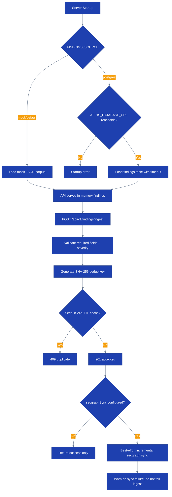

# Runbook: Ingestion Pipeline Operations

## Overview

This runbook covers CloudForge's current finding-ingestion paths, including:
- Startup finding source selection (`mock` vs `postgres`)
- Runtime ingestion through `POST /api/v1/findings/ingest`
- Deduplication behavior and duplicate handling
- Incremental secgraph side effects after ingest
- Failure modes and operator expectations

> Runtime note (April 6, 2026): the public demo still defaults to mock-backed findings unless `FINDINGS_SOURCE=postgres` and `AEGIS_DATABASE_URL` are configured. The admin ingest endpoint is a lightweight acceptance + dedup path. It does not replace a full durable scanner ingestion pipeline by itself.

## Process Flow



## Prerequisites

- [ ] `flyctl` authenticated against the live app org
- [ ] Admin API token for `POST /api/v1/findings/ingest`
- [ ] Viewer or operator API token for read-side verification
- [ ] PostgreSQL access if `FINDINGS_SOURCE=postgres`
- [ ] `jq` installed for response inspection

## Current Runtime Model

There are two distinct ingestion paths:

1. **Startup corpus loading**
   - `FINDINGS_SOURCE=mock` or unset: loads the bundled mock JSON corpus
   - `FINDINGS_SOURCE=postgres`: loads findings from the `findings` table

2. **Admin ingest endpoint**
   - `POST /api/v1/findings/ingest`
   - validates a compact finding payload
   - computes a SHA-256 dedup key from `(source, source_finding_id, resource_id, account_id)`
   - uses a 24-hour in-memory dedup cache
   - triggers best-effort incremental secgraph sync if configured

Important limitation:
- The current admin ingest endpoint does **not** persist the raw finding into the runtime `findings` table or append it to the in-memory corpus used by `GET /api/v1/findings`.
- Its durable effect today is the downstream secgraph materialization path, not full finding-store persistence.

## Runtime Controls

| Setting | Default | Purpose |
|--------|---------|---------|
| `FINDINGS_SOURCE` | `mock` | Selects startup corpus source (`mock` or `postgres`) |
| `AEGIS_DATABASE_URL` | unset | Required for `FINDINGS_SOURCE=postgres` |
| `FINDINGS_LOAD_TIMEOUT` | `30s` | Timeout for loading findings from PostgreSQL |
| Dedup cache TTL | `24h` | Duplicate suppression window for `/findings/ingest` |

## Startup Verification

### Step 1: Confirm the configured source

```bash
fly ssh console -a cloudforge-api -C 'printenv | rg "FINDINGS_SOURCE|AEGIS_DATABASE_URL|FINDINGS_LOAD_TIMEOUT"'
fly logs -a cloudforge-api | rg "Findings loaded from mock JSON|Findings loaded from PostgreSQL|FINDINGS_SOURCE=postgres requires"
```

Expected:
- `Findings loaded from mock JSON` for the default demo runtime
- `Findings loaded from PostgreSQL` for DB-backed runtime

If `FINDINGS_SOURCE=postgres` is set but the DB is unreachable, startup should fail rather than silently degrade.

### Step 2: Verify read-side findings surface

```bash
export API_BASE="https://api.cloudforge.lvonguyen.com"

curl -sf "$API_BASE/api/v1/findings/stats" \
  -H "Authorization: Bearer $VIEWER_TOKEN" | jq .

curl -sf "$API_BASE/api/v1/findings?page=1&per_page=5" \
  -H "Authorization: Bearer $VIEWER_TOKEN" | jq '{count: (.data | length), page, per_page, total}'
```

Expected:
- stable counts from the selected startup source
- no changes from a standalone `/findings/ingest` call unless the underlying source is updated separately

## Runtime Ingest Procedure

### Step 1: Submit a finding

Required fields:
- `source`
- `source_finding_id`
- `resource_id`
- `account_id`

Severity must be one of:
- `CRITICAL`
- `HIGH`
- `MEDIUM`
- `LOW`
- `INFO`

```bash
curl -s -X POST "$API_BASE/api/v1/findings/ingest" \
  -H "Authorization: Bearer $ADMIN_TOKEN" \
  -H "Content-Type: application/json" \
  -d '{
    "source": "aws-securityhub",
    "source_finding_id": "SH-001",
    "resource_id": "arn:aws:s3:::example-bucket",
    "account_id": "123456789012",
    "severity": "HIGH",
    "finding_type": "public bucket",
    "title": "S3 bucket is publicly accessible",
    "description": "Public read ACL detected"
  }' | jq .
```

Expected success:
- `201 Created`
- response contains `status: "accepted"`, `finding_id`, `dedup_key`

### Step 2: Verify duplicate handling

Resubmit the exact same payload within 24 hours.

```bash
curl -s -o /tmp/ingest-dup.json -w "%{http_code}\n" \
  -X POST "$API_BASE/api/v1/findings/ingest" \
  -H "Authorization: Bearer $ADMIN_TOKEN" \
  -H "Content-Type: application/json" \
  -d @/tmp/ingest-payload.json

cat /tmp/ingest-dup.json | jq .
```

Expected duplicate response:
- `409 Conflict`
- `status: "duplicate"`
- `existing_entry.finding_id`
- `existing_entry.first_seen`

## Secgraph Side-Effect Verification

If `secgraphSync` is configured, a successful ingest attempts a best-effort incremental sync with a 5-second timeout.

### Step 1: Check logs

```bash
fly logs -a cloudforge-api | rg "finding ingested|duplicate finding rejected|incremental secgraph sync failed after finding ingest"
```

Expected:
- `finding ingested` on success
- `duplicate finding rejected` on duplicate payloads
- if present, `incremental secgraph sync failed after finding ingest` is a degraded warning, not an ingest failure

### Step 2: Verify graph-native issue side effects

Because the raw findings list is not updated by this endpoint, verify via the secgraph issue surface instead of `GET /findings`.

```bash
curl -sf "$API_BASE/api/v1/issues?per_page=10" \
  -H "Authorization: Bearer $VIEWER_TOKEN" | jq .

curl -sf "$API_BASE/api/v1/issues/stats" \
  -H "Authorization: Bearer $VIEWER_TOKEN" | jq .
```

If the accepted ingest produced a mapped control failure, new issue materialization may appear here even though `/api/v1/findings` stays unchanged.

## Failure Modes

### `400 Bad Request`

Causes:
- missing `source`, `source_finding_id`, `resource_id`, or `account_id`
- invalid severity
- malformed JSON body

Action:
- fix the payload and retry

### `401` / `403`

Cause:
- missing or insufficient auth

Action:
- `/findings/ingest` is admin-only
- use a token with admin role claims

### `409 Conflict`

Cause:
- duplicate finding within the 24-hour TTL window

Action:
- treat as expected deduplication, not an incident
- inspect `existing_entry` in the response

### Startup failure with `FINDINGS_SOURCE=postgres`

Cause:
- `AEGIS_DATABASE_URL` missing or unreachable

Action:
```bash
fly logs -a cloudforge-api | rg "FINDINGS_SOURCE=postgres requires|query findings|scan finding row|PostgreSQL ping failed"
```

- restore DB connectivity or revert `FINDINGS_SOURCE` to `mock`

## Verification

- [ ] Startup logs match the intended source (`mock` or `postgres`)
- [ ] `/api/v1/findings/stats` returns `200`
- [ ] Valid ingest payload returns `201`
- [ ] Duplicate payload returns `409`
- [ ] If secgraph is enabled, issue/graph surfaces reflect the downstream materialization path

## Rollback

If runtime ingestion changes cause instability:

```bash
fly secrets set FINDINGS_SOURCE=mock -a cloudforge-api
fly secrets unset AEGIS_DATABASE_URL -a cloudforge-api
```

Then redeploy or restart the app and confirm startup returns to mock-backed operation.

If only the admin ingest endpoint is problematic, disable access operationally at the API gateway or revoke admin token access until the issue is fixed.

## Escalation

| Condition | Action |
|-----------|--------|
| DB-backed startup fails with `FINDINGS_SOURCE=postgres` | Escalate to platform owner immediately |
| Ingest returns `201` but expected secgraph side effects never appear | Check secgraph sync warnings, then escalate |
| Duplicate suppression behaves unexpectedly across restarts | Review in-memory dedup TTL assumptions and restart behavior |
| Operators assume `/findings/ingest` is durable raw-finding persistence | Stop rollout and clarify current contract before further automation |
