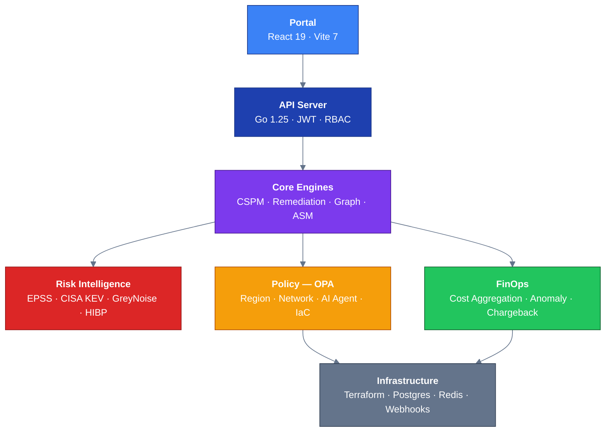

# CloudForge Documentation

**CloudForge** is an enterprise cloud governance platform that unifies posture findings, AI-powered risk scoring, policy enforcement, and automated remediation across AWS, Azure, and GCP.

## Quick Links

| Section | Description |
|---------|-------------|
| [Architecture](/docs/core/architecture/HLD) | High-Level Design, Detailed Design, DR/BC |
| [ADRs](/docs/adr) | 21 Architecture Decision Records |
| [Diagrams](/docs/diagrams) | System architecture and flow diagrams |
| [API Reference](/docs/api) | OpenAPI schema download plus markdown endpoint reference (89 operations) |
| [Posture Management](/docs/cspm/HLD_CSPM_Aggregator) | Multi-cloud finding aggregation module |
| [Runbooks](/docs/core/runbooks/deployment) | 9 operational runbooks |
| [Security](/docs/threat-models/remediation-and-ai-pipeline) | STRIDE threat model |

## Architecture at a Glance

> For the detailed component-level diagram, see [Diagrams](/docs/diagrams).

## Key Capabilities

- **Posture Management** -- Normalize findings from AWS Security Hub, Azure Defender, GCP SCC, Trivy, and Prowler into a unified schema
- **AI Risk Scoring** -- LLM-powered severity re-scoring considering asset tier, environment, exposure, and blast radius
- **Dual-OPA Policy** -- External OPA server for cloud provisioning + embedded Go SDK for AI agent governance
- **Automated Remediation** -- Dispatcher routes findings to provider-specific handlers with approval workflows
- **FinOps Integration** -- Multi-cloud cost aggregation with anomaly detection
- **Graph Analysis** -- Security-graph context and attack-path analysis for triage and containment

## Auth Architecture Today

- Frontend SSO is a browser-owned Okta SPA PKCE flow that redirects to `/callback` when `VITE_OKTA_ISSUER` and `VITE_OKTA_CLIENT_ID` are configured.
- The backend validates bearer JWTs via HS256 or RS256/JWKS and serves the public demo with static/demo auth modes.
- Backend authorize/callback routes, refresh-token storage, and `httpOnly` session cookies are not implemented today.
